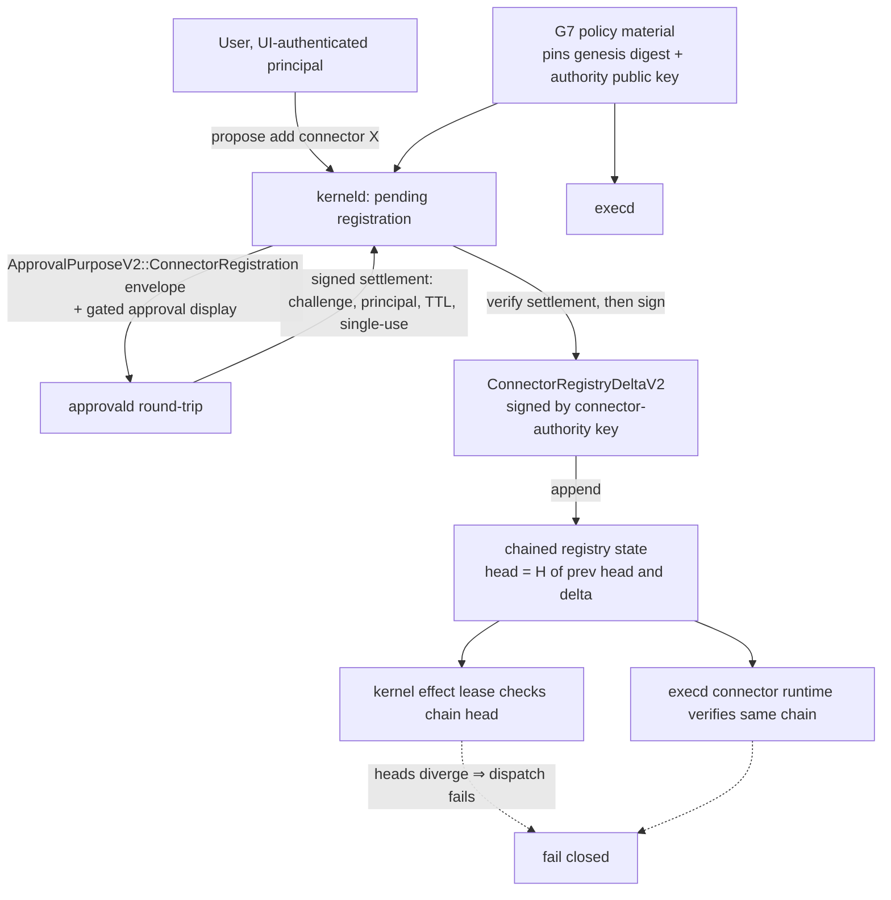

# Savana V2 Connector Registration: Self-Service Through the Signed Channel

Status: accepted design, v1.2 (2026-08-01). Specifies how a user adds an MCP
server (or any connector) to a running installation without a deployment
rollover — while keeping the kernel's rule that **registration verbs exist
only in signed channels; the runtime only verifies**. Changes no code by
itself.

v1.1: connectors gain explicit **tiers** (§5.1–5.3) — the capability-ceiling
pattern `labels.rs` already applies to values, lifted to connectors — with
per-tier ID namespaces and monotonic transitions; the host allowlist (O2,
now resolved) is specified in §5.4 and scoped to the user tier only.

v1.2: O1, O3, and O4 resolved (§13). Every question this document raised is
now decided; nothing remains open.

Companion reading: `docs/declassification-v2.md` (the release-rule surface
this design composes with, cited below as *DECL*), `docs/protocol-v1.md`.

---

## 1. Problem statement

Today a connector reaches the kernel only through the deployment channel:

| Step | Where | Evidence |
|---|---|---|
| Connector lands executor-side | `crates/savana-execd/src/connector_runtime.rs:37` | constructor is `from_verified_components` — execd itself accepts only verified parts |
| Its registry digest is pinned in G7 policy | `crates/savana-kerneld/src/v2_startup.rs:615,1206` | loaded from signed policy material at startup |
| The digest is zero-refused at type level | `crates/savana-kernel-protocol/src/v2/kernel_executor.rs:315` | `is_zero(...)` refusal in the constructor |
| Every dispatch re-checks it | `crates/savana-kerneld/src/v2_agent_authority.rs:3537-3539` | bound into the effect-gate lease |
| Tool descriptors enter G4 signed | `crates/savana-policy-core/src/v2/descriptor.rs:527,600` | publisher key authenticated by the active state manifest |

There is no runtime registration surface at all — in development the
connector-set digest is literally random bytes
(`savana-development-build-inputs.rs:110`). Adding one MCP server in
production therefore means: edit deployment inputs → re-sign → roll over.
Correct, but not a product. The goal is user self-service **without**
weakening the invariant that made the current state correct: no runtime
mutation of an effect surface on anyone's mere say-so.

## 2. Goals and non-goals

Goals:

- G-A: a user can add or remove a connector on a live installation through
  an explicit human-approval round-trip, with no deployment rollover.
- G-B: the connector registry becomes a **hash-chained state** whose genesis
  and update authority are pinned by the deployment channel — self-service
  extends the chain; it never escapes it.
- G-C: kerneld and execd verify the chain **independently** and converge;
  divergence fails dispatch exactly as a digest mismatch does today.
- G-D: **registered ≠ releasable.** A user-registered connector is a tool
  surface, never automatically an egress sink (§8).
- G-E: initiation is origin-restricted so an injected agent cannot even
  *propose* a registration (§7.1).

Non-goals:

- Discovering, packaging, or sandboxing connector implementations
  executor-side (execd's worker sandbox machinery already owns process
  isolation; this design feeds it verified descriptors, nothing more).
- Changing how deployment-shipped connectors arrive. The deployment channel
  remains available and remains the only path for release-rule changes.
- MCP protocol semantics. The kernel continues to know connectors only as
  digested descriptors; MCP lives behind execd's provider transport.

## 3. Design overview



The trick is the same one the rest of the kernel uses everywhere: split
*possibility* from *instance*. The deployment channel decides that
self-service is possible at all (genesis + authority key + limits, §5); each
individual registration is a human-approved, settlement-bound, signed,
chain-linked delta (§6–7).

## 4. The chained connector registry

Today `executor_connector_registry_digest` is one static digest in G7
material. It becomes the **genesis** of a chain:

```text
ConnectorRegistryStateV2:
    head_digest   = genesis_digest                      (no deltas), or
                    hash_domain("savana.connector-registry.head.v2\0",
                                previous_head || delta_signed_digest)
    connectors    = deployment-shipped set (genesis)
                    ± applied deltas, in sequence order
```

- G7 policy material gains two fields next to the executor material it
  already carries (executor identity, key id, seal key —
  `v2_agent_authority.rs:3537-3539` shows the cluster):
  `connector_registry_genesis_digest` and
  `connector_authority_public_key` (+ key id). **No operational trust-root
  change is needed** — the authority key is per-installation material, and
  G7 is where per-installation material already lives. (DECL claimed
  trust-root purpose 5; this design deliberately does not claim 6.)
- The effect-gate lease check changes from "digest equals the static pin"
  to "digest equals the current verified chain head". Same comparison,
  same failure behavior, evaluated against state both daemons derive
  independently from (genesis, deltas).
- A deployment that ships a zero `connector_authority_public_key` has
  **self-service disabled**: the chain can never grow past genesis, and the
  system behaves exactly as today. **Off is the shipped default — decided
  (O1)**: enabling is a per-deployment opt-in, never implicit.
- Wiped or corrupted local chain state ⇒ fall back to genesis. Failure
  shrinks the registry, never grows it.

## 5. What gets registered: `ConnectorDescriptorV2`

```text
ConnectorDescriptorV2 (canonical CBOR, bounded, digested):
    connector_id:          bytes32  — per-TIER hash domain over (display_name,
                                      transport identity); see §5.2
    display_name:          bounded UTF-8 (closed identifier language, G3Error::InvalidIdentifier rules)
    tier:                  u16      — ConnectorTierV2: 1 DeploymentShipped | 2 UserRegistered
    transport:             tagged   — Stdio { package_digest } | Https { url, tls_identity_pin }
    tool_descriptors:      array    — same shape G4 validates today (descriptor.rs:600),
                                      bounded by MAX_ACTIVE_TOOL_DESCRIPTORS
    requested_effects:     u16      — EffectSetV2 bits the connector's tools may carry
    descriptor_version:    u64
```

Validation highlights:

- `requested_effects` is clipped by the **tier ceiling** (§5.1) at decode,
  not at use — a descriptor that asks past its tier is refused outright.
- The transport identity is pinned (package digest for local processes, TLS
  identity for remote); user-tier hosts must additionally clear the
  allowlist (§5.4).
- Tool descriptors of user-tier connectors enter the G4 surface co-signed
  by the connector-authority key rather than the manifest-authenticated
  registry publisher, and carry the tier so policy can discriminate.
- `tier` is encoded on the wire and cross-checked against the
  `connector_id` derivation domain (§5.2) — encoded-then-recomputed, the
  same discipline as `decode_member`'s `key_id` check
  (`deployment_operational_trust.rs:707`). A mismatch is a decode error.

### 5.1 Tiers as capability ceilings

The kernel already has this pattern for values:
`UNTRUSTED_EFFECT_CEILING_V2` (`labels.rs:273`) — *integrity level implies
effect ceiling*, applied on every construction and derivation so no source
can hand an untrusted value an authorizing effect. `ConnectorTierV2` lifts
the same rule to connectors: **tier implies capability profile**, applied at
descriptor decode so no channel can register a connector past its tier.

| | `DeploymentShipped` (1) | `UserRegistered` (2) |
|---|---|---|
| Effect ceiling | up to policy-allowed | `∩ ¬FINAL_RELEASE` (`labels.rs:200`) |
| Host constraint | none at runtime — the descriptor itself is deployment-signed; a runtime allowlist constraining genesis would let a narrowed list strand the deployment's own connectors | must clear the user-tier host allowlist (§5.4) |
| Quota class | standard | tightened (hosted by the existing quota machinery) |
| Tool-execution approval class | per policy | policy may default to per-call approval |

What v1 expressed as a one-off rule ("UserRegistered must not request
`FINAL_RELEASE`", old CF5) is now one row of this table; new capability
dimensions get a column entry per tier instead of a new scattered special
case.

### 5.2 Namespace separation: tier lives in the identifier

```text
connector_id = hash_domain("savana.connector.deployment.v2\0", name || transport)   // tier 1
connector_id = hash_domain("savana.connector.user.v2\0",       name || transport)   // tier 2
```

Per-tier derivation domains make the two ID spaces **disjoint**: a
user-registered connector cannot collide with or impersonate a
deployment-shipped one at the identifier level, whatever it names itself.
The tier shown on the approval display is derived from the verified ID
domain, not read from a claimable field — the badge cannot lie.

### 5.3 Monotonic transitions and promotion

Generalizing C7's "failure shrinks, never grows" into a channel rule:

- The **runtime channel** (this design) can only create tier-2 connectors
  and remove connectors of any tier. It can never mint tier 1.
- Only a **deployment generation** creates tier 1 — including *promotion*:
  the next genesis re-ships a formerly user-registered connector as
  deployment-shipped. Promotion changes the derivation domain, hence the
  `connector_id`, hence the `destination_digest` — **deliberately**. Any
  release rule that named the old identity does not silently follow the
  promotion; releasing to the promoted connector requires re-authoring the
  rule against its new identity. Promotion is re-authorization, not
  relabeling — consistent with the two-authority split (§8).

### 5.4 The user-tier host allowlist (resolves O2)

The allowlist constrains where a **tier-2** remote connector may point.
Split precisely across data / logic / enforcement:

- **Data**: a deployment-signed field in G7 material, next to the genesis
  digest and authority key (§4). Empty list = no tier-2 remote connectors
  at all (fail-closed default; a deployment must opt hosts in).
- **Logic**: ONE shared predicate in `savana-policy-core`, called by both
  daemons — the masker/verifier lesson (`ed567d6`) applied preemptively:
  two implementations of suffix matching would drift, and suffix matching
  is a classic vulnerability class. The predicate specifies:
  - host normalization: lowercase, strip trailing dot, IDNA/punycode
    normalized before comparison;
  - **label-boundary suffix match**: `example.com` matches
    `api.example.com` and `example.com`, never `evilexample.com`;
  - IP literals match exactly only — never by suffix.
- **Enforcement points** (four, two per daemon):

| Who | When | What it stops |
|---|---|---|
| kerneld | at proposal, before the approval envelope is built | a forbidden descriptor never reaches the human — approval attention is not spent on something the deployment already refused |
| kerneld | at delta signing + every chain load | chain hygiene: invalid-by-policy descriptors never enter the chain; and the allowlist is a **standing constraint** — a new generation narrowing the list makes a previously registered connector inert (CF9) until removed or re-allowed |
| execd | at connector load | independent re-check against current G7 material — defense against a kerneld bug or a chain accepted under an older generation |
| execd | at connect time | the half only execd can do: TLS identity pin, connect-time host verification, no cross-host redirects (`provider_transport.rs`) |

The kernel judges "is this descriptor lawful"; the executor proves "did the
connection actually go where the descriptor said". Neither can do the
other's half.

## 6. The delta: `ConnectorRegistryDeltaV2`

```text
ConnectorRegistryDeltaV2 (canonical, signed):
    schema_version:         u16 = 1
    sequence:               u64      — genesis is 0; strictly +1 per delta
    previous_head_digest:   bytes32
    operation:              tagged   — Add { descriptor } | Remove { connector_id }
    settlement_digest:      bytes32  — Add: REQUIRED, the approvald settlement (§7);
                                       Remove: zero permitted (§9)
    issued_at_unix_ms:      u64
    authority_signature:    Ed25519 over domain-separated signed digest
                            ("savana.connector-registry.delta.v2.*" domains)
```

Signed by the **connector-authority key**: minted at installation
activation, held by kerneld alongside — and enforced distinct from — its
existing envelope and correlation keys (the distinct-key discipline already
exists at `v2_agent_authority.rs:152-153,189`). Domain separation makes the
key single-purpose: its signature means "a delta", never a policy, a rule,
an envelope, or a release. execd verifies the same signature against the
same G7-carried public key — kerneld holds the private half, execd never
does.

Chain validation mirrors the predecessor discipline used everywhere else
(`deployment_operational_trust.rs:321-341`): sequence `+1`, previous head
equality, canonical re-encode, bounded total (`max_user_connectors = 16`,
decided — O3, alongside the existing hard-limits family).

## 7. The registration flow

### 7.1 Initiation — origin-restricted

Only a UI-authenticated principal session can open a registration proposal.
The precedent is exact: UI authorizations are already registered through a
verified, origin-bound path (`v2_input_owner.rs:520`,
`register_verified_ui_authorization`; `FixedOriginV2` bindings as used at
`v2_agent_authority.rs:3302-3303`). There is deliberately **no agent-facing
operation** to propose a connector: an injected agent must not be able to
put a malicious endpoint one approval click away from existence. This is a
stronger stance than gating on approval alone, and it is cheap — the
proposal simply is not in the agent's protocol vocabulary.

### 7.2 Approval — reuse, not invention

kerneld builds a pending registration exactly the way it builds a pending
release (`prepare_release`, `v2_agent_authority.rs:3160-3345`):

- `ApprovalPurposeV2::ConnectorRegistration = 4` — the enum today is
  `{ Ingress = 1, ToolExecution = 2, FinalRelease = 3 }`
  (`signed.rs:184-188`).
- The approval envelope carries a challenge nonce, principal binding, and
  the existing 5-minute TTL (`TOOL_APPROVAL_TTL_MS`,
  `v2_agent_authority.rs:79`).
- The display digest binds what the human must see: display name, transport
  identity (full URL / package digest), the complete tool list, and
  requested effects. Construction of the rendered artifact is the
  `BuildApprovalDisplay` gated transition (DECL §10.1) once DECL stage S5
  lands; until then it follows the same digest-chain binding the release
  display uses (`:3230-3242`).
- Settlement verification is the verbatim release path: approvald-signed,
  challenge-fresh, principal-bound, decision must be `Approve`
  (`:3393-3406`), single-use with idempotent replay (`:3369-3381,3439`).

### 7.3 Apply and converge

On a verified `Approve` settlement, kerneld signs the delta (§6), appends it
to the durable chain, and serves the chain to execd (or execd pulls at its
existing sync points). Both sides recompute the head; the next effect-gate
lease evaluates against it. A connector is *live* when both daemons agree
on the head that contains it — and *not before*: if execd has not yet
verified the delta, dispatch against the new head fails closed, which is
the correct interim state.

## 8. Composition: registered ≠ releasable

The two-authority split from DECL applies with full force here:

- Registration (this design, runtime channel, human-approved) makes a
  connector's tools **proposable**: descriptors in G4, effects capped, every
  actual execution still walking intent → policy evaluation → (approval
  where required) → sealed dispatch, unchanged.
- Release (DECL §6.1, deployment channel, rule-signed) is what makes a
  destination an authorized egress sink: a `BuildFinalRelease` rule's reader
  allowlist must name the connector's `destination_digest`. This design
  **cannot** produce that: the tier-2 ceiling strips `FINAL_RELEASE` at
  decode (§5.1), and rule sets are signed by the
  `DeclassificationAuthority` key, which this flow does not hold. Promotion
  (§5.3) does not leak through either: the promoted connector is a new
  identity, so old rules cannot accidentally cover it.

So the worst a socially-engineered approval can yield is a tool the agent
may propose calls against — with the human approving each effectful intent
per existing policy — never a place data can be released to. Turning a
registered connector into a release sink takes a second, slower, deliberate
act through the deployment channel. That asymmetry is the point.

## 9. Removal and recovery

- **Removal is friction-free by design**: a `Remove` delta requires no
  approvald settlement (`settlement_digest` zero-permitted, §6) — shrinking
  the effect surface should never wait on a consent round-trip. It is still
  a signed, chained, journaled delta; nothing about removal is silent. The
  worst an abusive removal achieves is denial of a tool, not exfiltration
  (O4 records the dissenting option).
- Removing a `DeploymentShipped` connector via delta is permitted and
  survives restarts (the chain replays over genesis); the next deployment
  generation may re-ship or drop it, and its new genesis resets the chain.
- Recovery: chain state lost ⇒ genesis (§4). Users re-register; nothing
  widens silently.

## 10. Invariants and failure model

- **C1**: no connector becomes visible to policy or execd without a
  chain-valid, authority-signed delta over a pinned genesis.
- **C2**: no `Add` delta exists without a verified, single-use,
  challenge-fresh approvald settlement bound to the exact descriptor digest
  the human saw.
- **C3**: kerneld and execd never act on different registries — the lease
  head comparison fails dispatch on any divergence.
- **C4**: every descriptor's capabilities respect its tier ceiling (§5.1),
  enforced at decode; in particular tier 2 ⇒
  `FINAL_RELEASE ∉ requested_effects` — release authorization is
  unreachable from this channel.
- **C5**: the connector-authority key signs deltas and nothing else
  (domain separation), is never exported, and is distinct from every other
  kernel key.
- **C6**: zero authority key in G7 ⇒ the feature does not exist at runtime.
- **C7**: chain loss shrinks the registry to genesis; no failure mode grows
  it.
- **C8** *(v1.1)*: tier transitions are monotonic per channel — the runtime
  channel never mints tier 1; only a deployment generation does, and
  promotion changes the connector's identity (§5.3).
- **C9** *(v1.1)*: tier ID namespaces are disjoint by derivation domain
  (§5.2); a tier claim inconsistent with the ID domain is a decode error,
  so the displayed tier cannot be forged.

| # | Condition | Effect |
|---|---|---|
| CF1 | delta signature invalid / wrong key / wrong domain | delta refused, chain unchanged |
| CF2 | sequence gap, fork, previous-head mismatch | delta refused |
| CF3 | settlement missing, stale, non-Approve, or replayed on Add | pending registration refused; user re-approves |
| CF4 | descriptor over limits, malformed identifier, zero digests | decode refusal |
| CF5 | descriptor requesting capabilities past its tier ceiling (e.g. tier 2 with `FINAL_RELEASE`) | decode refusal (C4) |
| CF6 | kerneld/execd head divergence | dispatch fails closed until convergence |
| CF7 | registry at `max_user_connectors` | Add refused; remove first |
| CF8 | proposal from a non-UI origin (agent channel) | operation does not exist in that vocabulary |
| CF9 | tier-2 host outside the user-tier allowlist — at proposal, at chain load, or after a generation narrows the list | refused / connector inert until removed or re-allowed (§5.4) |
| CF10 | `tier` field inconsistent with the `connector_id` derivation domain | decode refusal (C9) |

## 11. Test plan

- Chain suite: genesis-only, add, remove, add-after-remove, gap, fork,
  replayed delta, cross-installation delta (wrong authority key).
- Settlement suite: reuse the release-approval matrix
  (`policy_attack_matrix` rows) with purpose 4 — replay across two Adds,
  settlement for descriptor A presented for descriptor B, expired TTL.
- Effects: CF5 decode refusal; a registered connector's destination digest
  absent from every release-rule allowlist ⇒ `declassify` tag 5 refuses
  (composition test with DECL).
- Tiers *(v1.1)*: ID-domain disjointness (same name+transport in both tiers
  yields different ids); tier/domain mismatch refused (CF10); promotion
  changes identity and old release rules do not cover the new id; runtime
  channel cannot mint tier 1.
- Host allowlist *(v1.1)*: shared-predicate suite — `evilexample.com` vs
  `api.example.com` label boundary, IDNA/punycode normalization, trailing
  dot, IP literal exact-only; empty list refuses all tier-2 remotes;
  generation-narrowing renders an existing connector inert (CF9) on both
  daemons; kerneld and execd agree on every vector (differential test over
  one shared function).
- Convergence: execd behind by one delta ⇒ dispatch fails, then succeeds
  after sync; wiped execd chain ⇒ genesis fallback both sides.
- Origin: the proposal operation absent from the agent-facing protocol
  surface (compile-time/vocabulary test, not a runtime check).

## 12. Staged delivery

| Stage | Content | Behavior change |
|---|---|---|
| R1 | Descriptor/delta/chain objects + `ConnectorTierV2` + per-tier ID domains + shared host predicate + G7 fields (genesis, authority key, allowlist) + validation tests | none (authority key zero everywhere) |
| R2 | kerneld: pending-registration flow, purpose 4 envelopes, settlement verify, delta signing, durable chain | none until a deployment ships an authority key |
| R3 | execd: chain verification + connector runtime consumption; lease check moves to chain head | self-service live where enabled |
| R4 | G4 co-signed descriptor path + DECL composition tests | user-registered tools proposable |

R1–R2 are inert without a deployment opting in (C6), so they can land
ahead of any product decision to enable the feature.

## 13. Decisions

All questions this document raised are resolved; numbering kept stable.

- **O1 — Default posture: decided — shipped disabled.** The deployment
  ships a zero authority key (§4, C6); the feature does not exist at
  runtime until a deployment explicitly enrolls a key. Enabling is a
  deliberate per-deployment act, never a side effect.
- **O2 — Host allowlist: decided (v1.1), §5.4.** A deployment-signed G7
  field scoped to tier 2 only, one shared predicate in policy-core, four
  enforcement points across both daemons. Empty = refuse all tier-2
  remotes — a deployment must opt hosts in, consistent with every other
  fail-closed default in this kernel.
- **O3 — Registration quota: decided — hard limit only, for now.**
  `max_user_connectors = 16` joins the compiled hard-limits family. Finer
  quotas (per-principal, per-time-window) are deliberately NOT schema:
  when a deployment wants them, they are policy-authored subjects hosted
  by the existing quota machinery (`DispatchQuotaSubjectV2` pattern,
  `v2_agent_authority.rs:3525-3530`) — no wire change, no new object, no
  blocker for R1–R4.
- **O4 — Approval on removal: decided — none.** Removal shrinks the effect
  surface and must never wait on a consent round-trip (§9); it remains
  signed, chained, and journaled. The dissenting view — removing a
  monitoring-ish connector could aid an attacker — stays recorded: if it
  ever prevails, `Remove` gains the same settlement binding `Add` has, a
  purely additive change to §6, at the cost of consent fatigue.

---

*Every file:line reference verified against the working tree at commit
`c76f892` on `claude/security-capabilities-assessment-06bjbl`.*
