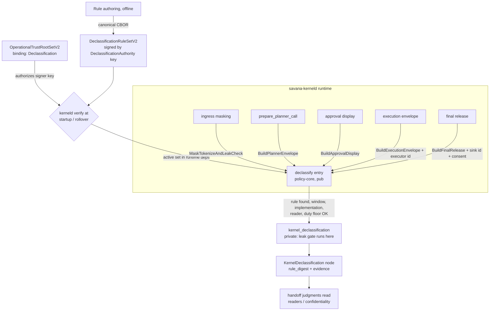

# Savana V2 Declassification: Signed Rules and the Gated Pipeline

Status: design proposal. This document specifies the signed declassification
rule surface and the wiring that routes every confidentiality widening through
`kernel_declassification`. It changes no code by itself.

Companion reading: `docs/protocol-v1.md` for the V1 byte-level conventions this
design mirrors (domain separation, canonical CBOR, fail-closed dispatch).

---

## 1. Problem statement

The V2 kernel has a fully built declassification door and no road that leads
through it. Every load-bearing piece exists and is individually correct:

| Piece | Where | State |
|---|---|---|
| Five declassification transitions with per-transition gate duty and target label | `crates/savana-policy-core/src/v2/provenance.rs:263-359` | complete |
| The constructor that runs the leak gate and mints a `KernelDeclassification` node | `provenance.rs:887` (`kernel_declassification`) | complete, **zero production callers** |
| The deterministic leak gate (blocklist + residual-PII duty) | `crates/savana-policy-core/src/v2/leak_gate.rs:61` (`enforce_for_declassification`) | complete, reachable **only** through the dead constructor |
| One shared definition of "sensitive" for masker and verifier | `crates/savana-leak-gate` (union of scanner + pattern table) | complete (commit `ed567d6`) |
| Null-binding refusal, exact-reader binding | `provenance.rs:908-936` | complete (commits `8543926`, `8b0de14`) |

The consequences, with evidence:

1. **`rule_digest` has no referent.** `kernel_declassification` takes
   `rule_digest`, `implementation_digest`, `token_set_digest`,
   `purpose_digest` as bare `Digest32V2` arguments. The only validation is
   the non-zero guard at `provenance.rs:908-918`. No signed declassification
   rule type exists anywhere in the workspace; nothing verifies that
   `rule_digest` names a rule someone actually signed. The words appear only
   inside `savana-policy-core` — no policy authoring, delivery, or
   verification surface exists.

2. **The masked agent view bypasses the gate.** In
   `crates/savana-kerneld/src/v2_runtime.rs`, ingress builds a
   `GatedIngress` provenance node for the raw value (`:263`,
   `from_verified_kernel_input`), then builds the masked view directly:
   `encode_masked_agent_view(&gated_input)` (`:274`) →
   `AgentViewV2::masked_text(...)` (`:359`) → vault record tagged
   `MASKED_AGENT_VIEW_RECORD_TAG_V2` → read back by the agent via
   `decode_persisted_agent_view` (`crates/savana-kerneld/src/v2_data_plane.rs:392`).
   No `KernelDeclassification` node is minted, no `leak_gate_digest` is
   recorded for the bytes the agent actually reads, and the
   `MaskTokenizeAndLeakCheck` transition is never instantiated outside tests.
   Masking itself is real (`savana-input-runtime` calls
   `savana_leak_gate::pii_spans` to find spans and substitutes placeholder
   tokens), but the result is *trusted by construction* rather than
   *verified at the boundary*.

3. **The planner envelope bypasses the gate.** `prepare_planner_call`
   (`crates/savana-kerneld/src/v2_agent_authority.rs:1728`) assembles a
   `PlannerEnvelopeV2` (`:1795`) from abstract slots and digests it under
   `PLANNER_ENVELOPE_DOMAIN` (`:1810`). No `BuildPlannerEnvelope`
   declassification is recorded.

4. **Two label dimensions are inert.** `SecurityLabelV2` carries
   `confidentiality` and `readers`
   (`crates/savana-policy-core/src/v2/labels.rs:256`), propagation is correct
   (join / intersect, `labels.rs:299-320`), but no judgment anywhere reads
   either dimension. Today the kernel is safe because *nothing ever widens*
   — safety by inertness, not safety by gated widening.

5. **Consent does not exist.** `EffectSetV2::FINAL_RELEASE` is defined
   (`labels.rs:200`) and `BuildFinalRelease` names an exact sink, but there
   is no representation of "the user approved this release, recently,
   for this purpose."

The design goal is the one the transition vocabulary already states: **every
confidentiality widening is a recorded transition, authorized by a signed
rule, verified by the in-kernel gate, naming the exact reader it releases
to.** This document specifies the missing rule surface and the five wiring
points, in dependency order.

## 2. Goals and non-goals

Goals:

- G-A: a signed, canonically encoded, hash-chained **declassification rule
  set** the kernel verifies against its operational trust root.
- G-B: a single **rule-checked kernel entry** through which all five
  transitions run; `kernel_declassification` stays private behind it.
- G-C: the **masked agent view** and **planner envelope** paths route through
  the entry (the two transitions that face a language model, hence carry the
  strictest duty).
- G-D: `readers` and `confidentiality` become **consulted** dimensions:
  handoff judgments refuse recipients outside a value's reader set, and
  envelope builders refuse values whose lineage lacks the matching
  declassification node.
- G-E: a **consent record** minted from the existing approval settlement
  flow, demanded by rule for `BuildFinalRelease`.

Non-goals:

- Changing the leak-gate corpus, pattern tables, or digest scheme.
- ML/NER recall improvements (§12 sketches the follow-on; it is orthogonal).
- V1 paths. Everything here is V2-only.
- Machine-code attestation of transformation binaries — that remains the
  deployment manifest's job (§6.3 explains the layering).

## 3. Design overview



Two authorities at two timescales gate the two halves of the risk:

- **Installer-time**: the signed rule set says which transitions are possible
  at all, under which purpose, performed by which implementation contract,
  released to which readers. It changes rarely and is hash-chained.
- **Runtime**: the leak gate proves the *content* property over the exact
  released bytes on every single transition, and (for final release) a fresh
  single-use consent proves the *user* wanted this one.

A rule can make a declassification possible; only the gate plus (where
demanded) consent make a particular one legitimate.

## 4. Authority chain: extending the operational trust root

The signer of rule sets is rooted exactly the way deployment and activation
signers already are (`crates/savana-policy-core/src/v2/deployment_operational_trust.rs`).

Additions:

- `OperationalTrustRootPurposeV2::DeclassificationAuthority = 5`.
- A third binding variant:

  ```rust
  OperationalTrustRootSetBindingV2::Declassification {
      declassification_trust_root_set_digest: Digest32V2,
  }
  ```

  with member-set domain `savana.set.declassification-trust-root.v2\0` and
  binding tag `3`. A separate binding — rather than piggybacking members
  onto the Deployment or Activation sets — preserves the existing
  `validate_payload` invariant that a binding constrains its members'
  purposes (`deployment_operational_trust.rs:528-546`): a Declassification
  set must contain *only* `DeclassificationAuthority` members, at least one.
- A `ClosedSecurityDomainV2::DeclassificationTrustRootSet` variant so
  `matches_versioned_identity` (`deployment_operational_trust.rs:343`)
  covers the new binding.

Everything else — key epochs, per-member validity windows nested inside the
set window, sort/dedup by `(purpose, key_id, epoch)`, predecessor chaining
via `validate_predecessor`, canonical re-encode check — is inherited
unchanged. The `authorizes(purpose, key_id, key_epoch, at)` predicate
(`deployment_operational_trust.rs:368`) works as-is for the new purpose.

Delivery: the Declassification trust root set and the rule set ride the same
vehicle as the existing trust root sets (deployment manifest / activation
flow — see open question O1). A deployment that ships neither gets a kernel
in which **no declassification is possible**: ingress masking fails closed
and no agent view is ever produced. That is the intended default for a
security kernel, not an error state to paper over.

## 5. Wire object: `DeclassificationRuleSetV2`

Mirror of `OperationalTrustRootSetV2`, same three-layer encoding:

```text
complete  = array(3) [ payload, payload_digest, authority_signature ]
payload   = array(8) [
    schema_version:          u16      = 1,
    product_family_digest:   bytes32,
    rule_set_sequence:       u64      (>= 1),
    previous_signed_digest:  option   (array(1)[0] | array(2)[1, bytes32]),
    rules:                   array of DeclassificationRuleV2 (§6),
    not_before_unix_ms:      u64,
    not_after_unix_ms:       u64,
    trust_root_set_digest:   bytes32,
]
```

Domains (all new, all NUL-terminated following the existing convention):

| Purpose | Domain string |
|---|---|
| payload digest | `savana.declassification-rule-set.v2.payload\0` |
| signed digest | `savana.declassification-rule-set.v2.signed\0` |
| signature | `savana.declassification-rule-set.v2.signature\0` |
| per-rule digest | `savana.declassification-rule.v2\0` |
| purpose string digest | `savana.declassification-purpose.v2\0` |

Signature: `ManifestDomainSignatureV2` with a fresh signature tag (next
unassigned; `OPERATIONAL_ROOT_SIGNATURE_TAG_V2 = 28`, so presumptively `29` —
confirm against the tag registry at implementation time, see O5). The signer
key must satisfy
`root_set.authorizes(DeclassificationAuthority, key_id, epoch, now)` where
`root_set` is the Declassification-bound operational trust root whose
`signed_digest` equals the payload's `trust_root_set_digest` field. Binding
the authorizing root set digest *into* the signed payload pins which root
generation the rule set claims descent from — a rule set cannot be replayed
under a later, differently-membered root without failing this check.

Validation on `from_canonical_bytes` (same shape as
`deployment_operational_trust.rs:179-214` and `:496-554`):

- object size ≤ existing manifest object bound; canonical re-encode equality;
  EOF exactness.
- non-zero `product_family_digest`; `sequence == 1 ⇔ previous is None`;
  non-zero previous digest when present; `not_before < not_after`.
- `rules` non-empty, `len ≤ DeploymentHardLimitsV2::compiled().max_declassification_rules()`
  (new limit; proposed 64), strictly sorted by `(transition_tag, purpose_digest)`,
  no duplicate `(transition_tag, purpose_digest)` pair, every rule window
  nested inside the set window.
- payload digest match, then signature verification, in that order.

Chaining: `validate_predecessor` identical to the trust-root version —
`sequence + 1`, previous signed digest equality, same product family. The
chain is the revocation mechanism: to revoke a rule, publish a successor set
without it. There is no per-rule revocation object; the set is small and
atomic replacement is simpler to reason about than tombstones.

Struct fields stay private; the only constructor is
`from_canonical_bytes(bytes, root_set, now)`. As with the trust root set,
**possessing a value of this type is proof of verification** — the
rule-checked entry (§7) takes `&DeclassificationRuleSetV2` and needs no
further signature logic.

## 6. Per-rule object: `DeclassificationRuleV2`

```text
rule = array(8) [
    transition_tag:         u16          (1..=5, the DeclassificationTransitionV2 tags),
    purpose_digest:         bytes32      (hash_domain(purpose-domain, canonical purpose string)),
    implementation_digest:  bytes32      (§6.3),
    duty_floor:             u16          (LeakGateDutyV2 tag; §6.2),
    reader_constraint:      option       (§6.1),
    consent_requirement:    option       (§6.4; present only for tag 5),
    not_before_unix_ms:     u64,
    not_after_unix_ms:      u64,
]
rule_digest = hash_domain("savana.declassification-rule.v2\0", canonical rule bytes)
```

`rule_digest` is not a wire field — it is derived, exactly like the private
registry identity in V1 (`docs/protocol-v1.md`). It is the digest that flows
into `SourceKindV2::KernelDeclassification { rule_digest }` and the node's
evidence vector, giving the existing parameter its referent at last.

### 6.1 Reader constraint

- Tags 1–3 (`MaskTokenizeAndLeakCheck`, `BuildPlannerEnvelope`,
  `BuildApprovalDisplay`): the target reader class is already fixed by
  `transition.target()` (`provenance.rs:321-339`) and the transition names no
  individual. `reader_constraint` MUST be absent (`array(1)[0]`); a rule
  cannot widen a class transition into naming readers it does not have.
- Tags 4–5 (`BuildExecutionEnvelope`, `BuildFinalRelease`):
  `reader_constraint` MUST be present: `array(2)[1, identities]` where
  `identities` is a non-empty, strictly sorted, deduplicated array of
  `bytes32` identity digests, `len ≤ max_rule_readers()` (new hard limit;
  proposed 16). The entry checks
  `transition.exact_reader_identity() ∈ identities`. An empty list is
  invalid at decode: a rule that names nobody authorizes nothing — the same
  principle as the null-binding refusal at `provenance.rs:908-918`, now one
  layer up.

### 6.2 Duty floor

`leak_gate_duty()` at `provenance.rs:310` stays exactly as it is and becomes
the **floor**. The effective duty is:

```text
effective_duty = strictest_of(transition.leak_gate_duty(), rule.duty_floor)
```

A rule may tighten (e.g. force `BlocklistAndNoResidualPii` on an approval
display in a deployment that never wants raw PII on screen); no rule content
can ever drop the LLM-facing transitions below `BlocklistAndNoResidualPii`,
because the hardcoded map is consulted regardless of what the rule says.
Defense in depth: a compromised rule-signing key cannot buy a weaker gate,
only a narrower or wider *possibility* space.

To keep "caller asserts nothing" intact, the private constructor computes the
effective duty itself: `kernel_declassification` gains a
`duty_floor: LeakGateDutyV2` parameter and internally runs
`enforce_for_declassification(value, strictest_of(transition.leak_gate_duty(), duty_floor))`
at `provenance.rs:919`. The duty is never passed in pre-resolved.

### 6.3 Implementation identity

`implementation_digest` pins the **transformation contract**, not machine
code:

```text
implementation_digest = hash_domain(
    "savana.declassification-implementation.v2\0",
    transition_tag || contract_version:u16 || contract_inputs
)
```

where `contract_inputs` is per-transition; for `MaskTokenizeAndLeakCheck` it
is `savana-leak-gate`'s `pattern_set_digest` (already computed and folded
into `leak_gate_digest` today) plus the masking algorithm version. Each
in-kernel transformation exports its compiled identity as a constant; the
entry compares the rule's `implementation_digest` against it and refuses on
mismatch.

Layering, stated plainly: this digest binds *which contract* (pattern set,
algorithm revision) the rule authorizes — so a pattern-table change without a
rule update is a refused declassification, loudly. Binding *which machine
code* runs is already the deployment manifest's job
(`deployment_manifest_claim.rs` signs binaries and projections). The rule
does not duplicate that; two mechanisms, two failure domains.

### 6.4 Consent requirement (tag 5 only)

```text
consent_requirement = array(1)[0]                       — none
                    | array(2)[1, max_age_unix_ms:u64]  — required, fresh within max_age
```

Present ⇒ the entry demands a matching, unconsumed `ConsentRecordV2` (§10)
no older than `max_age_unix_ms` (proposed default: 300 000 = 5 minutes).
MUST be absent for tags 1–4: consent is an egress concept; demanding it
mid-pipeline would train users to click through.

## 7. The rule-checked kernel entry

One new public function in `savana-policy-core`, the *only* road to the door:

```rust
impl ProvenanceRecordV2 {
    pub fn declassify(
        value: &KernelValueV2,
        context: ProvenanceContextV2,
        transition: DeclassificationTransitionV2,
        rule_set: &DeclassificationRuleSetV2,
        purpose_digest: Digest32V2,
        token_set_digest: Digest32V2,
        consent: Option<&ConsentRecordV2>,   // stage 5; earlier stages: None
        parents: &[&Self],
        policy_allowed_effects: EffectSetV2,
        at_unix_ms: u64,
    ) -> Result<Self, G3Error>;
}
```

Check order (each failure a distinct error, all fail-closed):

1. `rule_set` window contains `at_unix_ms` — `RuleSetExpired`.
2. Lookup by `(transition.tag(), purpose_digest)` — `NoAuthorizingRule`.
3. Rule window contains `at_unix_ms` — `RuleExpired`.
4. `rule.implementation_digest == compiled identity for transition` —
   `ImplementationMismatch`.
5. Tags 4–5: `transition.exact_reader_identity() ∈ rule.readers` —
   `ReaderNotAuthorized`. (The all-zero identity was already refused at
   `provenance.rs:931-934`; that guard stays.)
6. Tag 5 with consent required: consent present, matching (§10.3), fresh,
   unconsumed — `ConsentMissing` / `ConsentExpired` / `ConsentScopeMismatch`
   / `ConsentConsumed`.
7. Call the **private** `kernel_declassification` with
   `rule.rule_digest()`, `rule.implementation_digest`, `token_set_digest`,
   `purpose_digest`, `rule.duty_floor` — the gate runs there, on the exact
   bytes, as today (`provenance.rs:919`), and the non-zero guards stay as a
   second line.

New `G3Error` variants: `RuleSetExpired`, `NoAuthorizingRule`, `RuleExpired`,
`ImplementationMismatch`, `ReaderNotAuthorized`, `ConsentMissing`,
`ConsentExpired`, `ConsentScopeMismatch`, `ConsentConsumed`. Distinct
variants, not overloads of `BindingMismatch`: an operator debugging a refused
release must be able to tell "no rule" from "stale consent" without a
debugger.

Two properties this preserves:

- **Unskippable**: `kernel_declassification` stays private
  (`provenance.rs:887`); `declassify` requires a `&DeclassificationRuleSetV2`,
  which can only exist post-verification (§5). There is no API through which
  a caller can mint a `KernelDeclassification` node from asserted digests.
- **Replayable (G5)**: every input to every check is explicit — value bytes,
  rule set bytes, clock. No ambient state; the decision replays bit-exact.

## 8. Wiring point A: the masked agent view

Anchor: `crates/savana-kerneld/src/v2_runtime.rs`.

Today:

```text
:263  provenance = from_verified_kernel_input(...)        → GatedIngress node (raw value)
:274  masked_agent_view = encode_masked_agent_view(&gated_input)
:359  AgentViewV2::masked_text(text, placeholders)         → exact agent-visible bytes
      → vault record MASKED_AGENT_VIEW_RECORD_TAG_V2
      → v2_data_plane.rs:392 decode_persisted_agent_view   → agent reads it back
```

Target:

```text
:263  GatedIngress node for the raw value            (unchanged — the parent)
      masking runs                                    (unchanged — input-runtime, pii_spans)
NEW   masked_node = declassify(
          masked_value,                               // digest of the exact :359 bytes
          MaskTokenizeAndLeakCheck,
          &active_rule_set,
          PURPOSE_AGENT_INGRESS_MASKING,
          token_set_digest,                           // §8.1
          None,
          &[&ingress_node],
          effects, now)
      → gate re-verifies the masked bytes (BlocklistAndNoResidualPii)
      → node label: (AgentMasked, AGENT) from transition.target()
      persist node digest WITH the masked-view vault record
      → read-back at v2_data_plane.rs:392 returns the view bound to its node
```

### 8.1 `token_set_digest`

The "Tokenize" in the transition name, finally bound: the canonical digest of
the placeholder → vault-handle substitution set masking produced (sorted by
placeholder, domain-hashed). The node then attests not only "residual-PII
free" but *which* substitutions map the masked view back to vault-bound
originals. Any later unmasking step must present the same set digest.

### 8.2 Failure semantics — the drift tripwire

Since `ed567d6`, masker and verifier share one definition
(`savana-leak-gate`: `pii_spans` is the union of scanner and pattern table;
the gate's duty checks the same corpus), so the gate passing over masked
output is guaranteed **by construction** — the differential corpus (2 030
vectors) asserts the implication `masked(x) ⇒ gate_passes(masked(x))`.
Routing through the gate therefore costs no false blocks today. What it buys:
if the two ever drift again (a pattern added to one side, a scanner change),
the gate refuses, ingress fails closed, and the drift is a loud production
error instead of a silent leak. Refusal handling: the ingress request errors;
no partial agent view, no vault record, nothing for the agent to read.

### 8.3 Read-back binding

The vault record gains the node digest so
`decode_persisted_agent_view` can return the view *and* its declassification
evidence together. What the agent reads is then provably the bytes the gate
passed — closing the residual gap where a vault record could in principle be
written outside the checked path.

## 9. Wiring point B: the planner envelope

Anchor: `crates/savana-kerneld/src/v2_agent_authority.rs:1728`
(`prepare_planner_call`).

The envelope is already *structurally* confidentiality-preserving: prompt
values enter as abstract slots
(`PlannerAbstractSlotV2`, `PlannerSlotConfidentialityV2::ConfidentialAbstract`,
`:1763-1771`) — opaque slot references, never raw bytes; the envelope's other
fields are enums, limits, and nonces (`:1795-1806`). The declassification
here is of *shape*, VaultBound → PlannerAbstract: slot count, cardinalities,
kinds, template id, intent kind, route.

Wiring: after assembly and before ticket minting, run

```text
declassify(envelope_canonical_bytes, BuildPlannerEnvelope, &active_rule_set,
           PURPOSE_PLANNER_CALL, slot_binding_set_digest, None,
           parents = nodes of all prompt_values, effects, now)
```

with `token_set_digest` := digest of the sorted slot-binding set (slot ref →
value handle, `:1783-1789` already builds exactly this list). Bind the
resulting node digest into the `PlannerTicketRecordV2` (`:1818`) next to
`envelope_digest`.

Why gate bytes that today contain no free text: **this is the covert-channel
tripwire.** The envelope is precisely where smuggled content would ride if
any field ever grows free text (a template body, a guidance string — two
`Vec::new()` placeholders sit at `:1799` and `:1801` today). The gate over
canonical envelope bytes is nearly free now and refuses the day someone adds
a text field that can carry blocklisted content or PII. The duty is
`BlocklistAndNoResidualPii` (LLM-facing, `provenance.rs:312`), the strictest
— correct for the one artifact that leaves for an external model.

Parents: the prompt values' provenance nodes, so the planner envelope's
lineage records exactly which vault values shaped it, and
`derive`-style reader narrowing applies to anything later built from the
planner's answer.

## 10. Wiring points C–E, and consent

### 10.1 C: approval display (`BuildApprovalDisplay`)

Same pattern as §8: the display artifact rendered for the human approver is
declassified under a rule with purpose `PURPOSE_APPROVAL_DISPLAY`, duty floor
`BlocklistOnly` (the human must see real values to approve meaningfully —
`provenance.rs:315-317`; a deployment may tighten via §6.2). The node digest
is bound into the approval envelope so the settlement (§10.3) can prove
*what was shown* when consent is later checked. Anchor: the approval
envelope flow already present in `v2_agent_authority.rs`
(`SignedApprovalEnvelopeV2` / `UnsignedApprovalEnvelopeV2` imports, `:37-42`).

### 10.2 D: execution envelope (`BuildExecutionEnvelope`)

The executor handoff declassifies with the exact executor identity digest in
the transition (`provenance.rs:273-275`), checked against the rule's reader
allowlist (§6.1). Identity source: the platform identity the kernel already
holds for the executor connection (`savana-platform-identity` /
`ServiceIdentityV2` — the same identity `verify_agent_caller`-style checks
use). Duty `BlocklistOnly`. The sealed execution envelope
(`SealedExecutionEnvelopePayloadV2`) carries the node digest.

### 10.3 E: final release (`BuildFinalRelease`) and `ConsentRecordV2`

The egress transition demands both authorities (§3): a rule whose reader
allowlist contains the sink, **and** — when the rule says so, which for
`FINAL_RELEASE` effects it always should — a fresh consent record.

```text
ConsentRecordV2 (kernel-minted, vault-persisted, single-use):
    consent_id:                  nonce32
    run:                         run identity
    purpose_digest:              bytes32   — must equal the rule lookup purpose
    sink_identity_digest:        bytes32   — must equal transition.exact_reader_identity()
    token_set_digest:            bytes32   — scope: which substitution set / values were approved
    approval_display_node_digest bytes32   — §10.1: what the human actually saw
    approval_settlement_digest:  bytes32   — the signed settlement that closed the round-trip
    granted_at_unix_ms:          u64
    consumed:                    bool      — flipped atomically with dispatch
```

Minting: only upon a verified approval settlement (the existing
`SignedUiAuthenticationSettlementV2`-style round-trip). Consent is
kernel-internal state derived from a signed human action — it needs no new
signature domain of its own in stage 5; its integrity rides on the vault and
the settlement digest it embeds (see O3 for the alternative).

Matching at `declassify` (§7 step 6): equal `purpose_digest`, equal
`sink_identity_digest`, `token_set_digest` scope match, age ≤ rule's
`max_age`, `consumed == false`. Consumption flips in the same vault
transaction that journals the release dispatch — a crash between consume and
send burns the consent (user re-approves) rather than ever double-sending.
Single-use is deliberate: replaying one "yes" into two releases is the exact
attack consent exists to stop.

## 11. Making `readers` and `confidentiality` load-bearing

Two enforcement points, both cheap, both three-valued per the G5 convention
(`585539b`):

1. **Handoff judgment.** Wherever the kernel hands a value to a recipient
   (agent view read-back, planner call, approval display, executor dispatch,
   release), a new validator fact evaluates:
   `recipient_class ⊆ value.label().readers()` — and for tags 4–5, the
   recipient's identity digest equals the one bound in the value's
   declassification node. Verdicts: `Admits` / `Refuses` /
   `Unproven` (missing label ⇒ `Unproven` ⇒ refuse, fail-closed).
   `ReaderSetV2::contains` (`labels.rs:149`) is the whole predicate.

2. **Envelope lineage check.** Each envelope builder accepts only values
   whose provenance head is `SourceKindV2::KernelDeclassification` with the
   transition matching the envelope kind (agent view ⇐ tag 1's target
   `(AgentMasked, AGENT)`, planner ⇐ tag 2, …), verified by walking the
   node, not by trusting the label alone. This is the structural guarantee
   that the bypass of §1.2–1.3 cannot be reintroduced: an un-declassified
   value is not just *mislabeled* for an envelope — it is *unusable* in one.

Propagation stays untouched: `derive_normal` already narrows readers by
intersection and joins confidentiality upward (`labels.rs:299-320`); the
`UNTRUSTED_EFFECT_CEILING_V2` re-application after join (`labels.rs:318`)
already prevents effect laundering. These laws were always correct — they
simply now have a consumer.

## 12. Deferred follow-on: detection recall (NER)

Out of scope here, sketched so the rule surface anticipates it: a measured
worker (ONNX NER, as in the legacy system) may **propose** spans to mask.
Proposals only ever *add* masking — the deterministic union
(`pii_spans`) remains the floor, the gate remains the sole decider, and the
worker's output is `ExternalUntrusted` so it can authorize nothing
(`labels.rs:273`). Because §6.3 pins the masking contract by
`pattern_set_digest` + algorithm version, adding a proposal source bumps the
contract version and therefore requires a rule update — recall improvements
become visible, signed policy changes, not silent behavior drift. No changes
to this design are needed to accommodate it later.

## 13. Compatibility and encoding impact

- `SourceKindV2::KernelDeclassification { rule_digest }` — tag 7, `array(2)`
  (`provenance.rs:447-450`, `:493-495`) — **unchanged**. The richer binding
  (implementation, leak gate, token set, purpose, reader) already lives in
  the node's evidence vector (`provenance.rs:920-936`). No store migration.
  Locating the full rule from a historical node is possible because rule
  sets are hash-chained and durable: search the chain for the set containing
  `rule_digest`.
- New wire objects: `DeclassificationRuleSetV2` (+ trust-root binding variant
  and purpose). New `ClosedSecurityDomainV2` variant. New signature tag.
  New hard limits: `max_declassification_rules` (64),
  `max_rule_readers` (16). All additive.
- `kernel_declassification` signature gains `duty_floor` (private fn —
  no API break).
- New `G3Error` variants (§7) — additive to a `#[non_exhaustive]`-style
  match discipline; audit existing exhaustive matches on `G3Error` when
  implementing.
- No V1 impact; no `savana-kernel-protocol` message changes until stage 2
  touches the vault record layout for the agent view (one tagged field
  addition, versioned by the record tag).

## 14. Invariants and failure model

Testable properties, numbered for traceability into the test plan:

- **I1 — Unskippable gate** *(exists, preserved)*: no code path constructs a
  `KernelDeclassification` node without `enforce_for_declassification`
  running over the exact released bytes inside the constructor.
- **I2 — No unauthorized rule** *(new)*: every minted node's `rule_digest`
  names a rule inside a signature-verified, window-valid, chain-valid set
  whose signer the operational trust root authorizes for
  `DeclassificationAuthority`.
- **I3 — Duty floor** *(new)*: effective gate duty is never below
  `transition.leak_gate_duty()`, for any rule content whatsoever.
- **I4 — Exact reader** *(extends `8b0de14`)*: for tags 4–5, the released-to
  identity is non-zero, bound in the node, and a member of the rule's
  allowlist.
- **I5 — Null refusal** *(extends `8543926`)*: zero digests, empty rule
  sets, empty reader lists, absent-where-required and
  present-where-forbidden options are all construction/decode errors.
- **I6 — Reader judgment** *(new)*: no handoff to a recipient outside the
  value's reader set; unproven labels refuse.
- **I7 — Consent** *(new)*: no `BuildFinalRelease` under a consent-requiring
  rule without a fresh, matching, unconsumed consent; consumption is atomic
  with dispatch; a consent never authorizes two releases.
- **I8 — Fail closed** *(new)*: missing/expired/invalid rule set ⇒
  `declassify` refuses ⇒ no agent view, no planner call, no release. The
  kernel runs; nothing widens.

Failure-mode table (each row a distinct error and at least one test):

| # | Condition | Error | Effect |
|---|---|---|---|
| F1 | rule set signature invalid / signer not in root / wrong purpose | `InvalidDeclassificationRuleSet` (decode-time) | set never constructed |
| F2 | canonical re-encode mismatch (any mutated byte) | same | set never constructed |
| F3 | sequence gap, fork, wrong previous digest, family mismatch | same (`validate_predecessor`) | successor rejected, prior set stays active until its window ends |
| F4 | set/rule window excludes `now` | `RuleSetExpired` / `RuleExpired` | refuse |
| F5 | no rule for `(transition, purpose)` | `NoAuthorizingRule` | refuse |
| F6 | implementation contract drift | `ImplementationMismatch` | refuse — pattern-set change without rule update is loud |
| F7 | executor/sink not in allowlist | `ReaderNotAuthorized` | refuse |
| F8 | blocklisted content / residual PII in released bytes | `LeakGateBlockedContent` / `LeakGateResidualPii` | refuse (existing errors, `labels.rs:205-208`) |
| F9 | consent absent / stale / scope mismatch / already consumed | `Consent*` | refuse; user re-approves |
| F10 | recipient outside reader set at handoff | validator `Refuses` | handoff denied |
| F11 | value without matching declassification node offered to an envelope | lineage check fails | envelope construction denied |

## 15. Test plan

- **policy-core, rule objects**: CBOR round-trip; canonicality (single-byte
  mutation ⇒ F2); chain suite (genesis, happy succession, gap, fork, replay
  of an older set as successor — F3); window nesting; sort/dedup violations;
  reader-constraint presence rules per tag; limits.
- **policy-core, entry**: pairwise authorize matrix over
  {right/wrong transition} × {right/wrong purpose} × {valid/expired} ×
  {matching/mismatched implementation} × {member/non-member reader} —
  refusals map to exactly one error each; happy path per transition mints a
  node whose evidence vector equals the rule's digests; I3 property test —
  random rules never lower the duty for tags 1–2.
- **leak-gate differential** *(exists, extend)*: corpus implication
  `masked ⇒ gate-passes` re-asserted through `declassify` end-to-end rather
  than through `enforce_for_declassification` directly.
- **kerneld integration**: masked view read-back carries a node digest whose
  transition is tag 1 (§8.3); gate refusal ⇒ ingress error and *no* vault
  record; planner ticket records the node digest (§9); rule set absent ⇒ I8
  behavior (agent view request fails closed).
- **attack rows** (extend `policy_attack_matrix`): forged rule-set signature;
  rule set signed by a Deployment-purpose key; stale predecessor replay;
  consent replay across two releases; consent for sink A presented for
  sink B.
- **G5 replay**: a recorded declassification decision replays bit-exact from
  (value bytes, rule set bytes, clock) — no ambient inputs.

## 16. Staged delivery

Five stages, each independently shippable, tests green at every boundary:

| Stage | Content | Behavior change |
|---|---|---|
| S1 | Trust-root extension + `DeclassificationRuleSetV2`/`RuleV2` + `declassify` entry + all §15 policy-core tests | none (no callers) |
| S2 | kerneld loads/verifies the set at startup+rollover; masking routed (§8); vault record binding | ingress fails closed without a valid rule set |
| S3 | planner envelope routed (§9) | planner calls fail closed without their rule |
| S4 | reader-dimension facts + envelope lineage checks (§11) | mislabeled/unlabeled handoffs refuse |
| S5 | approval display routed + `ConsentRecordV2` + final release (§10) | egress demands consent |

S1 is pure addition and can merge immediately after review. S2 is the first
stage with operational impact and needs a rule set authored for the dev
deployment before it lands.

## 17. Open questions

- **O1 — Delivery vehicle**: rule set as a deployment-manifest item (rides
  `deployment_manifest_claim` like projections) vs. an activation-time
  object (rides the activation flow like the activation trust roots).
  Recommendation: manifest item — rules change with releases, not with
  installations. Decide before S2.
- **O2 — Purpose vocabulary**: closed enum in code (digest derived from the
  canonical name) vs. open strings. Recommendation: closed enum initially —
  three purposes suffice for S2–S3 (`agent-ingress-masking`,
  `planner-call`, `approval-display`); open strings invite unreviewable
  proliferation.
- **O3 — Consent signature**: §10.3 keeps consent kernel-internal (vault +
  settlement digest). Alternative: a fully signed consent object under its
  own domain, verifiable outside the kernel. Recommendation: internal for
  S5; revisit if an external auditor needs standalone consent proofs.
- **O4 — Consent freshness default**: proposed 300 s. Product decision.
- **O5 — Registry assignments**: signature tag (presumptively 29), binding
  tag 3, purpose 5, `ClosedSecurityDomainV2` variant value, hard-limit
  numbers (64 rules / 16 readers). Assign against the authoritative
  registries at S1 implementation time.
- **O6 — Approval-display duty**: floor stays `BlocklistOnly` (human needs
  real values); should the default *rule* for approval display tighten it in
  privacy-sensitive deployments? Deployment-specific; the mechanism (§6.2)
  supports either.

---

*Every file:line reference in this document was verified against the working
tree at commit `ed567d6` on `claude/security-capabilities-assessment-06bjbl`.*
