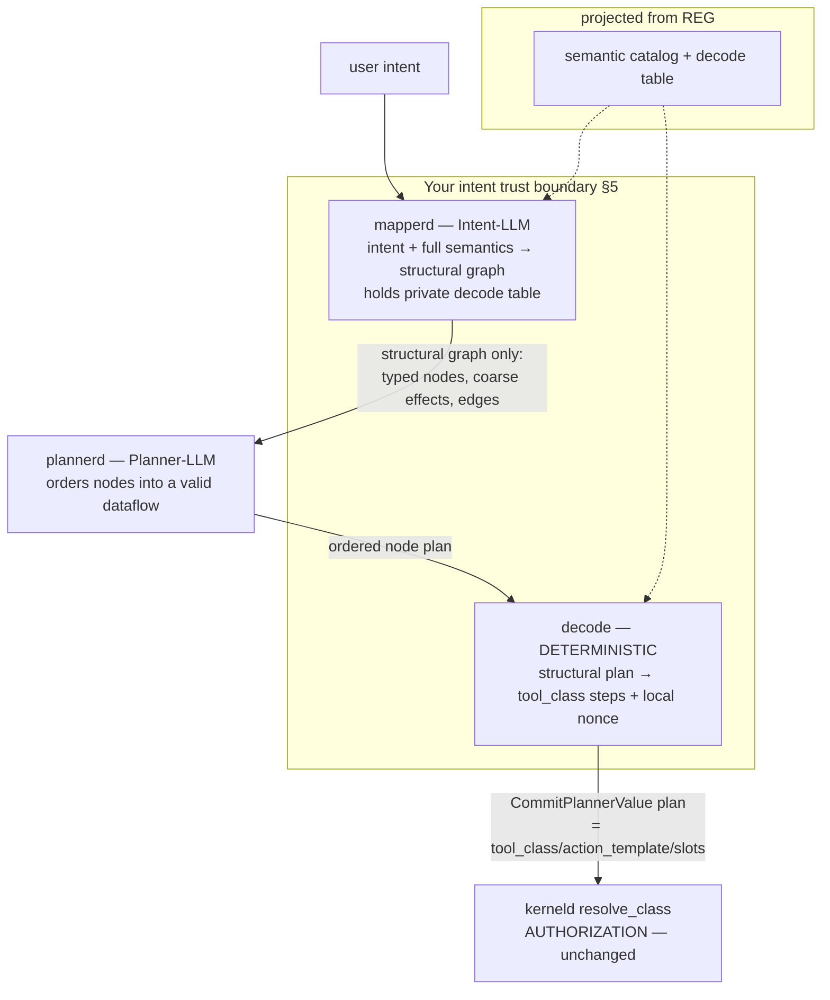

# Savana V2 Planner Privacy: Value, Shape, and Intent

Status: implemented, v1.2 (2026-08-02). `savana-agentd` withholds data
**values**, business semantics, reusable tool identifiers, and **intent** from
an untrusted structural planner without changing the kernel. The remote
planner necessarily observes the closed graph's structural-shape floor: node
count, coarse roles/effects, and topology.

The implemented deployment separates TLS identity from network routing. Each
model endpoint has a DNS-form server name used only for SNI/SAN/HTTP Host and a
signed bounded canonical connect-address list used for transport. Agentd has
no DNS fallback. Linux additionally derives a mandatory fail-closed systemd
drop-in from those lists: the base service denies all IP traffic, while the
root-owned generated drop-in permits exactly the measured unique IPs. Ports
and identities remain closed by typed endpoint configuration and SPKI-pinned
mTLS.

v1.1: O2 resolved — the intent trust boundary (§5) is **user-configured,
within a deployment ceiling, fail-safe to private**.
v1.2: O3 resolved — `structural_role` is **signed into the descriptor**
(§10), like `effect_class`.

Companion reading: `docs/connector-registration-v2.md` (*REG*, the connector
registry this design projects its semantic catalog from), and the current
planner path in `crates/savana-kerneld/src/v2_agent_authority.rs`
(`prepare_planner_call` / `commit_planner_value`) and
`crates/savana-agentd/src/planner_client.rs`.

---

## 1. Problem statement

The kernel already protects data **values**: ingress masking seals real values
in the vault and hands the model placeholders, and every effect is
kernel-authorized regardless of what the model proposes. But a system that
uses a remote planning model leaks two things the value-masking never touches:

- **Shape** — the structure of the plan: how many steps, which capability
  classes, in what dataflow order, to which kinds of sink. Even with every
  value masked, "query a data source → rank → draft → send to an external
  sink" is a recognizable operational fingerprint.
- **Intent** — what the user is actually trying to do. To plan at all, a model
  must understand the task; "retain churning high-value customers" is intent,
  and it lives in the task's verbs, not in the data values a masker redacts.

These are three independent leakage layers, ordered by how far upstream they
sit and how hard they are to hide:

| Layer | What it is | Hidden by |
|---|---|---|
| Value | names, emails, account numbers | masking + vault (kernel, **enforced today**) |
| Shape | the plan's structure/topology | de-semanticized planning (§4) |
| Intent | what the user wants done | keeping intent-understanding in a trusted domain (§5) |

The CaMeL line of work protects values (the quarantined-LLM pattern) and
assumes the privileged planner is trusted with intent. This document addresses
the two layers above that: it withholds shape from the remote planner
structurally, and makes intent exposure an explicit, configurable trust-domain
decision.

An information-theoretic floor bounds what is possible and is stated up front
so the design does not over-promise: **whoever produces the plan learns its
shape.** A model cannot order steps it understands nothing about; the signal
it needs to plan *is* the shape. Shape can be de-*semanticized* (the planner
learns "a source feeds a transform feeds a sink" without learning "customer DB
feeds ranker feeds CRM"), but it cannot be hidden from the planner outright.
Hiding shape entirely requires not letting the remote model plan — template
selection or local planning — which §7 notes but does not pursue.

## 2. Goals and non-goals

Goals:

- G-A: the remote planner reasons over a **structural graph** — typed
  dataflow nodes with coarse capability classes — never over domain semantics
  or concrete tool identifiers.
- G-B: intent exposure is a single explicit knob (§5), not an accident of
  deployment.
- G-C: the security-relevant mapping (abstract plan → concrete authorized
  tools) is **deterministic**, never performed by a model.
- G-D: **no kernel change.** The whole design lives agentd-side; the kernel
  sees the same `CommitPlannerValue` it sees today.
- G-E: the semantic catalog the design needs is a **projection of connector
  registration** (*REG*), not a separately maintained artifact.

Non-goals:

- Hiding shape from the planner outright (the §1 floor). Out of scope; noted
  in §7.
- Protecting values — that is the kernel's existing job, unchanged and assumed.
- Changing what the kernel authorizes. Authorization is orthogonal to privacy
  and untouched (§8).

## 3. Architecture: three stages, two of them models

Today `agentd` sends the kernel's planner envelope verbatim to the remote
model (`planner_client.rs:93`, `minicbor::to_vec(envelope)`). This design
splits that into three agentd-side stages:



| Stage | Model? | Trust domain | Holds |
|---|---|---|---|
| ① mapperd | **LLM** (Intent) | yours (§5) | user intent, full semantic catalog, private decode table |
| ② plannerd | **LLM** (Planner) | may be third-party | only the structural graph |
| ③ decode | **NO — deterministic** | yours | the decode table (node_id → tool_class) |
| ④ resolve_class | no — kernel | kernel (TCB) | authorization (existing) |

The two roles that need intelligence are ① (understand intent, choose and
structure capabilities) and ② (order a graph). The role that maps the abstract
plan back to concrete authorized tools is **③, and it must not be a model**:
an LLM decoder can hallucinate a different tool, which is a security defect.
Determinism here is not an optimization — it is a safety requirement. The
kernel already performs the final half of this deterministically
(`resolve_class`, §8).

## 4. The structural graph (all the remote planner ever sees)

A domain-free node vocabulary, closed by construction so no free text can
smuggle semantics across:

```text
StructuralNode {
    node_id:      fresh session-scoped label   (NOT tool_class; re-minted per run — §6 I3)
    role:         SOURCE | TRANSFORM | SINK      (dataflow position)
    effect_class: READ | SEND | EXECUTE | FINAL_RELEASE   (reuse EffectSetV2 — coarse)
    in_arity, out_arity: u8
}
StructuralEdge { from: node_id, to: node_id }   (data dependency)
```

- `role` lets the planner order steps (sources before consumers, sink last).
- `effect_class` is the existing coarse `EffectSetV2` — it tells the planner a
  sink is an egress without naming the business. It is the shape-privacy knob:
  coarser hints → blinder planner → less leakage, at some planning-quality
  cost (§6 I2).
- `node_id` is a fresh per-run label, deliberately **not** the `tool_class`, so
  the planner cannot fingerprint tools across sessions.

What the remote planner receives, end to end, for the running example
(retain churning high-value customers, draft, send to CRM):

```json
{ "nodes": [
    { "id": "n1", "role": "SOURCE",    "effect": "READ", "out": 1 },
    { "id": "n2", "role": "TRANSFORM", "effect": "READ", "in": 1, "out": 1 },
    { "id": "n3", "role": "TRANSFORM", "effect": "READ", "in": 1, "out": 1 },
    { "id": "n4", "role": "SINK",      "effect": "SEND", "in": 1 } ],
  "goal": "order into a valid dataflow" }
```

It returns `n1→n2→n3→n4`. It never learns that n1 is a customer database, n4 a
CRM, or that any of this is customer retention. It plans a shape it cannot
read.

## 5. Intent trust boundary: mapperd placement is the knob

mapperd is the only component that holds the original intent and the full
semantic catalog. **Where it runs is not a deployment-convenience setting — it
is the intent-privacy switch**, and must be named as such in config and UI:
call it the *intent trust boundary*, not "mapperd location".

"Local vs remote" is the wrong axis; the right axis is *which trust domain*.
Your own cloud GPU or a TEE is network-remote but trust-local. What matters is
whether the entity running mapperd is trusted with your intent.

Crucially, **value protection is independent of this knob** — the kernel
enforces it regardless. Only shape and intent depend on mapperd's placement:

| mapperd runs in | Value | Shape | Intent |
|---|---|---|---|
| your trust domain (local / your cloud / TEE) | ✅ kernel | ✅ structural | ✅ stays in domain |
| a third party | ✅ kernel | ❌ leaks to that party | ❌ leaks to that party |
| same third party as plannerd | ✅ kernel | ❌ | ❌ (collapses to today's single-remote planner) |

Two guardrails when mapperd is placed remotely-in-your-domain:

- The **decode table** (node_id → tool_class) and the **rich semantic
  descriptions** should stay as local as possible — if the codebook is remote
  too, the structural layer's protection weakens.
- "Remote" must mean *your* remote (your cloud / TEE), never a third-party API,
  if intent privacy is a goal.

Setting the boundary to a third party is a legitimate choice — it is exactly
the "intent is not the secret" position: you keep kernel-enforced value
protection and concede shape/intent for simplicity. The knob makes that
concession explicit rather than accidental.

### 5.1 Who sets it (resolves O2): the end user, within a deployment ceiling

The intent trust boundary is configured by the **end user**, not fixed by the
deployment — it is the user's intent, and theirs to trade. Three properties
make this safe and non-leaky:

- **Safe by §8.** The boundary affects only the confidentiality of *that
  user's* intent to the remote model, never authorization. A user's choice —
  even the most permissive one — cannot weaken anyone else's security or the
  system's, because the kernel authorizes every effect regardless of where
  planning happened. So user control here trades only the user's own intent
  privacy, which is exactly the thing that should be theirs to decide.
- **Fail-safe default.** The boundary defaults to **private** (intent stays in
  the trust domain); a user opts *out* to gain a cheaper/remote mapper, never
  in to gain privacy. Inertia must not leak — consistent with every
  fail-closed default in this kernel.
- **Deployment ceiling.** A deployment may cap the boundary — e.g. a regulated
  installation forbids a third-party mapperd outright — and the user
  configures only *within* that ceiling, exactly as connector tiers bound user
  choice in *REG*. The user can loosen up to the deployment's ceiling, never
  past it.

The choice is overridable **per task**, so a user can keep a cheap remote
mapper as a default and pin sensitive tasks (diligence, M&A, anything whose
intent is itself the secret) to local — the granularity that matters, since
intent sensitivity is per-task, not per-user.

A note on enforcement, to stay honest: the boundary is a directive to a
*trusted* agentd. A compromised agentd (A3) could ignore it and leak
regardless — the same caveat as everywhere else. The user's setting binds an
honest agentd in the user's trust domain; it is not, and cannot be, a
kernel-enforced guarantee (§8).

## 6. Invariants

- **I1 — One-way.** No channel from plannerd back to mapperd. The planner
  cannot ask what the intent was or trigger further disclosure. (single-
  direction pipe; plannerd holds no mapperd handle)
- **I2 — Coarse by construction.** Node `role` and `effect_class` come from
  closed enums (SOURCE/TRANSFORM/SINK, `EffectSetV2`) — never free text. Free
  text would be semantic smuggling. This enum granularity is the shape-privacy
  dial.
- **I3 — ID closure + re-minting.** mapperd exposes only the nodes this task
  uses (its authorization closure), and `node_id` is freshly minted per run,
  never the reusable `tool_class` — defeating cross-session fingerprinting.
- **I4 — Deterministic decode.** Stage ③ is a table lookup, never a model. A
  model-produced abstract→concrete mapping is a security defect (wrong tool).
- **I5 — Local nonce binding.** The `envelope_nonce` that binds the plan to
  the kernel ticket is injected by decode (③) from the locally-held envelope,
  because the remote planner never receives the envelope (§9). The remote
  produces ordering only; agentd assembles the final `PlannerPlanV2`.

## 7. What this does not do (the shape floor, restated)

The remote planner still learns the **structural shape** — node count and
dataflow topology — because it produces it (§1). If the shape itself is the
secret (e.g. a distinctive proprietary pipeline), no number of models hides it
from whoever plans it. The only mitigations are to stop letting the remote
plan freely:

- **Template selection** (REG-style fixed plan templates): shape collapses to
  a few bits (a template index), at the cost of novel-task autonomy.
- **Local planning**: plannerd itself moves into your trust domain, at the
  cost of using a remote frontier model for planning.

These compose with this design (hot flows → templates, long tail → structural
planning) but are out of scope here.

## 8. Composition: privacy is not authorization

Every layer above concerns **confidentiality** (what an outside model
observes), never **authorization** (what the system will do). The two are
orthogonal and must not be conflated:

- Even if a fully compromised or malicious remote planner learned the entire
  shape and intent, it changes nothing about what executes: `resolve_class`
  authorizes every step against role + time (`v2_agent_authority.rs`), the
  untrusted-effect ceiling holds, releases still require an exact sink and
  human approval.
- Therefore the kernel does **not** enforce this privacy, and should not be
  extended to. A kernel that policed what agentd reveals to a remote model
  would only constrain an honest-but-curious agentd — a compromised agentd
  (A3) holds the intent and could leak it regardless — while fattening the
  TCB. Privacy is a property of your trust domain's boundary with the remote
  planner; agentd is inside that boundary and is trusted for it.

This is why the design needs no kernel change: the kernel's authorization
guarantees are untouched, and privacy is layered entirely in front of them.

## 9. Implementation: the C-path (intent never reaches the remote)

Of the ways to keep the envelope's domain-flavored `intent` field
(`PlannerIntentKindV2`, today hardcoded `SummarizeDocument`) away from the
remote planner, the cleanest is to **not forward the kernel envelope at all** —
plannerd builds the remote prompt from the structural graph. The envelope's
intent field then stays purely internal (it binds the kernel ticket) and no
`PlannerIntentKindV2` variant needs adding.

The kernel does **not** validate the returned plan against the envelope's
intent — `commit_planner_value` checks steps against `active_tools`
(`resolve_class` + `action_template` + slots), binding the plan to the
envelope only via `envelope_nonce`. So a constant/unforwarded intent breaks
nothing.

Change list — **all in `savana-agentd`; zero in `kerneld` / `kernel-protocol`**:

| # | Location | Change |
|---|---|---|
| 1 | `planner_client.rs:93` and `plan()` signature | replace "serialize whole envelope → remote" with "send structural graph → remote"; return the ordered node plan |
| 2 | new mapperd (in agentd or a new crate) | Intent-LLM + structural encode from `ActiveToolView` + local semantic catalog; hold the private decode table |
| 3 | new decode | ordered node plan → `Vec<PlannerStepV2>` (fill `tool_class`/`action_template`/`slot_bindings`), inject `envelope_nonce` locally (I5), assemble `PlannerPlanV2` → existing `CommitPlannerValue` |
| 4 | semantic catalog + inverse decode table | projected from connector registration (§10) |
| 5 | `browser_authority.rs:593` call site | pass the structural graph; assemble `PlannerPlanV2` from the decoded result |
| — | `kerneld`, `kernel-protocol` | **no change** — `PlannerEnvelopeV2` / `PlannerPlanV2` / `PlannerStepV2` wire schema and `resolve_class` unchanged |

The pivot is a single line — `planner_client.rs:93` — because that is the one
place a domain-bearing artifact currently crosses to the remote. Everything
else is new agentd-side components in front of it.

## 10. Registration is the single source of truth

The semantic catalog and decode table are **not maintained by hand** — they
are a projection of connector registration (*REG*), extending its descriptor
with structural and semantic fields. Registering an MCP/connector once
populates every table, split three ways by trust:

```text
RegisterConnector {
  # ── signed part → kernel channel (authorization + coarse structure) ──
  tool_class:       5,
  action_template:  9,
  effects:          [SEND],          # → the node's effect_class (coarse; no business leak)
  structural_role:  SINK,            # SOURCE|TRANSFORM|SINK (coarse; no business leak)
  tier:             UserRegistered,  # REG tiers, unchanged
  transport:        { https, url, tls_pin },

  # ── local part → mapperd trust domain (planning; NEVER on the wire) ──
  semantic: {
     name:        "send_to_crm",
     description: "send email to Salesforce CRM",   # business-revealing → local only
  }
}
```

Three-way split on registration:

| Field | Destination | Purpose | Security status |
|---|---|---|---|
| `tool_class` / `effects` / `action_template` | kernel G4 table (signed, verified) | authorization | 🔒 security-critical — must be signed |
| `structural_role` / `effect_class` | signed descriptor (coarse, may go on the wire) | feed the structural graph | not business-revealing; signable, sendable |
| rich `description` | local mapperd catalog (never on the wire) | Intent-LLM selection | 🔓 business-revealing → stays in trust domain |
| `node_id ↔ tool_class` | per-run decode table | stage ③ | local |

Two judgments justify this split:

- **The structural/semantic metadata is not authorization-critical.** If a
  connector is mis-labeled (a SINK marked SOURCE, a wrong description), mapperd
  plans *badly*, but the kernel still authorizes every actual tool call via
  `resolve_class`. A wrong label yields a bad plan, never an unauthorized
  action. So this metadata can be lightweight local config; a mistake is
  self-punishing (worse planning), not a security hole.
- **But it is privacy-relevant.** The rich description is exactly what must be
  withheld from the remote planner, so it lives only where mapperd lives
  (§5). The coarse `structural_role` + `effect_class` do not reveal business,
  so they are both signed into the descriptor (O3, decided) and sent in the
  structural graph.

This closes the loop with *REG*: register once, and the kernel authorization
table, the mapperd semantic catalog, and the decode table all fall out as
projections — no separate catalog to drift (the "vocabulary is a projection of
the registry" principle, made concrete). REG tiers apply unchanged: a
user-registered connector contributes its structural/semantic fields exactly
as a deployment-shipped one does.

## 11. Open questions

- **O1 — Structural vocabulary depth.** SOURCE/TRANSFORM/SINK + `EffectSetV2`
  is the minimal set that lets a planner order a dataflow. Whether richer
  structural types (branch, join, retry-scope) improve planning enough to
  justify the marginal shape they reveal is open. Recommendation: start
  minimal; add types only when planning quality demands it.
- **O2 — Who sets the intent trust boundary: resolved (v1.1), §5.1.** The end
  user, within a deployment ceiling, fail-safe to private, overridable per
  task. Safe because the boundary is confidentiality-only (§8): a user's
  choice trades only their own intent privacy and cannot affect authorization.
- **O3 — Signed vs local `structural_role`: resolved (v1.2) — signed.**
  `structural_role` is signed into the descriptor alongside `effect_class`
  (§10). It is not business-revealing (a per-connector SOURCE/SINK role
  discloses nothing; only a concrete plan's shape does, which the remote
  planner sees anyway), so signing leaks nothing; and it buys integrity plus
  planning consistency for free. A mislabel surfaces as a bad plan, never an
  unauthorized action — the kernel still authorizes every step — so this was
  low-risk either way; signing simply takes the free integrity.
- **O4 — Catalog for deployment-shipped connectors.** REG covers user-tier
  registration cleanly; the same descriptor extension must be authored for
  deployment-shipped connectors at manifest build time. Mechanically
  identical; a build-tooling task.

---

*Implemented on the agentd side with exact mTLS CBOR endpoints
`POST /savana.mapper.v2/map` and `POST /savana.planner.v2/plan`. Browser tag 2
is private-by-default; tag 16 is the explicit ceiling-bounded third-party
opt-out. Kernel planner operations and planner wire schemas remain unchanged.*
