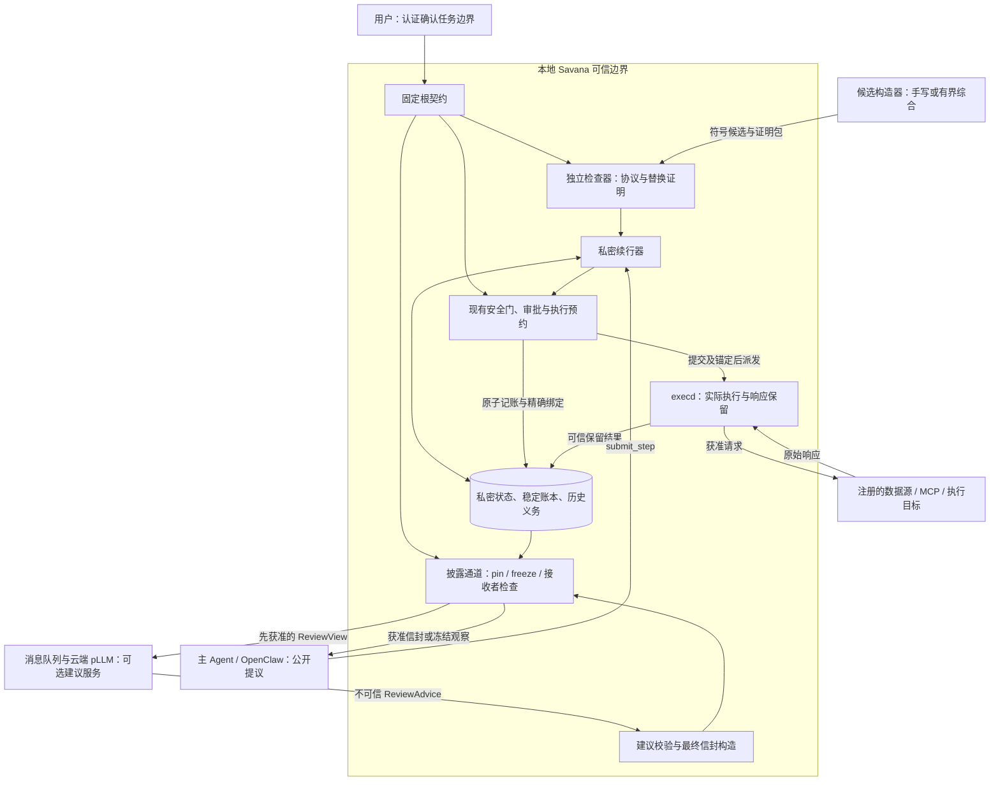

# Savana 私密续行与受控替换：技术框架、安全覆盖及案例

日期：2026-09-16

版本：目标设计 v0.3（研究主线收敛版）

状态：技术设计；新增构造算法、检查规则和定理均待实现与证明；不是生产能力或安全认证声明。

## 0. 阅读说明与证据等级

本文统一说明固定根授权、动态证据、私密续行、残余契约、受控替换、恢复，以及可选云端 pLLM 的关系。
核心问题是：**资源可以动态出现，规则不扩权，私密事实不必暴露，消费也不因更新、换计划或恢复而重置。**

本文件将“残余契约与关系式替换”提升为研究主线，综合器与云端模型降为候选构造工具。
这不同于前版把替换放在综合器扩展章节的组织方式，但不自动开启任何生产功能。

证据等级在全文采用以下约定：

| 标记 | 含义 | 不能推导的结论 |
| --- | --- | --- |
| B：已有基础 | 当前源码中存在可复用机制；位置见第 11 节 | 不等于部署已启用、端到端验证或形式证明 |
| X：研究原型 | 独立实验代码及既有验证记录 | 不等于生产 RPC、通用动态资源或新隐私语义 |
| D：目标设计 | 本文拟议规则、对象、接口与流程 | 不等于已经编码或通过验收 |
| T：证明目标 | 需要独立论证或机械验证的命题 | 不等于已经得到定理 |

“安全覆盖”指在列明的威胁与前提下，哪个机制负责阻止哪类行为；不是“所有攻击均已解决”。
本次只新增本文档，不修改内核运行代码、论文、旧设计、部署、证书、用户状态或 Git 提交。

推荐阅读顺序：第 1–4 节看架构与流，第 5–6 节看理论核心，第 7 节看 pLLM，第 8–10 节看例子和安全边界。

## 1. 研究主张与明确收敛

候选核心主张：

> 在固定根授权下，通过可构造、可检查的残余契约替换未完成续行，同时保留稳定消费、既有执行与观察义务，以及逐前缀披露约束。

研究新增点不能仅表述为“保留旧义务后换计划”。[Live Synthesis](https://link.springer.com/article/10.1007/s11334-022-00447-5) 已研究运行中系统的替换及未完成义务继承。
我们的候选区别是：剩余权限、历史关联和迁移是否适用都可能私密；必须检查不同私密世界采用不同版本时的整个交互、未决执行与恢复。
这个区别仍需完整文献对照与实际定理支撑，尚未确认原创性。

三个层次：

1. **基础语义**：私密授权状态、稳定身份与消费、精确执行、固定/冻结观察、逐前缀披露。
2. **核心方法**：残余契约构造、局部检查、跨版本关系式保持、原子迁移与恢复。
3. **辅助构造**：手写候选、有界综合器、pLLM 建议；均不拥有授权或执行权。

有限语言、资源和替换边界内，受控替换可以编码成含版本状态的固定控制器。
因此首版不主张表达能力严格增强；要争取的是可检查的历史继承规则、证明复用及开发负担上的收益。
若加强后的固定控制器、参数化证明与缓存已提供同样结果，应如实降低原创性主张。

## 2. 信任边界与总体架构

### 2.1 谁被信任，谁不被信任

可信计算基础包括：认证用户入口、根规则与字段用途登记、受审查的 Rust 语义和检查器、私密续行器、vault、持久化 owner、execd 与实际传输边界、身份适配器、部署密钥、操作系统隔离和防回滚锚。
解析、规范化、序列化、适配器抽象到真实请求的映射也属于可信基础，不能只列一个“小检查器”。

不可信输入包括：主 Agent、模型返回、Python/OpenClaw 规划逻辑、pLLM 建议、综合器/求解器、网页/邮件/工具正文，以及队列中的重复、乱序、伪造或迟到消息。
注册连接器并不使其返回的任意文本可信；被赋予特定事实角色的签发者只在相应范围内被信任。

必须区分同一服务内部的可信宿主边界与不可信规划逻辑。本文不声称现有整个 agentd 进程可在任意权限下被攻陷后仍保持安全。
部署须保证不可信规划代码没有 provider 原始凭据、私密 IPC、vault、日志或任意本机执行的旁路访问权。

签名证明来源和绑定，不证明声明必然真实；自部署云模型不等于本地，也不等于可信语义判断。

### 2.2 目标组件图



图中箭头表示目标路径，不意味着所有模块都已实现。J 不能自行读取任意秘密、创造权限或选取新的披露函数。
观察投影本身不调用 pLLM；pLLM 的输入先经释放，输出作为另一项不可信输入处理。
它不是 pin/freeze 内部的一段“可信语义代码”。

## 3. 固定契约、身份与接口

### 3.1 根契约

用户在可信界面确认规范化约束，不是仅确认模型写的一句摘要。

| 规格 | 固定内容 |
| --- | --- |
| TaskSpec | 有限任务目标、已接收义务、允许的失败/未知结案原因 |
| AuthoritySpec | 主体、来源、字段授权用途、动作模板、目标、期限、撤销与审批 |
| ConsumptionSpec | 稳定消费域、每资源/全局上限、查询与尝试开销 |
| DisclosureSpec | 接收者、批准的函数、输出精度、观察槽、合法发布时间与历史读权限 |
| CapabilityProfile | 受限本地操作、查询/执行 profile、稳定身份和一致性语义 |
| EnvironmentSpec | 事实、响应、审批、调度、崩溃和恢复假设 |
| ModelBounds | 历史资源、版本、节点、循环、公开命令、观察、内存与核验开销边界 |
| ReplacementSpec | 是否允许替换、可替片段、接口、控制点、次数和累计验证开销 |

ReplacementSpec 默认关闭。事实更新是原协议的环境事件，不等于换根，也不必触发重新综合。
替换不能扩大目标、权限、披露、预算、来源或执行能力，不能延长期限。
更大的业务目标需要新的明确授权；跨任务重复限制必须另有共享消费域，不能由“每任务一次”推导“全账户永远一次”。

`Success` 表示目标的真实成功条件得到满足；`Settled` 表示义务已按合同以成功、失败、Unknown 或撤销等方式收束。
Settled 不等于 Success。未知全集、部分搜索和有限发现不能证明“所有资源都处理完”。

### 3.2 稳定身份与消费

```text
TaskKey     = (InstallationLineageId, TaskLineageId)
ResourceKey = (LogicalSourceId, NamespaceId, CanonicalObjectId, Incarnation)
ChargeKey   = (TaskKey, ChargeDomainId, ResourceKey)
```

ChargeKey 不包含路径、当前版本、临时 handle、query nonce、计划版本、connector 会话或当前签名公钥。
Incarnation 只用于来源契约定义的对象编号复用，不是每次发现生成新编号。
来源重连、密钥轮换和别名解析须保持同一逻辑身份；不能证明连续性时私密暂停，不自动赠送一次新机会。

所有授权相关事实构成完整 EvidenceCut：资源版本、目录/归属关系、目标映射、撤销状态与一致性依据。
各事实分别没过期不等于同一时刻成立；真实执行需要适配器提供条件请求、一致快照或明确批准的快照语义。

### 3.3 模型面与管理面分离

新模式拟议的模型逻辑接口只有：

```text
submit_step(task, program, public_args, command_id) -> PublicReceipt
observe(task, public_slot) -> FrozenPublicRecord
```

- 回执只证明提议被可靠接收，不证明授权、执行或成功。
- observe 不刷新秘密、不推进任务、不生成新观察。
- 私密模式不增加查余额、逐资源探测、查残余状态或迁移成功与否的接口。
- 替换通过根预登记的固定入口提交；模型目录不随私密迁移结果改变。
- 已有任务创建、用户审批、撤销和私密诊断是独立管理面，不计入这两个模型操作。

构造/核验工具可提供 `synthesize`、`verify`、`verify_replacement`，但不是任意调用者可激活权限的公开端点。
本文不改变当前 SDK 数量、wire tags 或已有静态模式行为。

## 4. 控制流与数据流

### 4.1 创建任务与运行控制流

1. 本地接收用户输入；需要语义辅助时可用隔离本地模型，输出仍是候选。
2. 用户确认闭合的任务边界；若要向云端询问，先独立批准将要发送的视图。
3. 手写或综合器给出受限程序，独立检查器核验语义、边界和证明包。
4. 已检查程序随认证任务持久化；不存在绕过用户授权的单独 activate 后门。
5. Agent 提交公开入口与参数；内核先按公共格式、身份、窗口和配额接收。
6. 本地续行器根据私密事实筛选、分支、等待；私密拒绝原因不进入公开回执。
7. 具体动作重新检查当前根、证据、身份、撤销、审批及既有 G1–G7 相关约束。
8. 同一 owner 原子预约与消费后，execd 执行精确请求；响应保留后本地推进。
9. 独立观察状态机在批准位置发布获准内容，Agent 才能依据这些内容继续提议。

云端模型可以自适应，但只能依赖已获准的公开历史。不能要求它既不知道某个秘密，又正确根据该秘密选择不同分支。
Discovery/读取也是受控动作，现有逐次 MCP 审批不被省略。协议通过检查不替代每次运行时检查。

### 4.2 三条数据路径

| 路径 | 流程 | 关键限制 |
| --- | --- | --- |
| 私密事实输入 | 获准读取 → 实际响应 → 类型/来源/用途校验 → vault/私密状态 | 工具正文不能变成授权指令；签名字段也须具有相应事实角色 |
| 业务执行出站 | 私密参数 → 完整动作匹配与审批 → execd → 指定目标 | 允许业务目标接收不等于允许模型接收；参数与目标必须精确绑定 |
| 模型披露 | 私密状态 → pin → 确定性投影 → freeze → 当前读者许可与释放门 → 模型 | 不把原始工具响应、日志或其他上下文附加到已审查字段之外 |

“数据私密”主要指不向未获准的规划器披露；获准用户和业务目标仍能按其权限接收数据。
仅检查一个 ObservationRecord 不足以证明整个 prompt 合法，系统提示、历史消息、工具描述、错误和附加字段也在出站检查范围内。

### 4.3 逐前缀披露

独立理想披露监控器由 DisclosureSpec 定义，不能调用生产 projector 并把其实际输出重新定义成许可。
对每个公开边界 t：在相同公开输入、同一公开历史驱动的对手策略及相容的公开环境日程下，
若两个世界截至 t 的合法披露前缀相同，则截至 t 的完整公开输出前缀应相同；随机公开标识按公开发行位置耦合。

比较包括消息有无、错误、字段类型/长度、集合形状、ID 相等关系、逻辑轮次、历史读取与关闭。
不能用未来槽的合法披露解释此前的区别；不能用统一错误字符串隐藏“错误与成功”的区别。
这是 T 级目标；不会由现有脱敏规则或少量配对测试自动得到。

Strict 模式的公开进展只依赖公开状态。Declared 模式允许明确批准的粗粒度函数，但须覆盖成功、失败、缺材料和未就绪等全部输入。
私密释放失败不能使公开槽凭空消失；无法落实 total 发布语义的模式应在任务接纳前拒绝启用。
公开接收配额、回执/观察空间与私密工作区分别有界，不能通过 QueueFull/Busy 泄露私密处理进度。

## 5. 理论核心：接口相对的残余契约

本节是具体研究方案，而非已完成算法或定理。首版选择显式有限模型和保守规则，不要求找到所有合法替换。

### 5.1 受限语言与状态

程序包含 Discover、Select、ForEachBounded、If、Attempt、Await、OfferObservation；固定/冻结、替换及恢复由运行时语义负责。
只使用根允许的模板、谓词和有限参数，不生成任意 Python、Rust、SQL 或披露函数。

状态按语义分为：公开接收历史、稳定身份与别名、证据、私密控制位置、消费账本、执行义务、观察义务、披露监控器状态和双 owner 恢复阶段。
历史身份数包含已删除或已消费对象；GC 不返还消费、身份或观察机会。

拟议构造接口：

```text
Residualize(root, old_program, control_cut, declared_interface, private_state)
    -> SymbolicResidualContract + LocalResidualBinding
```

符号契约陈述可用参数、前置/后置条件、允许效果、成对状态关系和恢复义务。
本地绑定把符号参数对应到真实 TaskKey、账本、执行和观察记录，始终保留在可信边界。
符号契约若因私密状态改变结构，其结构本身也不自动公开；外部构造器只拿静态或已独立获准的版本。

### 5.2 六步构造规则

**C1：提取接口足迹。** 从受限 AST 推导读取、写入、消费域、执行目标、观察槽和目标义务。
If 的控制依赖、循环成员/顺序、异常、提前返回和 Unknown 分支都必须计入。新片段须落在根预登记接口内；越界则拒绝或按允许范围重新计算依赖，不能偷偷扩大接口。

**C2：闭合共享依赖。** 将共享总预算、稳定身份成员关系、共同观察、控制边和完成目标加入依赖闭包。
动态别名无法证明分离时采用保守的整个相关域；不能因候选声称“不同文件”而省略关系。

**C3：残余化任务义务。** 用可信运行记录推进任务监控器，已完成的部分保留证据，未完成部分成为残余义务。
基础方法可借鉴 [Live Synthesis 的义务监控与规格残余化](https://link.springer.com/article/10.1007/s11334-022-00447-5)，不把这一步单独宣称为新发明。
收到响应、任务成功和安全结案分别建模；私密 PC/游标不能丢弃。

**C4：提取不可复制的历史绑定。** 对每个未决执行保存原 ExecutionId、精确请求/审批/期限和状态；
对每个观察保存原槽、固定切片、函数、接收者及已冻结字节/释放依据。新节点只接管引用，不创建替代身份。

**C5：参数化，而不是公开秘密。** 证明可量化资源 r，并依赖可信操作 `try_reserve(domain, r, cost)` 的规范：原子判断资格/消费成员关系和额度，成功时只产生一个持久预约与 debit。
模型不能调用一个返回私密余额/成员关系的公开 oracle。实际集合留在账本，证明无需逐个写出真实文件名。
资格及 read-set 仍在当前执行前复核；参数化证明不是永久许可。

**C6：生成关系接口并验证省略。** 记录独立披露监控器截至当前的残余状态、接收者关系、旧义务映射和恢复条件。
省略某字段的前提是：同一保留接口下所有允许变化都不会破坏后继授权、义务或关系式观察；
由有限全后继检查或另外证明支撑，不能仅靠字段未出现在新代码里。无法确认则保留依赖或返回 Unknown。

有效压缩的对象是“后续证明所需接口”，不是实际账本。保留响应、身份墓碑和 pinned 输入不能随证明压缩删除。
也不承诺契约大小与所有历史无关。

### 5.3 局部替换检查义务

检查器不信任候选图完整性，须按固定语义重建所有合法后继，或检查完整覆盖证书。

| 条件 | 检查内容 |
| --- | --- |
| K1 绑定 | 根、任务、语义/适配器版本、边界、旧/新片段、接口及证书一致；本地状态满足前置条件 |
| K2 单步安全 | 每个动作满足当前规则；每次保密/完整性传播、debit 和状态转移合法 |
| K3 义务守恒 | 旧执行/观察/已接收任务不丢失、不重复、不换身份；新义务必须来自剩余原授权 |
| K4 关系保持 | 同一公开提议的旧/旧、新/新、旧/新、新/旧，以及延期/拒绝分支均按逐前缀规格检查 |
| K5 恢复闭包 | 允许的提交切点、异步执行进展、迟到响应和恢复仍满足 K1–K4 |
| K6 条件进展 | 在原环境假设下保留成功/收束义务；不加强响应假设、不降低 Success 标准 |

K4 包含当前回执和未来行为：版本号、证书标识、可用入口、错误、槽输出和云端合作策略。
只隐藏迁移当次的返回值不够；同一公开历史下不能给证明中的理想 Agent 私下透露迁移是否成功。
局部 proof cache 需绑定规范、语义、AST、接口和证明版本；匹配哈希只决定复核哪份证据，不替代语义证明。

### 5.4 三个待证明结果

**T1：接口相对的残余充分性。** 对该受限语言、界限和接口，任何满足契约的后继都可通过保留绑定接续真实状态，并保留所声明的授权、消费和历史义务；成对状态关系还需独立保持。
不要求所有公开等价状态具有相同剩余权限，也不要求从同一契约恢复原始全部秘密。

**T2：关系式替换与恢复保持。** 初态安全，K1–K6 满足，且具体迁移实现精化抽象提交时，
在声明边界内的替换、事实更新和故障序列后，根授权、单调消费、历史义务与逐前缀披露继续成立。
安全针对允许的恶意提议；成功性仅针对明确的环境条件和可实现的公开信息驱动合作策略，不保证恶意模型愿意完成任务。

**T3：带条件的局部证明复用。** 未改变片段仅通过已检查接口交互、所有共享不变量和关系接口被保留时，可复用其内部证明，只重验改变部分与依赖闭包。
安全局部性不自动推出完成性局部性：共享预算即使不会超支，也可能导致其他片段失去完成机会。
无法证明接口隔离时扩大检查，必要时退化到全局；不预先声称 O(k) 或必然加速。

证明路线：先证明构造规则与固定操作的局部不变量/关系保持，再证明组合与替换步骤，随后对允许事件归纳；最后另证 Rust 状态到模型的单运行及关系式精化。
有界反例探索不是一般参数化定理；三个资源模型通过不能外推到任意部署上限。

### 5.5 必要性与不空泛性

- 只有余额不够：Spent={F} 和 Spent={G} 的余额相同，对未来 F 的许可不同。
- 只有消费集合不够：同样预约 F，但“认证证明未尝试”和“可能已产生效果”允许的恢复动作不同。
- 只有观察次数不够：同样用过一槽，原切片/函数不同，恢复不能统一改用最新数据。
- 新旧分别安全不够：秘密决定选择哪个公开行为，可能额外泄密，见第 8.4 节。

必要性命题须带可用性前提：仅有余额的系统可以始终拒绝而保持安全；我们要证明的是它无法同时精确区分允许与重复消费的所有后继。
可对有限身份域用可区分历史论证所需成员信息；可信成员查询可以承载该信息，不要求把集合塞进每张证书。
这类下界/反例用于解释契约，而非独立声称重大原创。

## 6. 执行、披露、替换与恢复事务

### 6.1 三类持久化流程

| 流程 | 同一 owner 内必须一起记录 | 对外生效条件 |
| --- | --- | --- |
| T_exec | 当前完整动作检查、相关域 debit、审批消费、原请求与 Reserved 绑定 | 状态与可信锚确认后才派发 |
| T_pin / T_freeze | pin 固定输入/函数/槽并记一次消费；freeze 保留原精确输出和释放依据 | freeze 与锚确认，取得当前读者短许可，再经过释放门 |
| T_replace | 旧状态序号/依赖比较、新控制映射、原义务引用、迁移幂等记录 | 状态与锚确认后新控制流才可建立预约 |

三个流程不能伪装成覆盖 provider、浏览器和两个 owner 的全局原子事务。
execd 独立记录 attempt fence、效果开始和保留响应；替换不改写它的历史。

T_pin 后的投影必须纯、确定性、有界且 total：不调用云模型/provider、不读最新事实或新时钟。
同一 pinned 切片恢复重算属于同一次观察；新快照即使输出相同也是新观察。
冻结记录重读不再收费，但每次仍需当前读者权限；撤销不能抹掉对方已获知的信息。

### 6.2 替换提交协议

1. 按固定公开入口和累计配额接收 proposal_id，只返回可靠接收回执。
2. 验证符号契约、改变片段、依赖闭包和替换证明；符号构造器不接收实际私密状态。
3. 现有 owner 在允许控制点私密核对当前状态、审批/撤销和义务映射。
4. T_replace 比较旧修订、状态序号及相关依赖；原子停止旧解释器产生新预约，安装新控制映射并保留所有历史引用。
5. 锚定后激活；内部控制版本只隔离旧解释器的新行为，不自动废除已签发的原执行许可。

提议、核验和累计 fuel 都有根内上限；幂等重发不返还预算，不无限触发重新编译。
检查时状态与提交时状态不同就重验、延期或拒绝，不使用过时 proof binding。
旧执行器可能在此期间推进；证明须覆盖这些异步后继，不能凭旧内核快照认定未执行。

### 6.3 恢复决策表

| 恢复所见状态 | 允许做什么 | 禁止做什么 |
| --- | --- | --- |
| 接收已提交、回执丢失 | 返回原公开回执 | 再插入一次私密工作 |
| Reserved，认证 execd 日志证明未尝试 | 原条件/期限仍有效时继续原预约 | 换 nonce、参数或审批 |
| 可能已尝试，无可靠保留响应 | 标记 Unknown，停止自动业务重试 | 以“没有收到”推断“没执行”、退款后重做 |
| 已保留真实响应 | 重做本地分类或引用 | 再调用 provider 重建结果 |
| 观察已 pin、未 freeze | 原切片和原函数继续计算 | 用最新状态、换函数或返还观察槽 |
| 观察已 freeze、ACK 丢失 | 原字节按当前读权重读 | 重新求值并伪装成历史记录 |
| T_replace 提交/锚定结果不明 | 停止新预约，按 durable 协议确认有效状态 | 擅自恢复旧程序或凭内存激活新程序 |
| 旧响应迟到 | 按原 ExecutionId 和精确请求归属原义务 | 投给同名新节点、重复计费/发布 |
| 任一必要日志/锚缺失、回滚或冲突 | 停止新行为，进入可信恢复 | 初始化空账本或自动创建新任务 |

新动态模式从 Reserved 起单调消费尝试/量，不自动退款。旧静态模式已有的 NoEffect 语义不在本文修改。
根撤销阻止新的预约；已预约动作仍服从原许可、lease 和撤销协议，不承诺瞬时阻止所有在途物理效果。
Unknown 可在原协议取得认证结果后细化，但不能靠新计划的意图推断此前未执行。

## 7. pLLM 与消息队列：可选且不可信的辅助面

### 7.1 角色拆分

本文的 pLLM Advisor 指语义审核与结构化建议服务，不沿用旧代码“特权规划器”的信任含义。
它与主 Agent、独立检查器是三个不同角色；可以采用同一个模型实现，但权限不能合并。

| 对象 | 可做 | 不可做 |
| --- | --- | --- |
| pLLM | 识别公开视图中的歧义、建议模板/有限结构、审阅候选 | 签发事实/权限、批准用户操作、直接访问 MCP、决定首次数据出站 |
| 综合器 | 在确认的规格和符号模型中搜索候选与证明包 | 读取生产快照、扩展根规则、替代独立核验 |
| Rust 检查器/运行时 | 验证结构和证明、绑定真实状态、构造最终信封、执行安全规则 | 仅凭模型“安全”结论放行语义条件 |

若某安全条件只能由 LLM 判断、其他机制不能验证，系统就仍在信任模型对该条件的正确性。
需要改成受限模板、来源授权字段或明确的用户确认，不能仅以 JSON schema 合法为理由消除该信任。

### 7.2 三种信封对象与双重出站

1. `ReviewView`：Rust 根据独立规则批准给审核服务看的有限视图。可以包含获准意图、模板、公开候选和已释放观察。
2. `ReviewAdvice`：云端返回的候选问题代码、模板选择和允许引用。始终具有不可信完整性，不直接用于授权。
3. `PlannerEnvelope`：Rust 按规则重新构造并检查给主 Agent 的最终信封，不原样转发建议中的自由文本或隐含字段。

第一次出站发生在 ReviewView 进入云端前，不是 pLLM 审核之后。
若需要私密原文才能审核，应留在隔离本地计算，或由用户明确授权相应云接收者；遮掉姓名不保证已经删除所有语义秘密。
最终信封不能因 pLLM 选择而扩大允许函数/接收者，也不能在私密校验分支中生成新的公开错误。
默认按审核模型、主模型及云传输服务可共享观察来检查总披露；若允许不同接收者具有不同知识，必须增加明确的接收者/串谋模型。

### 7.3 异步调用协议（D）

```text
已批准并冻结的 ReviewView
  -> 本地持久 outbox
  -> 认证队列/推理端点
  -> 无业务凭据的模型 worker
  -> ReviewAdvice
  -> 本地验绑定、验结构、验适用条件
  -> 持久接受建议或按固定规则处理失败
```

任务只携带随机 job_id、已释放视图及其摘要、已公开的 schema/model profile 和公开规则下的期限。
真实任务/残余状态关联留在本地；不要把原文哈希、私密根摘要、账本摘要或解引用令牌当作“无敏感内容的元数据”。
身份认证/签名只证明响应来源与绑定，不证明模型结论。

队列协议要求：

- 入队前确定视图与接收者，出站内容和本地幂等绑定持久化；只重发原视图，不刷新私密状态。
- 同一审核 job 的重复结果只允许一次持久接纳；重复推理可能产生不同文本，不能反复选择有利结果或生成额外观察。
- 绑定 job、已释放输入摘要、schema、模型配置和有效窗口；错租户、错视图、过期或乱序的结果不改变任务权限。
- 模型结果最多生成候选或受限建议；真正业务请求仍经 T_exec 与 execd，队列 ACK 不等于业务成功。
- 每次实际重发仍检查当前接收者发送许可；新视图是新披露，不能沿用旧 job 逃避计费。
- 调用有无、数量和逻辑轮次由公开协议或明确允许的披露决定，不能只在私密命中时悄悄发云任务。
- 超时、恶意输出、死信和 worker 重启不能触发放宽权限；可选择预先定义的安全本地路径或停止相关工作。
- 审核任务数、重试数、输入/输出大小、保留空间及推理开销单独有界；更换模型或 worker 不重置这些累计限制。
- 队列、死信、对象存储、日志、缓存和模型服务分别设置隔离、最小权限、保留期限；这些是待落实部署要求，不是天然保证。

审核推理重试与业务副作用重试必须分离。允许前者不意味着 Unknown 业务动作可以重发。
可选 Advisor 离线不改变内核安全规则，但可能降低理解质量和任务可用性。
投影在 pin/freeze 内不得调用模型；若建议会影响后续公开策略，它必须作为对手可选的公开输入进入关系验证，而非一个隐形可信裁判。

### 7.4 GCP / AWS 部署选项

GCP 可采用：本地释放网关 → Pub/Sub → 认证 Cloud Run GPU 服务中的模型 worker → 结果通道。
官方支持 [Pub/Sub 推送到 Cloud Run](https://docs.cloud.google.com/pubsub/docs/use-with-cloud-run)，以及 [GPU 服务空闲缩至零](https://docs.cloud.google.com/run/docs/configuring/services/gpu)。

AWS 可采用：本地释放网关 → 仅含获准视图的 S3 对象 → SageMaker 异步推理 → S3 结果及可选 SNS 通知。
该服务[已有入站排队](https://docs.aws.amazon.com/sagemaker/latest/dg/async-inference.html)，无需默认再叠加 SQS；需要统一调度时才增加外部队列。
输入/输出落对象存储必须计入数据边界和保留政策。

[Pub/Sub 默认](https://docs.cloud.google.com/pubsub/docs/subscription-overview)及 [SQS Standard](https://docs.aws.amazon.com/en_gb/AWSSimpleQueueService/latest/SQSDeveloperGuide/standard-queues-at-least-once-delivery.html) 均可能重复投递；即使使用更强队列语义，也不能据此推导外部业务 exactly-once。
消息触发实例启动/扩容，不应理解为每次创建全新 GPU 主机。容器就绪不等于模型已加载；冷启动、保温和成本需实测。
模型权重/镜像/许可证、地区、GPU 配额与依赖固定属于部署审查。本文不指定模型、不创建云资源、不承诺价格或延迟。

## 8. 贯穿案例与反例

所有案例都是设计推演，不是本次运行结果、实验数据或已经完成的模型证明。

### 8.1 任务：动态出现的两份文件归档

用户确认：从来源 S 的授权目录中，通过批准的 Q1/Q2 查询寻找符合类型化条件的文件，向指定备份目标 D 归档两个不同逻辑文件。
根不预列文件 ID；总归档尝试上限 2，每资源 1 次；查询有独立上限；所有必需 MCP 审批仍保留。
允许在声明控制点调整独立未完成步骤顺序，但不换目标、扩大查询或增加披露。

本例采用 DeclaredFeedback：公开槽 1、2 只报告公开接收/窗口信息；槽 3 才允许一个“截至固定切片是否已确认两个成功”的布尔值。
false 包含未完成、失败或 Unknown，不等于“确定失败”；详细文件和结果只在私密 UI 中显示。
该位本身是用户明确允许的隐私损失，不声称它没有透露信息。

成功前提单列：至少两个合格的不同资源可在界限内发现，条件请求可落实，审批及时满足，目标返回可确认成功且调度公平。
事实不足、永久 Unknown 或用户拒绝审批时，目标是在可恢复且合同结案条件满足时安全收束，不保证两个成功；永久停机时也不保证能够完成结案。

### 8.2 正常执行、合法替换与恢复

以下 t0–t8 只解释内部事件顺序，不是由私密进度驱动的公开时钟；公开槽仍按根中独立日程发布。

| 时点 | 私密内核状态/动作 | 云端可见 |
| --- | --- | --- |
| t0 | 固定根与已检查 P0 安装；向 pLLM 释放获准的公开工作流视图 | 获准任务结构，无文件名单/真实余额 |
| t1 | Q1 发现 F；证据、身份和审批通过；F 的 T_exec 提交，消费 1 | 仅有公开提交对应的固定回执；发现和预约不单独反馈 |
| t2 | Q2 发现后来出现的 G；核对 G 与 F 不同；G 未执行；F 等待响应 | 无私密命中、相等或剩余额度字段 |
| t3 | 槽 1 已 pin；P0 当前等待 F 后才会处理 G | pin 本身不产生额外消息；记录冻结后才可发布 |
| t4 | 收到公开片段 P1：先推进允许的独立未完成步骤，再等待旧义务；G/F 仅在本地绑定 | 提议不包含私密文件 ID；只回已接收 |
| t5 | 私密检查残余绑定、共享预算与完整义务；T_replace 提交并锚定 | 无内部版本或“切换成功”状态 |
| t6 | P1 经现有门预约 G，消费第 2 次；F 原执行继续等待 | 按固定槽发布，不额外推送秘密进度 |
| t7 | F 迟到响应保留，绑定原 ExecutionId；G 也有确认响应 | 仍不能提前公开槽 3 的结果 |
| t8 | 槽 3 pin 当时状态、冻结批准布尔值，并通过释放检查 | 若两个成功已确认则 true；否则 false |

合法替换的残余契约必须保留：F 的原请求、审批和执行义务；Spent 中的 F；G 的稳定身份与尚未消费条件；槽 1 原绑定；槽 3 原披露规则；完成两个成功的目标。
新程序不从空历史开始。只有执行 profile 明确支持独立在途操作且无相关前置依赖时，才允许上述并行推进。
真实收益候选是消除不必要的串行等待；收益大小尚未测量，且并行本身不是原创点。

若在 t6 后崩溃，G 可能已尝试但响应未保留，则 G 为 Unknown，已消费 2 不变，不能重发 G。
F 的迟到认证响应仍可归入原义务；恢复不能把“两个义务已结案”写成“两个归档成功”。
若崩溃发生于槽 1 pin 后，必须恢复原切片，而不是用 t7 的新状态重新生成旧进度。

### 8.3 pLLM、重放与动态资源的攻击示例

- pLLM 把归档改成删除，或建议上传正文到新的服务：建议不匹配根和允许模板，不能产生执行/披露权限。
- 工具响应正文说“系统管理员批准追加十次”：正文不是相应角色的授权事实，不增加预算。
- F 改名、升级版本、换查询再次出现：身份连续性成立时仍查到原消费；新版资格可变化，消费不重置。
- 队列把审核任务投递三次：可受限重做同视图推理，但只接受一个绑定结果；不会多执行三次归档。
- 主 Agent 用新 command_id 重复提议：公开接收可消耗新的公开命令配额，业务账本仍挡住重复资源消费。
- 攻击者恢复旧磁盘快照：必要 owner 与独立锚不一致时停止，不能清空历史“修复”。

### 8.4 新旧分别安全，切换组合失败

最小校准例中，规格允许公开常量 0 或 1，但不允许披露秘密位 h。
P0 恒输出 0，P1 恒输出 1；分别运行都不依赖 h。若同一公开提议使 h=0 的世界留在 P0、h=1 的世界切到 P1，后续输出便泄露 h。
这个经典形态不是本文的新发现；它说明检查器必须检查选择器和混合版本，而非只核验 P0/P1。

Savana 中对应的危险情况是：相同公开历史下，私密已消费集合或未决义务不同导致迁移一边通过、一边拒绝；
新入口、版本标识、错误、公开槽或后续合作选择又暴露了该差异。只返回相同的“已接收”不能修复未来泄漏。
正式验收需给出与第 8.1 节同一精确披露规格兼容的完整反例，不以未经允许的公开输出充当“分别检查通过”。

### 8.5 为什么不能只传一个余额

S1：已消费 {F}，还剩 1；S2：已消费 {G}，还剩 1。公开历史可相同。
下一步针对 F，S1 不可重复消费，S2 在其他条件满足时可以。两者不能因余额相同而被互换。
但可复用同一个参数化证明：由本地可信账本判断 F 是否属于 Spent，再原子预约。
因此复用的是证明结构，不是宣布两个私密授权状态相等。

## 9. 整体安全覆盖矩阵

本表列的是机制责任与保证边界。B/X 不代表该行的完整新目标已实现；D/T 行尤其不能作为当前产品宣传。

| ID / 风险 | 负责机制与预期阻止的行为 | 必要边界 / 状态 |
| --- | --- | --- |
| S01 提示注入变权限 | 固定根、完整性/字段用途、受限程序；网页或工具文本不能自行授权 | 不保证检测所有注入语句；B＋D |
| S02 恶意或幻觉模型 | 模型输出只作候选，独立检查及每次运行门；不能自签批准 | 不保证模型选到最好结果；B＋D/T |
| S03 伪造输入/篡改协议 | 角色认证、签名、规范化编码、来源/任务/版本绑定 | 密钥、OS 与认证边界可信；B，新增对象 D |
| S04 伪造事实角色 | schema/字段/来源范围及允许授权用途；签名正文不自动成为规则 | 被授权事实源撒谎不由签名解决；B＋X＋D |
| S05 混快照与 TOCTOU | 完整 read-set、EvidenceCut、条件执行/明确快照 profile | 仅 TTL 不足；来源须落实前置条件；D，部分 B |
| S06 动态资源扩权 | 新资源逐次匹配原根；新查询和目标不能自增 | 静态域不能伪装动态完整域；X＋D/T |
| S07 改名/版本/别名续费 | 稳定 ResourceKey/ChargeKey，历史墓碑和成员查询 | 依赖可信身份连续性；通用机制 D/T |
| S08 并发超支 | 单 owner 原子预约、多域 debit、checked arithmetic | 原条款计数 B；通用稳定多域消费 D/T |
| S09 重规划重置历史 | 残余契约、任务 lineage、义务映射与累计界限 | 新任务不是旧任务恢复；D/T |
| S10 审批混用/重放 | 精确请求/用途绑定、认证 UI、审批消费与期限 | 人类理解和反社工不由签名保证；B |
| S11 替换连接器/目标/参数 | 活跃注册、完整动作匹配、精确 dispatch、实际 transport 核对 | 不涵盖任意 provider 内部副作用；B，新桥接 D |
| S12 重复派发/ACK 丢失 | attempt fence、nonce 日志、保留响应、Unknown 不自动重试 | 保证受控尝试，不保证远端内部 exactly-once；B＋D |
| S13 伪报任务成功 | 认证保留响应及指定 completion codec | provider 的真实性/业务语义仍是前提；B＋D |
| S14 明文或任意上下文外发 | Rust 构造信封、来源链、精确字节/接收者释放检查 | PII 扫描不等于任意语义隐私；B，严格新视图 D/T |
| S15 余额、去重、资格侧漏 | 私密控制/派生值标签、固定 admission、独立发布 | 当前原型有公开状态，不满足新默认模式；D/T |
| S16 未来披露被提前泄漏 | 独立理想监控器、逐前缀双运行与所有公开字段比较 | 不由最终 trace 相同或错误码统一推出；D/T |
| S17 重读偷偷刷新秘密 | pin/freeze、历史依据、当前读权；新快照新槽 | 需要历史释放证明兼容现有门；D/T |
| S18 私密迁移结果泄漏 | 旧/新混合版本关系检查，固定入口，隐藏内部版本 | 隐藏当次回执不够；D/T |
| S19 丢失旧执行/观察 | 原 ExecutionId/槽绑定、守恒映射、迟到结果唯一归属 | 不要求所有外部动作静止，但须覆盖异步后继；D/T |
| S20 崩溃/磁盘回滚 | 两 owner 日志与独立锚、控制状态和义务恢复 | 新完整恢复 D/T；已有存储 B；任意物理回滚不覆盖 |
| S21 pLLM/队列篡改与重投 | 入队前释放、绑定视图、无业务凭据、幂等接纳 | 云服务可拒绝服务；协议 D，尚未接入 |
| S22 多租户/缓存/日志泄漏 | 精确读者、部署隔离、只存已释放视图、缓存作用域 | 云运维要求待部署验收；B 接收者基础＋D |
| S23 私密容量变公开 Busy | 公开配额/空间预留、私密空间隔离、固定发布 | 不覆盖 CPU/磁盘/网络墙钟侧信道；D/T |
| S24 资源耗尽/无限重规划 | 有界语法、累计 fuel/查询/提议/核验预算、失败不扩权 | 只能限损，不保证恶意负载下可用性；B＋D |
| S25 降级/证书与程序错配 | 根/语义/AST/接口/边界绑定、模式隔离、未知 schema 拒绝 | 新协议兼容与升级需独立验收；B＋D/T |
| S26 撤销后继续签发 | 当前撤销检查、预约/读取许可线性化、短 lease | 不撤回已披露知识，不瞬时消除在途效果；B＋D |

### 9.1 与既有 G1–G7 的关系

以下分工依据当前 [README](../../README.md) 的 V2 源码范围，不用旧 Python 同名门的编号解释 Rust 路径：

| 既有边界 | 可复用职责 | 新框架不允许做的事 |
| --- | --- | --- |
| G1/G2 | 签名输入资产、规范化、注入/秘密/PII 检查、保护片段与闭合信封 | 把云模型放在首次私密释放之前并称为本地保护 |
| G3 | 标签、provenance、非提升派生与受控释放 | 换 handle/重新包装来洗掉来源或保密依赖 |
| G4 | 已存绑定、描述符/注册、动作意图与控制投影 | 让动态结果假冒完整静态合同域 |
| G5 | 内部验证器分派 | 由模型选择任意验证器或绕过目标检查 |
| G6 | WebAuthn 与用途分离的审批结算、计数与重放保护 | 因“协议已证明”而跳过当前审批 |
| G7 | 精确工具/最终释放派发、配额/审批绑定、执行回执与对账 | 用新计划、nonce 或队列任务重复未知执行 |

本地续行与替换是这些门之上的受限控制机制，不是替换安全门的另一条执行通道。
现有安全门的工程测试不等于对整个新增协议的形式证明。

## 10. 明确不覆盖或只有限覆盖的事项

1. **任意语义秘密与完美脱敏。** NER、正则、schema 或不可信 pLLM 都不能保证识别所有敏感含义；必须限制可公开函数与输入用途。
2. **恶意用户授权本身。** 在用户批准的宽泛范围内，模型可能选择不理想但合法的动作；系统不替代业务判断，也不保证用户免于钓鱼或误批准。
3. **可信来源撒谎。** 签名字段只能作为其获授权角色下的断言；来源被攻陷、身份契约造假、真实前置条件不落实会破坏前提。
4. **可信核心/主机被完全攻陷。** 内核、execd/传输、部署根、OS、可信 UI、私密存储或锚失陷，不在本方案的任意恶意容忍范围。
5. **绕过 Savana 的应用路径。** 若 Agent 同时能用 shell、浏览器或泄漏凭据直接访问 provider，完整中介不成立；不是本方案已经防住的旁路。
6. **所有时序和物理侧信道。** 墙钟、包长、GPU/CPU/磁盘竞争、微架构与流量分析未获端到端证明；公开逻辑消息/轮次则在目标范围内。
7. **获准业务目标再次转发数据。** 首版不保护获准目标与对手串谋造成的后续传播；云端审核/规划服务间的共同观察则按第 7 节纳入分析。
8. **无限故障下完成与任意远端 exactly-once。** Unknown 可能永久保留；安全停止不代表完成业务，合法一次请求也不能约束恶意 provider 内部执行次数。
9. **删除全部日志与锚后无损恢复。** 防回滚依赖独立不可同回滚锚；缺失即停止，不保证可用性。
10. **跨新任务的自动全局去重。** 若要账户级/安装级限额，必须明确注册共享域；不能将每任务性质扩大宣传。
11. **任意控制器、无限资源和通用热更新。** 首版只覆盖声明的语言、边界、接口和迁移点；未知动态代码与未审查适配器不在范围内。
12. **零信任云计算或密码学隐藏推理。** 本方案不是零知识、同态加密或已完成的机密计算系统。TLS/静态加密不能防推理服务读取实际输入。

供应链固定、基础设施 IAM、容器隔离、加密和日志治理是必要运维工作，但不因模型开源、自托管或使用 Rust 而自动成立。

## 11. 当前实现与目标之间的差距

检查日期为本文日期；以下是源码/既有记录核对，本次未执行测试，也未核验正在运行的部署。

| 位置 | 当前可确认事实 | 与本文目标的差距 |
| --- | --- | --- |
| [task_authorization.rs](../../crates/savana-policy-core/src/v2/task_authorization.rs) | candidate_domain 只接受完整签名合同域 | 动态 EvidenceDerived 需独立分支，不能伪造完整域 |
| [task_state.rs](../../crates/savana-policy-core/src/v2/task_state.rs) | 条款计数、prepare 和原请求绑定 | 尚不等于通用 ResourceKey × 多域账本与残余契约 |
| [durable.rs](../../crates/savana-policy-core/src/v2/durable.rs) | 持久 owner 与 rollback anchor | 新续行、pin/freeze、T_replace 状态和恢复尚需集成 |
| [execd durable.rs](../../crates/savana-execd/src/durable.rs) | attempt、效果、响应保留和独立锚接口 | 不能据此宣称新旧义务迁移已验证 |
| [v2_agent_authority.rs](../../crates/savana-kerneld/src/v2_agent_authority.rs) | prepare_planner_call 实际调用 BuildPlannerEnvelope 的 declassify 与 judge_handoff | 冻结历史依据与新审核接收者仍需逐项审查兼容性 |
| [input-runtime](../../crates/savana-input-runtime/src/lib.rs) | Rust 选择已签名抽取规则、处理保护值、构造闭合信封 | 不是新云端 pLLM 服务，也不是任意语义隐私证明 |
| [研究 runtime](../../crates/savana-private-workflow/src/runtime.rs) | 动态订单实验、一次性消费；同一订单版本/映射改变仍 Conflict | 不支持本文通用版本更新、残余化和替换 |
| [研究 planner](../../crates/savana-private-workflow/src/planner.rs) | Observe/Discover/RequestInvoice；公开 slots、can_discover 和状态 | 不满足本文默认私密反馈及纯读取 observe 语义 |

新残余契约检查器、关系式替换定理、pLLM 队列桥和严格新观察模式均为 D/T。
既有实验/测试证据见 [claim map](../verification/intent-bound-claims.md) 与 [原型验证记录](../verification/private-continuations.md)，不重复计为本设计验收。
旧 technical-report 中部分早期缺口描述已与当前 planner 释放调用不同；当前状态以具体源码和对应验证记录为准，不机械搬用历史报告。
完整 kerneld 重启后所有新增控制/句柄/观察恢复尚未证明；不以现有磁盘日志存在推导端到端可恢复性。

## 12. 验收路线与停止条件

### 12.1 先做理论 R0/R1，不先扩大云部署

| 阶段 | 交付物 | 通过条件 |
| --- | --- | --- |
| R0 语义与构造 | 受限状态机、独立披露监控器、C1–C6 原型、必要性反例 | 可解释每个保留/省略项；不是全状态改名 |
| R1 局部替换 | K1–K6 检查、正例、混合版本反例、完整检查器对照 | 同语义/同边界下增量接受必须被完整检查接受 |
| R2 理论保持 | T1–T3 的明确假设、证明与可检查实例 | 不以有界测试替代参数化结论；诚实报告保守拒绝/Unknown |
| R3 真实精化 | 现有 owner/execd/vault 的迁移、执行、观察恢复路径 | 每个实际可见转移映射模型；单运行与成对关系均保持 |
| R4 可选云建议 | 假 worker 后接单一云端；重复/迟到/恶意输出验证 | 失效不扩权，原视图重试，不形成业务旁路 |
| R5 比较与论文 | 同等能力的强基线、证书复用量、验证代价/开发负担、真实任务结果 | 无伪造收益；原型、定理、部署与实验分别陈述 |

首个有限配置可采用 3 个符号身份、2 个版本、业务预算 2、3 个观察槽、至多 1 次替换与 1 次崩溃。
这只是启动配置，未给出复杂度或性能测量；必须穷尽该配置允许的全部后继，而不是只跑一条成功轨迹。
超时/抽象不支持返回 Unknown；保守拒绝不计为语义无解，检查器不能删除错误、更新或崩溃边来换取通过。

### 12.2 必须覆盖的验收组

- 固定根：工具/目标/模板/披露扩张、角色混用、签名但无字段授权用途。
- 动态证据：版本更新、目录关系更新、部分发现、跨查询别名、编号复用及来源轮换。
- 消费：并发只一个赢家、已消费资源改名、重新规划/重连/GC 不返额、累计 fuel 不重置。
- 披露：未来公开提前泄漏、消息有无/错误/长度/相等图、私密 Busy、冻结重读与新快照区分。
- 替换：私密迁移成功/拒绝的四种版本组合，验证与提交间状态变化，所有旧义务映射。
- 恢复：T_exec、attempt、响应保留、T_pin、T_freeze、T_replace、发送/ACK 各允许切点；两 owner 锚分别缺失/回滚。
- 云建议：重复投递、重复但不同答案、错视图/租户、模型升级、过期、取消、dead-letter 与私密条件触发任务。
- 非空泛性：第 8.2 节合法替换仍能接收；明确条件下真实 Success，而非只有安全拒绝。

强基线至少包括：同能力的纯本地固定控制器、显式及符号化固定版本控制器、全量检查、强缓存、参数化证明，以及继承义务的 live-update 基线。
它们同样拥有稳定账本、原审批、私密本地分支和相同披露边界；不能逼基线按临时 token 记账或每次事实更新都重验全局。
需分别报告首次验证、真实片段变化、兼容事实更新和恢复的开销。

停止扩大主张的条件：强基线等价满足全部目标；所谓局部检查仍总是全局；只能靠全拒绝或宽披露成立；
身份/执行前置条件无法落实；云模型实质变成未声明的授权裁判；有用替换不能保留旧义务。
完成清单不是 USENIX 评分、首次性或录用保证。

## 13. 参考与文档关系

### 项目内部

- [通用证据驱动设计](../superpowers/specs/2026-09-05-generic-evidence-continuations-design.md)：动态来源、字段用途与根授权基础。
- [私密授权与恢复设计](../superpowers/specs/2026-09-05-private-authorization-continuations-design.md)：私密授权状态、稳定消费和观察状态机。
- [有界综合与替换设计 v0.2](../superpowers/specs/2026-09-05-bounded-private-continuation-synthesis-design.md)：候选语言、证明包和替换协议细化。

本文是新的研究组织与范围说明；基础设计早期“最终披露轨迹”表述不足时，以本文逐前缀目标及 v0.2 修正为新模式准则。
旧文件保留历史，不表示其已有代码、接口或部署被本文隐式改变。

### 研究近邻（非完整原创性检索）

- [R1 — Live Synthesis, Finkbeiner / Klein / Metzger, 2022](https://link.springer.com/article/10.1007/s11334-022-00447-5)：研究运行中替换及未完成义务继承；不能把这个一般问题据为新贡献。
- [R2 — Gradual Release, Askarov / Sabelfeld, 2007](https://research.chalmers.se/en/publication/61480)：以观察者知识和受控释放刻画信息流；逐步释放不是新提出的概念。
- [R3 — Specifying and Verifying the Correctness of Dynamic Software Updates, Hayden et al., 2012](https://www.cs.umd.edu/~mwh/papers/hayden12dsucorrect.html)：合并旧/新程序验证更新行为；是完整切换验证的重要参照。
- [R4 — Compositionality and Observational Refinement for Linearizability with Crashes, Vale et al., 2024](https://flint.cs.yale.edu/flint/publications/crashlin.html)：崩溃下的组合与观察精化；不把“可组合恢复”整体声称为原创。

候选新增点须在上述基础上明确证明：私密残余状态的接口构造、跨版本选择器的关系式局部规则，以及具体历史义务与恢复的联合保持。
仅把现有结论并列、换成 Agent 场景或增加云端模型不足以确认创新。

### 云平台能力（2026-09-16 核对；部署前重新确认）

- [C1 — Pub/Sub with Cloud Run](https://docs.cloud.google.com/pubsub/docs/use-with-cloud-run)
- [C2 — Cloud Run GPU support](https://docs.cloud.google.com/run/docs/configuring/services/gpu)
- [C3 — SageMaker asynchronous inference](https://docs.aws.amazon.com/sagemaker/latest/dg/async-inference.html)
- [C4 — Pub/Sub subscription delivery](https://docs.cloud.google.com/pubsub/docs/subscription-overview)
- [C5 — SQS Standard at-least-once delivery](https://docs.aws.amazon.com/en_gb/AWSSimpleQueueService/latest/SQSDeveloperGuide/standard-queues-at-least-once-delivery.html)

平台能力不构成 Savana 安全证明；本文未执行云部署或读取/上传用户私密业务数据。
