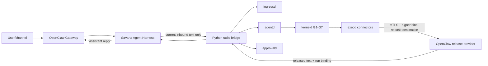

# OpenClaw + Savana Production Runtime Design

> Date: 2026-08-18
>
> Status: approved for implementation
>
> OpenClaw compatibility baseline: `openclaw@2026.7.1-2` (exact stable pin)
>
> Savana baseline: `codex/security-capabilities-implementation` at `9787784`

> Repository boundary: every adapter, release receiver, test, package manifest,
> and deployment example described here is implemented and committed in the
> user's `savana-core-rs` repository. The upstream OpenClaw repository is a
> read-only compatibility reference and `openclaw@2026.7.1-2` is consumed only
> as an exact dependency; this project never commits or pushes to OpenClaw.

## 1. Goal and security claim

Build a consumer-facing personal privacy assistant in which OpenClaw supplies
channels, Gateway admission, session selection, progress delivery, and the
visible transcript, while Savana is the only component allowed to plan,
authorize, approve, execute, and release data-bearing work.

For the OpenClaw agent configured with this runtime:

- the OpenClaw embedded model loop never runs;
- OpenClaw tools and OpenClaw-managed MCP tools are not callable;
- every planner step and connector effect passes through the existing Savana
  G1-G7 policy and execution path;
- the TypeScript plugin and Python bridge never inspect a capability or read a
  private output document; and
- only plaintext delivered after Savana's explicit final-release workflow may
  become an OpenClaw assistant reply.

This is a production integration around the existing kernel, not a new kernel
path. It must not change kerneld, agentd, ingressd, approvald, execd, their
routes, wire encodings, ports, or security decisions. If the existing signed
connector and release surfaces cannot express a required handoff, integration
stops at a documented acceptance gate instead of adding a bypass.

## 2. Trust boundary and honest privacy scope

The first supported deployment is one local OS user with OpenClaw Gateway and
the Savana services on the same trusted machine. Raw inbound text necessarily
exists at the selected messaging provider and at OpenClaw channel ingress
before Savana can receive it. Savana's protection begins at the native plugin
ingress; this design does not claim to hide the message from WhatsApp, Slack,
Telegram, OpenClaw, or any other upstream channel provider.

OpenClaw is trusted only as a local channel and presentation shell. It is not
trusted to make policy decisions, hold Savana capabilities, choose tools for
Savana, read masked/private documents, or decide that an output is releasable.
The Python bridge is trusted adapter code in the same local product boundary,
but owns only live SDK objects and the minimum cleartext explicitly crossing
the ingress or final-release boundary.

OpenClaw's visible transcript will contain the inbound user message and the
released assistant reply. The Savana agent is configured with memory indexing,
research capture, transcript export, and other secondary transcript consumers
disabled. Product packaging must also set a bounded local retention policy and
private filesystem permissions. These controls reduce local persistence; they
do not turn OpenClaw into a cryptographic boundary.

## 3. Chosen architecture

The integration has four new adapter/deployment components:

1. `integrations/openclaw-savana-runtime/` is a trusted TypeScript OpenClaw
   plugin. It registers a synthetic provider and the `savana` agent harness,
   maps OpenClaw run/session events to a local bridge protocol, and returns only
   released output to OpenClaw.
2. `crates/savana-core-py/python/savana/openclaw_bridge/` is a Python module
   launched as a child process without a shell. It owns `Identity`, `Client`,
   live `Session`, `RunLimits`, approval callbacks, and calls only the public
   asynchronous Python SDK.
3. A versioned, bounded stdio protocol connects the plugin and bridge. It adds
   no browser route, application HTTP API, daemon, or kernel capability.
4. `savana-openclaw-release-provider` is a Rust loopback mTLS receiver plus the
   deployment's fixed release destination projection and signed
   declassification rule. Execd's existing verified provider transport sends
   it only a payload that has passed `Session.release(...)`.

The existing three browser-facing services remain the SDK's entire application
network surface: approvald on 8766, ingressd on 8767, and agentd on 8768. The
OpenClaw plugin never calls these ports directly; Rust inside `savana-core-py`
owns all wire construction and validation. Final release uses a separate
deployment-pinned loopback TCP endpoint because the existing execd provider
transport is TLS 1.3 over TCP with mutual certificates, SPKI pinning, fixed
ALPN, and a manifest-bound address. A Unix socket or stdio destination would
require changing execd and is therefore outside this design.

## 4. OpenClaw registration and fail-closed selection

The plugin targets exactly `openclaw@2026.7.1-2`. The Agent Harness API is
documented as experimental, so a loose semver floor is not acceptable. The
package uses an exact `peerDependencies.openclaw` value, records the tested
plugin API contract in its manifest when supported by the pinned host, and
refuses activation on any other host version until its compatibility suite is
rerun and the pin is deliberately updated.

The plugin registers:

- provider id `savana`, with one synthetic model `savana/agent`;
- harness id `savana`, which supports only provider `savana` and model `agent`;
- synthetic provider availability, because Savana authentication is owned by
  its out-of-band bootstrap and WebAuthn flow rather than an LLM API key; and
- startup/reset lifecycle handlers for the bridge and native session binding.

The OpenClaw model route must carry model-scoped
`agentRuntime.id: "savana"`. A whole-agent runtime setting is insufficient in
the pinned OpenClaw API. Explicit selection means missing plugin, unsupported
model, version mismatch, bridge failure, or harness failure terminates the
turn. There is no embedded-runtime fallback and no replay through another
provider after Savana may have caused an effect.

The plugin manifest activates only for provider/harness `savana`; it exports no
agent-callable tool. Operator configuration must deny all OpenClaw tools for
this agent, including `message`, browser, filesystem, shell/exec, plugin tool
groups, and OpenClaw MCP projection. The harness also ignores `params.tools`
and rejects startup when its secure profile is not installed. This is defense
in depth: the sole executor is Savana, not the OpenClaw model tool surface.

## 5. Exact turn input

OpenClaw's prepared `params.prompt` may contain bootstrap files, system text,
memory, transcript context, skill instructions, and other host-owned content.
It must never be sent to Savana as if it were the user's request.

For a user-triggered text turn the harness takes the current inbound body from
`params.transcriptPrompt`, whose pinned API describes it as the user-visible
prompt body. When `params.currentInboundContext.text` is also present, it must
match after the pinned API's documented normalization; an unexplained mismatch
fails closed. Missing current inbound text, non-user triggers, bundled images,
media-only turns, and composed prompts are unsupported in the first release.

The first release is text-only. File and image ingestion will be a separate
design that maps trusted, bounded local attachments to `Session.ingest_file`;
the harness will never forward arbitrary OpenClaw workspace paths.

## 6. Bridge protocol

The plugin spawns an operator-configured absolute Python executable with
`-m savana.openclaw_bridge`. It uses an argv array with `shell: false`, a
minimal environment allowlist, a private working directory, and inherited
stderr only. stdout is protocol-only.

The protocol is UTF-8 NDJSON with a 1 MiB encoded-line maximum, 256 KiB maximum
inbound text, and 1 MiB maximum released text. Every message is
a closed object containing `protocol_version`, a cryptographically random
`request_id`, a closed `type` tag, and that tag's bounded payload. Unknown
fields, duplicate IDs, invalid ordering, oversized lines, extra terminal
messages, malformed UTF-8/JSON, and version mismatches close the bridge and
fail the active turn.

The v1 message families are:

- plugin to bridge: `initialize`, `turn.start`, `approval.answer`,
  `turn.cancel`, `session.reset`, `shutdown`;
- bridge to plugin: `initialized`, `turn.event`, `approval.request`,
  `turn.released`, `turn.failed`, `session.closed`.

`initialize` carries public compatibility metadata and configured absolute
paths, never bootstrap capabilities or WebAuthn secrets. Bootstrap material is
loaded by the bridge from an operator-owned, private source outside the chat
prompt. Handles, tickets, sessions, assertions, and callbacks remain live
Python/Rust objects and are never serialized onto this protocol.

The bridge may emit at most one terminal `turn.released` or `turn.failed` per
request. Logs contain only request/run correlation digests, public stable error
codes, timings, and redacted event names. They never contain input text,
approval display text, released text, raw handles, credential data, or local
identity/bootstrap contents.

## 7. Session, authentication, and lifetime

An OpenClaw `sessionId` plus owning agent identity maps to one random bridge
binding id. The mapping must not use a user-controlled session key as a file
path. The Python side holds the actual Savana `Session` in memory under that
binding and serializes all operations per session.

Savana session bootstrap remains out of band:

- `Identity.load` reads a configured private identity path;
- a configured trusted bootstrap source supplies the Jarvis transfer token;
- the WebAuthn callback is fulfilled by the product's authenticated local
  ceremony; and
- no bootstrap token, WebAuthn assertion, credential key, or capability enters
  OpenClaw config, transcript, prompt, or the stdio protocol.

The first release does not persist live Savana capabilities. A bridge restart
cannot resurrect a session and must require a fresh bootstrap/authentication
flow. OpenClaw `/new`, `/reset`, session deletion, plugin shutdown, or an
unrecoverable turn error calls `Session.close()` where possible, drops the
binding, and zeroizes adapter-owned sensitive buffers. A reset never silently
resumes the old native session.

## 8. One turn through the real SDK

For one accepted text turn the Python bridge performs:

1. Resolve or create the live Savana session through
   `await Client.session(identity, bootstrap, webauthn, ingress_approval)`.
2. Call `await Session.ingest_text(text, ContentKind.CHAT_TEXT)`. Ingress
   masking, commitment, and approval remain on the existing ingress/kernel
   path.
3. Construct finite `RunLimits` from bounded plugin configuration and call
   `await Session.run_agent(IntentPrivacy.PRIVATE, limits, approval, events)`.
   Private intent is the immutable default for this product profile.
4. Translate redacted `AgentEvent` values into bounded OpenClaw progress events.
   Do not claim tool arguments, effects, or result content that the SDK does
   not expose.
5. Select a returned document only from the opaque output handles present in
   the terminal `ExecutionResult`. The adapter may compare kinds/counts but may
   not inspect handle bytes or document contents.
6. Ask for the exact final-release approval and call
   `await Session.release(document, approval)`.
7. Wait for the deployment-bound OpenClaw release provider to deliver the
   matching released payload. Return that text as `turn.released` only after
   validating its one-time run binding and release provenance.

The adapter does not call `run_planner` and `execute` independently for the
normal path; `run_agent` remains the single bounded autonomous loop. It does
not auto-release before step 6, and a successful execution without an
explicitly selected/released output produces a truthful no-output result.

## 9. Approval routing

The Python SDK callbacks are synchronous, while OpenClaw channel interaction is
asynchronous. Each Savana turn therefore runs outside the bridge event-loop
thread. When a callback fires, it emits one `approval.request` containing only
the exact `ApprovalRequest.display`, its closed purpose, request id, and a
deadline, then blocks on a condition owned by that request.

The TypeScript harness presents this through the pinned OpenClaw blocking-user-
input helper. It must not summarize, rewrite, preselect, or expand the display.
Only an explicit affirmative answer maps to Python `True`; denial, timeout,
disconnect, malformed answer, duplicate answer, cancellation, or helper error
maps to `False` or fails the workflow closed. Approval answers are one-time and
bound to the requesting turn and session.

Ingress, tool execution, connector registration, and final release keep their
distinct Savana purposes. The adapter never signs approval settlements;
approvald does.

## 10. MCP and connector ownership

OpenClaw does not choose MCP tools for this runtime. There is no MCP catalog in
the model prompt and no `tool_search`/`describe`/`call` projection. MCP servers
are installed as Savana connectors through the existing signed connector
lifecycle:

- an operator obtains a canonical descriptor artifact;
- Rust validates it with `ConnectorDescriptor.load`;
- the UI-authenticated registration flow calls
  `Session.register_connector(descriptor, approval)`;
- kerneld evaluates the descriptor and registry chain; and
- execd speaks MCP behind its verified provider transport only after dispatch.

The OpenClaw chat agent cannot initiate connector registration. Registration is
an operator/admin surface outside the harness, matching the connector design's
origin restriction. A user-registered connector is proposable but not a final
release destination.

The `savana-openclaw-delivery` connector is different: it must be
deployment-shipped and its exact destination digest must appear in a signed
`BuildFinalRelease` rule. Runtime self-registration cannot create this egress
authority because the user tier excludes `FINAL_RELEASE`. This prevents a chat
prompt or one socially engineered registration approval from turning an
arbitrary endpoint into a data sink.

## 11. Released-output handoff

The current public SDK deliberately returns only an `ExecutionResult` from
`release`; it does not return released plaintext. The adapter must not add a
`read_raw`, decode a handle, inspect the vault, or reuse a masked-view API to
work around that fact.

The production release receiver is a Rust process listening only on a fixed
loopback address provisioned into execd. It requires TLS 1.3, the exact ALPN,
the manifest-pinned server certificate/SPKI identity, and execd's provisioned
client certificate. It accepts the existing canonical provider request, whose
outer frame already carries the execution nonce, dispatch-core digest, and
dispatch-subject digest. It does not add an HTTP route and does not accept a
plain TCP connection.

The current browser release API does not expose execd's execution nonce to the
SDK. The receiver therefore implements a global one-release reservation:

1. Before calling `Session.release`, the bridge opens one random, expiring
   reservation for the owning OpenClaw turn.
2. Only one reservation and one final release may be in flight for the whole
   local product deployment.
3. The next valid mTLS provider request atomically claims that reservation and
   binds its execution nonce and dispatch digests before the plaintext is made
   visible to the bridge.
4. The receiver durably records the released payload and binding before
   returning provider evidence to execd.
5. A proven `failed_no_effect` may clear an unclaimed reservation. Timeout,
   crash, or any indeterminate state seals the receiver against new
   reservations until operator reconciliation, so a late old delivery can
   never be mistaken for a later turn.

This serialization is required by the real API, not a throughput preference.
Concurrent planning and tool execution remain allowed; only final-release
dispatch is globally serialized. The handoff binds:

- installation and deployment generation;
- OpenClaw bridge instance and session binding;
- the bridge reservation and OpenClaw turn/request id;
- destination digest;
- one-time release dispatch/provenance identity; and
- payload digest and bounded content type.

The bridge accepts one matching delivery, verifies the reservation without
seeing a kernel capability, acknowledges it once, and rejects late, duplicate,
cross-session, cross-run, wrong-destination, or oversized payloads. The plugin
receives only the final UTF-8 text and a redacted attestation summary; raw
release proofs remain in the Rust receiver/executor boundary.

The receiver and its connector codec must work with the existing
`VerifiedRustlsProviderTransportV2` canonical request and worker protocol. If
that cannot be achieved without changing an existing daemon or wire contract,
production integration is blocked for a separate design review. A status-only
demo is not considered completion.

## 12. Cancellation, retries, and failures

OpenClaw abort propagates to `RunLimits.cancel()` and prevents new Savana work.
It cannot undo an effect already dispatched. The bridge closes the session on
an indeterminate effect, protocol violation, callback failure, or lost
delivery binding.

No layer automatically retries a Savana turn after dispatch may have occurred.
Exact `failed_no_effect` replanning remains bounded inside `run_agent`; policy
refusal, approval denial, quarantined output, or indeterminate effect is
terminal. A bridge crash, OpenClaw reconnect, model fallback request, or
duplicate Gateway run id never replays the request. The user must start a new
explicit turn after the prior outcome is reconciled.

Public errors map to stable redacted categories: authentication, approval
denial, policy refusal, cancellation/deadline, incompatible runtime, protocol
failure, delivery timeout, and indeterminate effect. Error text must not leak
private endpoint, path, prompt, display, connector, or capability material.

## 13. Required SDK hardening before production

The existing client SDK is the correct boundary, but four known issues must be
closed before the OpenClaw adapter can be called production-ready:

1. `execute` and `release` must bounded-poll every valid nonterminal refresh
   state rather than assume one refresh is terminal.
2. Public error classification must map `PolicyRefused` only from protocol
   evidence that actually proves policy refusal.
3. PyO3 callback exception state must be operation-scoped so concurrent
   sessions cannot consume one another's callback errors.
4. Python must expose every already-public structured `MaskedView` field needed
   by applications without inventing or exposing private fields.

These are client/binding corrections. They may add canonical response decoders
or getters to existing libraries when necessary, but may not change a daemon,
route, encoding, or kernel rule. Connector activation's `active` projection is
also corrected if it affects truthful readiness reporting.

## 14. Configuration and packaging

The plugin configuration is a closed schema containing only:

- absolute Python executable and optional private bridge working directory;
- exact expected bridge protocol and Savana package versions;
- identity/bootstrap source references, never secret values;
- a 120-second turn default with a 300-second compiled maximum, a 120-second
  approval default with a 300-second maximum, and a 30-second release-delivery
  default with a 60-second maximum;
- the protocol/data bounds from section 6;
- `RunLimits(24, 4, 120.0)` defaults whose configurable values may not exceed
  64 steps, 8 replans, or the 300-second turn maximum; and
- allowed local logging level with secure redaction always enabled.

The shipped OpenClaw profile selects `savana/agent` and model-scoped
`agentRuntime.id: "savana"`, enables only the trusted plugin, denies all tools,
disables native MCP/tool projection and secondary transcript consumers, and
does not define model fallbacks. A doctor/preflight command verifies the exact
OpenClaw version, plugin selection, tool denial, three Savana service origins,
identity/bootstrap readability, connector registry convergence, signed release
destination, and bridge protocol compatibility without displaying secrets.

## 15. Testing and acceptance

Implementation is test-driven and must include:

- TypeScript unit tests for strict config/protocol decoding, exact inbound-text
  selection, provider/harness selection, tool denial, approval correlation,
  abort/reset, no fallback, and released-only terminal output;
- Python tests with fake SDK objects for lifecycle serialization, callback
  blocking, exception isolation, cancellation, no handle serialization,
  redacted logging, and delivery binding;
- Rust/Python SDK tests for all four hardening items in section 13;
- compatibility compilation and runtime selection tests against exactly
  `openclaw@2026.7.1-2`;
- integration tests using the existing service fixtures and a fake delivery
  connector, followed by a real local deployment-shipped connector test; and
- adversarial tests proving that assembled prompts, OpenClaw tools/MCP,
  unapproved output, duplicate delivery, cross-session delivery, callback
  races, crash/restart, and post-dispatch replay all fail closed.

Production acceptance requires all of the following observable facts:

1. OpenClaw reports harness `savana` for `savana/agent` and refuses to run when
   it is missing or incompatible.
2. The run receives only current inbound user text, and the Savana agent has no
   OpenClaw tool or MCP inventory.
3. Every effect is visible in existing Savana policy/approval/execution audit
   evidence.
4. The assistant reply bytes exactly match one successfully released payload
   delivered by the signed OpenClaw destination connector.
5. Killing either adapter cannot cause fallback, duplicated effect, capability
   exposure, or delivery into another session.

## 16. Delivery order and non-goals

Delivery proceeds in this order: SDK hardening; bridge protocol and Python
adapter; TypeScript provider/harness with fake delivery; Rust loopback mTLS
release provider plus signed projection/rule; local end-to-end verification; then server
and consumer UI integration. The dirty Jarvis server worktree is intentionally
outside the first implementation phase and remains untouched until the core
integration passes its acceptance suite.

Non-goals for this design are Manus integration, direct OpenClaw model calls,
direct OpenClaw MCP execution, automatic connector registration, automatic
release, arbitrary attachment ingestion, multiple OS users sharing one bridge,
remote bridge networking, capability persistence, and any kernel/daemon/wire
change. The one deployment-pinned loopback mTLS release endpoint is required by
the existing execd transport and is not a general application API.

## 17. Normative references

- OpenClaw agent harness contract at the exact compatibility tag:
  <https://github.com/openclaw/openclaw/blob/v2026.7.1-2/docs/plugins/sdk-agent-harness.md>
- OpenClaw prepared-run parameter source at the exact compatibility tag:
  <https://github.com/openclaw/openclaw/blob/v2026.7.1-2/src/agents/embedded-agent-runner/run/params.ts>
- OpenClaw exact package/export surface:
  <https://github.com/openclaw/openclaw/blob/v2026.7.1-2/package.json>
- Savana SDK contract: `docs/client-sdk-v2.md`
- Savana connector authority: `docs/connector-registration-v2.md`
- Savana final-release authority: `docs/declassification-v2.md`
