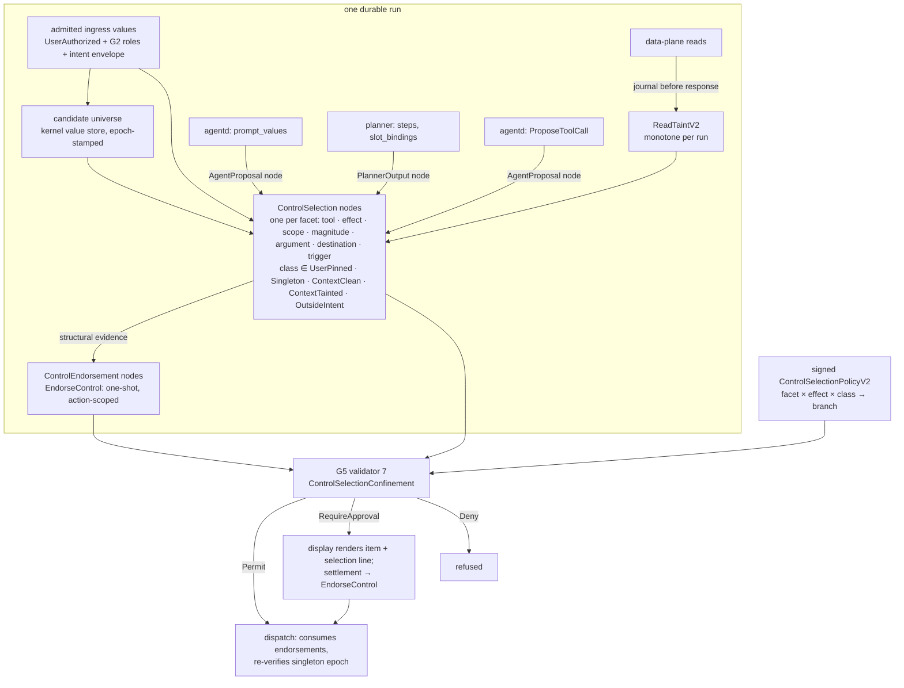

# Savana V2 Control-Selection Provenance: Governing Who Chooses

Status: proposed design, v0.2 (2026-09-03). Written against `main` at
`bee2ed3`. This document changes no code by itself; it specifies four
mechanisms that together make *choices* — not only *values* — subject to the
kernel's provenance, labels, validators, and consent. It composes with
`docs/declassification-v2.md` (*DECL*), `docs/planner-privacy-v2.md`
(*PRIV*), `docs/connector-registration-v2.md` (*REG*), and
`docs/superpowers/specs/2026-07-27-savana-secure-kernel-v2-design.md` §8–9
(*MASTER*). Where this document and MASTER differ, MASTER's fail-closed rules
win and the affected dispatcher stays disabled.

v0.2 resolves three review findings against v0.1: (R1) selection provenance
must cover every choice dimension — tool, effect kind, operation and resource
scope, magnitude, and whether to act at all — not only destination-projected
arguments (§4, §8); (R2) the way a choice regains trusted integrity needs a
formal object, a closed one-shot action-scoped endorsement transition, rather
than an informal "the settlement is the record" (§5.6); (R3) the singleton
argument holds only over a closed, kernel-computed candidate universe with a
defined freeze point, a defined answer to late arrivals, and a defined place
in the action's digests (§6).

---

## 1. Problem statement

The label algebra (`crates/savana-policy-core/src/v2/labels.rs`) governs
what a *value* may do. It says nothing about who *chose* the value. A
compromised proposer — the planner (A2), the agent process (A3), or either of
them steered by fetched content (A1, A4) — still decides:

1. **which tool** a plan step invokes (`tool_class`, `action_template`);
2. **which effect kind** the step carries — a send step inside a
   summarization task;
3. **which operation and resource scope** — one item or the whole account;
4. **which magnitude** — an amount, a count, a size the user never stated;
5. **which of several trusted handles** fills a control field (recipient,
   target, destination);
6. **whether and when** a committed step is proposed at all.

Worked example A. The user's input contains Alice's and Bob's addresses.
Both enter the run as `UserAuthorized` values with `SEND` in their effect
set. An injected agent binds `to ← Bob`. Every argument label is trusted,
every existing validator permits, and — as §1.2 shows — the human cannot see
the substitution in the approval display.

Worked example B (R1). The user asks for a summary. The run contains one
active send tool. The attacker does not need Bob: the plan simply contains a
send step whose only candidate destination is the one address in the run.
Argument-level selection provenance would classify that as a singleton and
permit it. The choice that matters is *effect kind* and *whether to act*,
not the destination.

In classical IFC terms this is the *implicit flow* / program-counter
dependency: the control decision depends on data the label of the moved
value does not carry. CaMeL's interpreter tracks it by making values and
tool calls inside a branch depend on the branch condition. Savana has no
interpreter with branches — derivation has five unconditional operations and
a plan is a DAG — so the dependency lives at *who bound this argument, who
chose this step, and what had they read when they did*. Today it is not
recorded.

### 1.1 Where the choice is made today (evidence)

| Choice | Selector | Code | State |
|---|---|---|---|
| Which values are offered to the planner at all | agentd (`prompt_values`) | `crates/savana-kerneld/src/v2_agent_authority.rs:2458` (`validate_run_values`), `:2489` (zip with slots) | accepted from the caller; only run membership is checked |
| Slot kind visible to the planner | kernel | `v2_agent_authority.rs:2470` (`SlotKindV2::new(1)` for every slot) | constant; the planner cannot distinguish candidates by kind |
| Which tool classes the planner is *told* it may use | kernel, from the signed per-intent template allowlist | `v2_agent_authority.rs:2433`–`2447` | advisory: it shapes the envelope |
| Which tool classes a committed plan may actually use | planner | `v2_agent_authority.rs:2681`–`2686` | commit checks class → active descriptor and template equality, **not** membership in the signed `allowed_action_templates`; a plan may commit a step the envelope never offered |
| Alias → argument binding | planner (`PlannerStepV2::slot_bindings`) | `crates/savana-kernel-protocol/src/v2/kernel_agent.rs:364`; resolved at `v2_agent_authority.rs:2693` | resolved to the offered value handles at commit; label of the plan never joined |
| Effects an intent may carry | kernel | `v2_agent_authority.rs:2960` | intersection of the *argument* labels only |
| "Should untrusted data steer this effect?" | G5 `IntentFlowConfinement` | `crates/savana-policy-core/src/v2/validator.rs:664`, rationale at `:404` | confined iff no argument is `ExternalUntrusted`; the comment states that user values "stay `UserAuthorized` even when the planner selects them by internal id" — selection is deliberately not tainted |
| Role relations that could pin a slot to the user's stated intent | G2 / G4 | `v2_agent_authority.rs:2873` and `:3131` pass `Vec::new()`; `crates/savana-input-runtime/src/lib.rs:819` emits only adjacent-slot link relations | machinery exists; no role semantics are extracted or enforced |
| Which committed step is proposed, and when | agentd (`ProposeToolCall`) | `v2_agent_authority.rs:2811` | any committed step, any time before expiry |
| Reads that precede a proposal | kernel | `crates/savana-kerneld/src/v2_data_plane.rs:158` | served from the vault; not journaled as a run fact |

What *is* pinned today: the planner route, task template, intent kind and
purpose come from the input runtime's verified planner envelope and the
request must equal them (`v2_agent_authority.rs:217`–`228`). The intent kind
is therefore user-derived. What the plan does with that intent is not.

### 1.2 The human backstop is opaque for tool execution

The tool-execution approval display is built by `projected_display`
(`v2_agent_authority.rs:5983`): for each argument it emits the argument
name, the value digest and the provenance digest — never the value — and the
bytes are rendered by `BoundedApprovalDisplayTextV2::from_binary`
(`crates/savana-kernel-protocol/src/v2/signed.rs:170`) as a prefixed base64
string. The signed envelope, the two WebAuthn ceremonies, and the exact-bytes
binding all work as designed, but the exact bytes a human approves are
digests. A human cannot distinguish "send to Alice" from "send to Bob", nor
"summarize" from "summarize, then send". (Final release renders a
destination projection; connector registration renders a complete textual
descriptor. Tool execution does not.)

### 1.3 Why existing mitigations do not close it

- **Planner quarantine** (PRIV) removes free text from the planner, so A1
  cannot inject the planner directly. It does not constrain A2 or A3, and the
  agent reads masked views that still carry every non-PII byte, including
  injected instructions that miss the 21 blocklist patterns.
- **Per-intent template allowlist** bounds what the planner is told, not
  what a plan may commit (§1.1).
- **Ontology constraints** (`crates/savana-policy-core/src/v2/ontology.rs:650`)
  restrict which *values* are acceptable. Alice and Bob both pass an
  allowlist that contains both.
- **Policy disposition** `RequireApproval` escalates every authorizing call
  to a human — who then sees §1.2.
- **Egress exact-sink binding** (DECL §10.3) restricts final release to
  signed sinks. It does not cover tool arguments, and a sink allowlist with
  two entries has the same problem.

## 2. Goals and non-goals

Goals:

- **G-A Choices are provenance.** Every control-relevant choice, on every
  facet of §4, becomes a node in the provenance DAG, minted by the kernel,
  labeled by the existing algebra, and bound into the intent's evaluation
  input and approval binding.
- **G-B The algebra is unchanged.** No fifth label dimension. A choice is
  modeled as a derivation whose parents are the chosen item and the
  *selector*; `derive_normal` then gives the conservative answer for free.
- **G-C Endorsement is a closed transition.** The only way a choice regains
  trusted integrity is `EndorseControl`, a one-shot, action-scoped
  transition with three closed evidence kinds (§5.6). Structural evidence
  (a user-pinned role, a kernel-proved singleton) endorses without a human;
  everything else needs a settlement. Nothing is `Permit` by default.
- **G-D Whether-and-when is covered.** The decision to issue a call at all,
  and the effect kind it carries, are selections with their own nodes.
- **G-E Consent sees the choice.** The approval display renders the chosen
  item and the reason it needed a human; the settlement binds the choice.
- **G-F Crash- and replay-safe.** Read taint, candidate snapshots and
  endorsements are durable facts written before the response or effect that
  depends on them; replay reproduces the same nodes or fails with
  `StateConflict`.

Non-goals:

- Bandwidth-limited covert channels through the choice itself (which of
  several approved actions runs, how many, when). This design makes them
  *auditable* (every choice is a node with its candidate set) and
  *rate-limited* (tainted choices need a settlement); it does not eliminate
  them. MASTER §4.3 lists side channels as out of scope.
- Planner quality or the private mapper's internals (PRIV). The kernel
  cannot see agentd-side stages; it treats their output as `PlannerOutput`.
- Any change to the five declassification transitions or the content gate.

## 3. Design overview



Four mechanisms, one carrier:

| # | Mechanism | Role | Section |
|---|---|---|---|
| M1 | Selection provenance nodes and the endorsement transition | the carrier: every choice is a labeled node; endorsement is the only way up | §5 |
| M2 | Singleton candidate sets | "no choice was made" is provable by the kernel over a closed universe | §6 |
| M3 | User-pinned bindings | the user's own extracted intent fixes the facet | §7 |
| M4 | Context classes and the trigger | a choice made after reading untrusted content is tainted; issuing a call at all, and the effect it carries, are choices | §8 |

Two authorities at two timescales, as in DECL: the signed
`ControlSelectionPolicyV2` (§9) says which selection classes a deployment
tolerates for which facets and effects; the settlement (§10) says a human
resolved this particular choice.

## 4. Vocabulary

### 4.1 Control facets (R1)

A **control facet** is one dimension along which a proposer chooses. The
set is closed (`ControlFacetV2`, `u16`):

| Tag | Facet | What is chosen | Candidate universe (§6.1) |
|---:|---|---|---|
| 1 | `Tool` | the active descriptor that implements the step | active descriptors for the session role whose action template is in the signed per-intent `allowed_action_templates` |
| 2 | `EffectKind` | the authorizing effect class the step carries | effect classes implied by the user's intent envelope: the union of `descriptor.effects()` over the allowed templates for the G2 intent |
| 3 | `Scope` | the descriptor's declared `ResourceScopeV2` (`Item`, `Collection`, `Account`, `Global`) and every argument the descriptor marks as a scope argument | scope classes permitted by the intent envelope; for scope arguments, run values of the argument's kind |
| 4 | `Magnitude` | every argument the descriptor marks as a magnitude (amount, count, size, duration) | user-supplied values of that magnitude kind in the run |
| 5 | `Argument(name)` | every other argument of an authorizing descriptor (control fields, default: all of them) | run values of the argument's slot kind |
| 6 | `Destination` | the final-release sink | signed sinks (DECL) that the run's evidence references |
| 7 | `Trigger` | that this step is proposed now | effect classes the intent envelope authorizes, joined with the read-taint state at proposal |

Descriptors declare their facets (`control_fields`, `scope_arguments`,
`magnitude_arguments`, `resource_scope`; §12). An authorizing descriptor
that declares nothing gets the defaults: all arguments are `Argument`
facets, the scope is `Global`, and no magnitudes — which is the most
escalating reading, so an unannotated descriptor costs approvals, never
safety.

Example B under this vocabulary: the send step's `EffectKind` candidate
universe for a `SummarizeDocument` intent is `{READ}`; `SEND` is not in it.
The choice is `OutsideIntent` (§4.4), and the trigger inherits the same
class. A singleton destination does not help the attacker, because the
facet that fails is not the destination.

### 4.2 Candidate universe, snapshot, epoch

The **candidate universe** of a run is the kernel's value store for that
run (`crates/savana-kerneld/src/v2_value_owner.rs`) plus the kernel-held
descriptor registry and intent envelope. §6.1 enumerates every path that
adds to it. A **candidate snapshot** is the universe filtered for one facet
at one moment, stamped with the run's `candidate_epoch` — a monotone counter
the kernel increments every time an *eligible* item (§6.2) is added to the
universe. The snapshot digest is `H(SAVANA_CANDIDATE_SET_V2\0 ‖ facet ‖
epoch ‖ sorted item ids)`.

### 4.3 Selectors

The provenance record of whatever made a choice:

| Choice | Selector record | Source kind |
|---|---|---|
| offered candidates | the authenticated `PreparePlannerCall` request | `AgentProposal` (new, tag 9) |
| tool, effect kind, scope, magnitude, alias → argument | the committed plan | `PlannerOutput` (existing, tag 4) |
| proposal of a step, timing | the authenticated `ProposeToolCall` request | `AgentProposal` |
| destination of a release | the authenticated `PrepareRelease` request | `AgentProposal` |

`AgentProposal` records are minted by the kernel from the authenticated
canonical request bytes (`authenticated_canonical_request` already reaches
`propose_tool_call`), carry integrity `ExternalUntrusted`, readers `KERNEL`,
and effects confined to `READ` by the existing ceiling. They are provenance
only; they hold no value bytes.

### 4.4 Selection classes

`SelectionClassV2` (closed, `u16`), computed by the kernel from durable
facts; no request field can carry one:

| Tag | Class | Meaning |
|---:|---|---|
| 1 | `UserPinned` | a G2 role binding from the user's own approved input fixes this facet to the chosen item (§7) |
| 2 | `Singleton` | the snapshot has exactly one member and the chosen item is it (§6) |
| 3 | `ContextClean` | a real choice among ≥ 2 candidates, made before any tainting read in the run (§8) |
| 4 | `ContextTainted` | a real choice among ≥ 2 candidates, made after a tainting read, or bound before but proposed after (§8) |
| 5 | `OutsideIntent` | the chosen item is not in the snapshot at all: an effect the intent does not authorize, a magnitude the user never stated, a scope wider than the intent, a tool outside the allowlist |

`OutsideIntent` is a class rather than a refusal because a person can
answer "the task did not ask to send anything — send anyway?". Policy may
still map it to `Deny` (§9), and for `Tool` it always is (§8.4).

## 5. M1: selection provenance nodes and endorsement

### 5.1 Node

`SourceKindV2::ControlSelection` (new, tag 10), `array(4)`:

```text
ControlSelection {
    facet: ControlFacetV2,
    field: ControlFieldIdV2,               // argument-name digest, or zero for facet-level choices
    selection_class: SelectionClassV2,
    candidate_set_digest: Digest32V2,      // §4.2; zero only for Trigger
}
```

- `value_digest` = the chosen item's digest: a value digest for arguments,
  the descriptor digest for `Tool`, the effect-set canonical digest for
  `EffectKind`, the scope tag digest for `Scope`, the intent's semantic
  binding digest for `Trigger`.
- `parents` = `[chosen item record]` for `Singleton`;
  `[chosen item record, ingress extraction record carrying the role]` for
  `UserPinned`; `[chosen item record, PlannerOutput record, AgentProposal
  record(s)]` for `ContextClean`, `ContextTainted` and `OutsideIntent`.
  For facet-level choices (`Tool`, `EffectKind`, `Scope`) the "chosen item
  record" is the kernel's `PolicyConstant` record for the descriptor,
  effect set or scope tag, which is `KernelTrusted`; the selector parent
  supplies the untrust. For `Trigger` the parents are the intent's argument
  records plus the proposing `AgentProposal`.
- `evidence` = `[facet tag, field digest, class tag, candidate_set_digest,
  candidate_epoch, read_taint_digest at selection, plan_revision_digest,
  internal_step_id, role_evidence_digest (zero unless UserPinned)]`.
- Digest domain `SAVANA_CONTROL_SELECTION_V2\0`. Same bounds as every node.

### 5.2 Label

The node's label is `derive_normal(parents, policy_allowed_effects)` —
nothing new:

- `Singleton`: one parent; the node inherits its label.
- `UserPinned`: both parents `UserAuthorized`; the join is `UserAuthorized`.
- `ContextClean`, `ContextTainted`, `OutsideIntent`: a `PlannerOutput` or
  `AgentProposal` parent is `ExternalUntrusted`; the join is
  `ExternalUntrusted` and the ceiling leaves `effects ⊆ {READ}`.

### 5.3 Where nodes are minted

| Point | Facets | Selector parents |
|---|---|---|
| `commit_planner_value` (`v2_agent_authority.rs:2631`) | `Tool`, `EffectKind`, `Scope`, `Magnitude`, `Argument` for every committed step | `PlannerOutput` + the `AgentProposal` of the `PreparePlannerCall` that offered the candidates |
| `propose_tool_call` (`:2811`) | `Trigger` | `AgentProposal` of this proposal |
| `prepare_release` (`:4077`) | `Destination`, `Trigger` | `AgentProposal` of this request |

Minting happens after the existing binding checks and before any durable
preparation, on the "gate before durable prepare" boundary DECL
established: a refused node leaves no intent, no quota reservation, and no
journal entry.

### 5.4 Binding into the decision

`VerifiedActionIntentMaterialV2` gains `control_bindings: Vec<ControlBindingV2>`:

```text
ControlBindingV2 {
    facet, field,
    selection_node_digest,
    selection_class,
    endorsement_node_digest: Option<Digest32V2>,   // §5.6
}
```

sorted by `(facet, field)`, deduplicated, at most `max_control_facets`. Its
canonical digest (`SAVANA_CONTROL_BINDINGS_V2\0`) is folded into:

- the G5 `evaluation_input_digest`, so a changed selection is a different
  decision and replays as `StateConflict` rather than a silent re-decision;
- the tool approval binding digest (`crates/savana-policy-core/src/v2/intent.rs:260`)
  under a new domain string, so a settlement authorizes exactly this
  selection (§10);
- the durable pre-seal digest for execution and release, next to the
  declassification node digest DECL already binds there.

It is **not** folded into `ActionIntentIdV2`. Intent identity is "this step
with these arguments", created exactly once per committed step
(`create_or_replay_verified_intent`); the material — and therefore the
selection facts — is immutable from that moment, and a request that would
attach different facts to an existing identity is already a binding
conflict. The digests above are where the facts become load-bearing
(R3, last question).

### 5.5 The validator

A seventh internal validator, `ControlSelectionConfinement`
(implementation id 7; ids 1–6 unchanged so recorded decisions replay under
their own registry):

```text
confined(intent) :=
    descriptor.effects ∩ EFFECT_AUTHORIZING_V2 = ∅
    ∨ ∀ b ∈ control_bindings:
          b.endorsement_node_digest ≠ None
        ∨ b.selection_class ∈ policy.permitted_classes(b.facet, effect_class(descriptor))
```

Failure branch: `RequireApproval`. The signed policy table (§9) contributes
a further branch by `meet`, which is how a class can be driven to `Deny` for
a facet and effect class without a validator ever widening anything — the
composition rule in `evaluate_or_replay` (`validator.rs:545`) is unchanged.
`IntentFlowConfinement` (id 6) keeps its definition; 6 asks "is the *value*
untrusted?", 7 asks "is the *choice* untrusted?".

### 5.6 Endorsement: the only way up (R2)

Declassification is the kernel's only confidentiality-lowering operation
(DECL). Its dual — the only integrity-raising operation for a choice — is a
closed transition:

```text
EndorseControl {
    selection:  Digest32V2,                 // the ControlSelection node
    evidence:   EndorsementEvidenceV2,      // closed, below
    slot:       (ControlFacetV2, ControlFieldIdV2),
    action:     (ActionIntentIdV2, evaluation_input_digest),
}
```

with `EndorsementEvidenceV2` (closed, `u16`):

| Tag | Evidence | Who mints | When |
|---:|---|---|---|
| 1 | `UserRole { role_evidence_digest }` | kernel, automatically | at plan commit, when §7.3 pins the facet |
| 2 | `SingletonProof { candidate_set_digest, candidate_epoch }` | kernel, automatically | at node minting, when §6.3 proves the singleton |
| 3 | `Settlement { settlement_digest, control_bindings_digest }` | kernel, on verified consent | at `authorize_tool_call` / `authorize_release`, when a settlement whose binding digest covers this intent's control bindings verifies |

The transition mints `SourceKindV2::ControlEndorsement` (new, tag 11): a
node whose `value_digest` equals the selection node's, whose single parent
is the selection node, whose evidence is `[evidence tag, evidence digest,
slot, action_intent_id, evaluation_input_digest]`, and whose label is
`⟨UserAuthorized, conf(selection), readers(selection), effects(selection
parent item) ∩ policy_allowed_effects⟩` — the integrity is set by the
transition, not derived; it is the one place in the kernel where integrity
rises, and it is bounded to `UserAuthorized`, never `KernelTrusted`.

Properties, each enforced by construction:

- **One-shot.** The endorsement is consumed by exactly one durable dispatch
  preparation, recorded in the WAL next to the settlement consumption DECL
  already journals. A second preparation naming the same endorsement is
  `StateConflict`.
- **Action-scoped.** `action` is inside the node's evidence and inside its
  digest. Validator 7 accepts an endorsement only if its `action` equals the
  intent under evaluation and its `slot` names one of that intent's control
  bindings. An endorsement minted for intent *a* cannot satisfy intent *b*,
  even for the same value, the same facet, and the same run.
- **Not derivable.** `derive_normal` and `ProvenanceRecordV2::build` refuse
  a `ControlEndorsement` (or `ControlSelection`) node as a parent with a new
  `G3Error::ControlNodeNotDerivable`. Endorsed integrity cannot flow into
  any value; it exists only as the evidence that lets *this* action pass
  validator 7. This is what keeps G-B true: no value in the DAG is ever
  more trusted than its data parents.
- **Not reusable.** An endorsement is bound to the intent's
  `evaluation_input_digest`, which includes the control-bindings digest
  (§5.4); a re-evaluation with different facts is a different digest and
  the endorsement no longer matches.
- **Not asserted.** Evidence kinds 1 and 2 are computed by the kernel from
  its own store; kind 3 requires a settlement that approvald signed over
  the same control-bindings digest. There is no request field that carries
  an endorsement.

The validator reads endorsements only through the intent's
`control_bindings`; a `ControlEndorsement` node that no binding references
is inert.

## 6. M2: singleton candidate sets (R3)

### 6.1 Where candidates come from

The universe is closed because every path that adds to it is kernel-owned:

| Path | Adds | Integrity | Eligible |
|---|---|---|---|
| run admission (`v2_value_owner.rs:301`, `commit_verified_run_admission`) | the gated ingress input and every G2-extracted slot of every admitted ingress | `UserAuthorized` | yes |
| `DeriveValue` (`v2_value_owner.rs:321`) | derivations over existing run values, labeled by `derive_normal` | join of parents | yes iff the join is `UserAuthorized` or `KernelTrusted` |
| `CommitPlannerValue` (`v2_value_owner.rs:470`) | the plan value | `ExternalUntrusted` | never |
| policy constants | signed constants referenced by descriptors | `KernelTrusted` | yes |
| descriptor registry and intent envelope | active descriptors, allowed templates, effect classes, scope classes | signed | yes, for the facet-level universes |

Tool results and recovered executions are vault documents
(`v2_agent_authority.rs:4009`), not run values; they are `ExternalUntrusted`
and never candidates. No agent-facing operation registers an arbitrary
value: the 25 agent operations can only derive from existing run values or
commit a planner output.

### 6.2 Eligibility

An item is eligible for a facet's snapshot iff it (i) has the facet's kind
(for arguments: the declared slot kind — prerequisite P1 in §14 replaces
the constant `SlotKindV2::new(1)` with kinds derived from provenance),
(ii) carries integrity `UserAuthorized` or `KernelTrusted`, (iii) is live
(not expired, not revoked), and (iv) satisfies the facet's cardinality.

### 6.3 Freeze point and epoch

The snapshot for a facet is frozen when its selection node is minted (§5.3)
and stamped with the run's `candidate_epoch` at that instant. The snapshot
digest and the epoch are in the node's evidence, in the control-bindings
digest, and therefore in the evaluation-input, approval-binding and
pre-seal digests (§5.4). A `SingletonProof` endorsement carries both.

### 6.4 Can the agent hide a candidate?

No, on three grounds. The snapshot is computed from the store, not from
the agent's `prompt_values`; offering Bob alone leaves Alice in the
universe. G2 extraction is kernel-owned and runs at admission, before any
plan exists, so every slot of every admitted input is in the store first.
And there is no operation that removes a value from a run: revocation is a
vault-level, journaled transition that marks a value not live, which
*shrinks* eligibility only through a record the audit can see, and a
revoked-then-singleton facet is classified with the revocation in its
evidence.

Late *arrival* is the mirror case and is answered in §6.5.

### 6.5 Late candidates and recorded decisions

- A recorded decision is immutable. A candidate that arrives after an
  intent's snapshot does not rewrite that intent's class, its evaluation
  digest, or its approval binding; replay reproduces the recorded decision.
- A `SingletonProof` is an *absence* claim ("nothing else existed"), and
  absence claims are re-verified at the moment of effect: durable dispatch
  preparation compares the run's current `candidate_epoch` with the epoch in
  every `SingletonProof` endorsement the intent consumes. A mismatch is
  `StateConflict`: the intent is not dispatched, the endorsement is not
  consumed, and the agent must re-propose, which re-classifies against the
  current universe (now ≥ 2 candidates ⇒ a real choice ⇒ a human or a
  role). A stale singleton therefore never dispatches.
- `UserRole` and `Settlement` endorsements are *presence* claims and are
  not invalidated by later arrivals: the user did name Alice; the human did
  approve this binding.
- The epoch increments only on eligible additions, so an attacker cannot
  invalidate a legitimate singleton by registering untrusted values;
  registering a *trusted* derivation (from user content) does invalidate it,
  which is the safe direction and costs the attacker an approval.

### 6.6 Classification

- `|snapshot| = 1 ∧ chosen ∈ snapshot` ⇒ `Singleton`, and a
  `SingletonProof` endorsement is minted immediately.
- `chosen ∉ snapshot` ⇒ `OutsideIntent` for facet-level facets and for
  magnitudes; for arguments bound to an untrusted or wrong-kind value the
  existing binding validators already refuse.
- otherwise ⇒ §7, then §8.

A universe larger than `max_control_candidates` (§12) is classified
`ContextTainted` (fail closed toward a human), never `Singleton`.

## 7. M3: user-pinned bindings

### 7.1 Extraction

The signed G2 asset (`crates/savana-input-runtime/src/lib.rs`) gains, per
extraction rule, `role_bindings: Vec<(RelationIdV2, SlotSelectorV2)>`: a
closed relation id in a new *role* namespace (`recipient_of`, `target_of`,
`subject_of`, `amount_of`, `scope_of`, …, at most `max_role_bindings`) and
a selector that names which extracted slot of the rule's trigger fills the
role (by ordinal within the match, or by detection class when unique). The
kernel-owned extraction emits `AbstractRoleBindingV2 { role, slot }`
alongside the existing adjacent link relations; they are digested into the
G2 output and stored with the run at admission, keyed by value handle. The
agent never sees or supplies them. A rule may also pin facet-level choices:
an intent rule that names `allowed_effects` or a `scope` pins `EffectKind`
and `Scope`.

### 7.2 Descriptor side

Descriptors already declare `permitted_relations` per argument
(`crates/savana-policy-core/src/v2/binding.rs`). A control field that may be
pinned lists the role relation(s) that satisfy it. This is signed with the
descriptor (REG).

### 7.3 Enforcement at plan commit

For each facet with at least one permitted role:

- exactly one run item carries a matching role binding and it is the
  chosen item ⇒ `UserPinned`, and a `UserRole` endorsement is minted;
- exactly one run item carries the role and the chosen item is a
  *different* member of the snapshot ⇒ **refuse** with
  `InvalidInternalSlotBinding`. The user said Alice; a plan that says Bob is
  malformed, not risky, so it denies rather than escalates;
- no item or more than one item carries the role (the user named nobody, or
  two people) ⇒ fall through to §6 and §8.

The `Vec::new()` at `v2_agent_authority.rs:2873` and `:3131` becomes the
run's stored role bindings. `from_resolved_envelope` already rejects
incident relations outside `permitted_relations`; no new rejection path is
needed there.

## 8. M4: context classes, read taint, and the trigger

### 8.1 Read taint

`ReadTaintV2` is a per-run record in kerneld's durable agent state
(`crates/savana-kerneld/src/v2_agent_durable.rs`):

```text
ReadTaintV2 { tainted: bool, first_taint_sequence: u64, sources_digest: Digest32V2 }
```

It is set the first time the kernel is about to return to the agent any
bytes whose provenance lineage contains a *tainting source*: by default
`ToolResult`, `RecoveredExecution`, and `GatedIngress` on the
`OriginalSource` and `ExtractedPage` channels (user-supplied documents can
carry injected instructions even though their use is authorized).
`ChatText` — the user's typed request — is not tainting by default; a
kernel that tainted on it would classify every run tainted before the first
plan, which is the CaMeL assumption inverted. The tainting set is a closed,
signed policy list (§9), not a caller choice.

Read paths that can taint: `ReadAgentView`, `GetExecutionStatus` with a
completion projection, `FetchCompletion` projections, and any future
data-plane read. The taint record is committed to the durable state
**before** the response is released — the journal-before-effect discipline
MASTER §9 applies to dispatch — and is part of the run's recovery
projection. A run whose taint record cannot be recovered is treated as
tainted.

### 8.2 Context class

A real choice (neither pinned, singleton, nor outside the intent) is:

- `ContextClean` if every selector record that made it — the
  `AgentProposal` that offered candidates, the `PlannerOutput` that bound
  the alias, and the `AgentProposal` that proposes the step — has a durable
  sequence number below `first_taint_sequence` (or the run is untainted);
- `ContextTainted` otherwise. In particular a step bound clean but proposed
  after a tainting read is tainted: that is the "when" dimension.

Under A1 and A4 the distinction is meaningful: an agent steered by fetched
content necessarily read that content first. Under A2 and A3 it is not — a
malicious provider or agent can choose Bob before reading anything — which is
why `ContextClean` is never `Permit` without an explicit signed opt-in (§9)
and why the settlement (§10) remains the backstop for those adversaries.

### 8.3 The trigger and the effect kind

Every intent with an authorizing effect carries a `Trigger` binding whose
class is the context class at proposal time and whose selector is the
proposing `AgentProposal`, and an `EffectKind` binding whose snapshot is the
intent envelope's effect classes. Together they cover "whether and when"
and "what kind": a call issued after reading tool results is a tainted
choice even when every argument is pinned or singleton, and a send step in a
summarization task is `OutsideIntent` even when its destination is a
singleton (example B). The policy table decides what each costs (default: a
human; for some, refusal).

### 8.4 Tool, scope, magnitude

- `Tool`: candidates are the active descriptors for the role whose action
  template the signed per-intent allowlist contains. A step whose template
  is outside the allowlist is `OutsideIntent`, and for this facet the class
  is always `Deny`: this converts the advisory allowlist of §1.1 into an
  enforced one at plan commit. One implementer ⇒ `Singleton`; several ⇒ a
  real choice with the plan as selector.
- `Scope`: the descriptor's declared `ResourceScopeV2`, ordered `Item <
  Collection < Account < Global`, compared with the widest scope the intent
  envelope permits; wider ⇒ `OutsideIntent`. Scope *arguments* (a folder, an
  account id) are `Argument` facets with role `scope_of`.
- `Magnitude`: an amount, count, size or duration argument. Candidates are
  user-stated magnitudes of that kind (G2 extracts them under P1); a
  magnitude with no user-stated candidate is `OutsideIntent`, one user-stated
  candidate is `Singleton`, several are a real choice. Ontology bounds
  (`In`/`Eq` comparisons, signed) continue to cap the value itself.

## 9. Policy: `ControlSelectionPolicyV2`

A signed, canonically encoded, manifest-pinned table in the G5 policy
material (delivered with the same discipline as the validator declarations
`v2_startup.rs` decodes today):

```text
ControlSelectionPolicyV2 {
    schema_version: 1,
    tainting_sources: [SourceChannelV2],                            // closed, sorted, deduplicated
    rows: [(ControlFacetV2, EffectClassV2, SelectionClassV2, BranchV2)],   // total over the product
    allow_context_clean_permit: bool,
}
```

Validation at decode (fail closed):

- every (facet, effect class, selection class) triple has exactly one row;
- `UserPinned` and `Singleton` may be `Permit`, `RequireApproval`, or `Deny`;
- `ContextClean` may be `Permit` only if `allow_context_clean_permit` is
  true — the deployment explicitly adopting the CaMeL posture that a plan
  formed from user input alone is trusted for control flow;
- `ContextTainted` ∈ {`RequireApproval`, `Deny`};
- `OutsideIntent` ∈ {`RequireApproval`, `Deny`}; for facet `Tool` it must be
  `Deny`;
- rows for `FINAL_RELEASE` may not be `Permit` for any class: a release
  needs its settlement regardless (DECL §10.3).

Recommended defaults, which are also the compiled fallback when a
deployment ships no table (S2 in §14):

| Facet × effect | UserPinned | Singleton | ContextClean | ContextTainted | OutsideIntent |
|---|---|---|---|---|---|
| `Argument`, `Destination` × CREATE / UPDATE / SEND | Permit | Permit | RequireApproval | RequireApproval | RequireApproval |
| `Argument`, `Destination` × DELETE / EXECUTE | Permit | RequireApproval | RequireApproval | Deny | Deny |
| `EffectKind`, `Scope`, `Magnitude` × any | Permit | Permit | RequireApproval | RequireApproval | RequireApproval (DELETE / EXECUTE: Deny) |
| `Tool` × any | Permit | Permit | RequireApproval | RequireApproval | Deny |
| `Trigger` × any | — | — | RequireApproval | RequireApproval | RequireApproval |
| any facet × FINAL_RELEASE | RequireApproval | RequireApproval | RequireApproval | RequireApproval | Deny |

The table participates in `evaluate_or_replay` as one more branch in the
`meet`; it can only narrow.

## 10. Consent: a legible display and a bound settlement

### 10.1 Display

The signed display projection for tool execution must render, for each
control binding that is not endorsed by structural evidence, the chosen
item through the descriptor's display projection (bounded, gated by
`BuildApprovalDisplay` as today), followed by a selection line rendered
from the node:

```text
effect: SEND — not part of this task (summarize); chosen by planner
to: alice@example.com — chosen by planner among 2 candidates; context: tainted (tool result read at #3)
```

The lines come from the node (facet, class, candidate count, taint
sequence), never from caller text. The display remains bounded by
`MAX_APPROVAL_DISPLAY_BYTES_V2`; a display that does not fit is refused, not
truncated (the REG display already follows this rule). This resolves §1.2 for
tool execution as a side effect and is prerequisite **P2** in §14: without it
the settlement of §10.2 would bind a choice the human could not see.

### 10.2 Settlement

The approval binding digest includes the control-bindings digest (§5.4).
Approvald's settlement therefore authorizes this intent *with these
selections*. On verification, `authorize_tool_call` mints one
`Settlement` endorsement per non-endorsed control binding (§5.6), each
bound to this intent's evaluation-input digest. A settlement obtained for
`to ← Alice` cannot be replayed for `to ← Bob` even if both intents share
every other field; the mismatch is `G4Error::StateConflict` at dispatch
preparation, exactly as DECL's final-release settlement rule behaves today.

The audit therefore always reads the same way: a machine chose
(`ControlSelection`, `ExternalUntrusted`), and either the kernel proved the
choice was not one, the user had already made it, or a human agreed to it
(`ControlEndorsement`, `UserAuthorized`, one action, once).

## 11. Invariants and failure model

Invariants:

- **I1** Every applicable facet of an intent with an authorizing effect has
  exactly one `ControlSelection` node, and the node digest is bound into
  the evaluation input digest, the approval binding digest, and the pre-seal
  digest.
- **I2** A selection node's integrity is the join of its parents. The kernel
  is a parent only through `PolicyConstant` items or a singleton's chosen
  value; kernel computation never upgrades a choice.
- **I3** Candidate snapshots are computed from the run's value store, the
  signed descriptor registry and the intent envelope by the kernel; no
  request field can name, add, or remove a candidate.
- **I4** Read taint and `candidate_epoch` are monotone within a run, set only
  by the kernel, and durable before the bytes or effect that depend on them
  leave the kernel.
- **I5** `ContextTainted` and `OutsideIntent` are never `Permit`;
  `ContextClean` is `Permit` only under an explicit signed flag; `Tool` ×
  `OutsideIntent` and `FINAL_RELEASE` × `OutsideIntent` are `Deny`;
  `FINAL_RELEASE` is never `Permit`.
- **I6** Exact replay of a proposal reproduces the same selection nodes; a
  proposal whose durable facts differ (taint, snapshot, roles) yields a
  different evaluation input digest and `StateConflict`.
- **I7** A settlement binds one control-bindings digest; it authorizes no
  other selection.
- **I8** A `UserPinned` conflict (user named Alice, plan bound Bob) refuses
  at plan commit and creates no intent.
- **I9** `EndorseControl` is the only transition that raises the integrity
  of a choice; its output is bounded to `UserAuthorized`, bound to one
  action and one evaluation-input digest, consumed at most once, and never
  accepted as a derivation parent.
- **I10** A `SingletonProof` endorsement dispatches only if the run's
  `candidate_epoch` still equals the epoch it was minted at.
- **I11** A step whose action template is outside the signed per-intent
  allowlist never commits (`Tool` × `OutsideIntent` = `Deny`).

Failure model:

| # | Condition | Outcome |
|---|---|---|
| F1 | candidate universe exceeds `max_control_candidates` | class `ContextTainted` |
| F2 | slot kind of a control field unknown (P1 not satisfied for this value) | class `ContextTainted` |
| F3 | role bound to one item, plan bound another candidate | `InvalidInternalSlotBinding`, no intent |
| F4 | role bound to >1 items | fall through to §6/§8 |
| F5 | taint record or epoch unrecoverable after restart | run treated as tainted; every `SingletonProof` in it is stale |
| F6 | policy table missing | compiled defaults (§9) |
| F7 | policy table malformed, non-total, or violating I5 | startup refuses the generation (`KERNEL_UNAVAILABLE`) |
| F8 | validator 7 absent from the required set while the table is present | startup refuses: a table without its validator is inert by accident |
| F9 | control-bindings digest in settlement ≠ intent's | `StateConflict` at dispatch preparation |
| F10 | display with selection lines exceeds the bound | display refused; the agent receives `PolicyLimitExceeded` |
| F11 | node parents cross runs or manifests | existing `CrossRunParent` / `CrossManifestParent` |
| F12 | `AgentProposal` record cannot be minted (entropy, limits) | proposal refused, nothing durable |
| F13 | selection class, endorsement, or candidate set supplied in any request field | malformed request (the fields do not exist on the wire) |
| F14 | `Trigger` or `EffectKind` node missing on an authorizing intent | `ArgumentBindingIntegrity` refuses the binding as incomplete |
| F15 | endorsement's `action` ≠ intent under evaluation, or `slot` not among its bindings | endorsement ignored; validator 7 evaluates the raw class |
| F16 | second dispatch preparation names a consumed endorsement | `StateConflict` |
| F17 | `SingletonProof` epoch ≠ current run epoch at dispatch preparation | `StateConflict`; endorsement not consumed; re-proposal required |
| F18 | `ControlSelection` or `ControlEndorsement` node offered as a derivation parent | `G3Error::ControlNodeNotDerivable` |
| F19 | step template outside the signed allowlist | plan commit refused (`Tool` × `OutsideIntent` = `Deny`) |

## 12. Wire, schema, and limit impact

All changes are additive and V2-only.

| Surface | Change |
|---|---|
| `SourceKindV2` | tags 9 `AgentProposal { request_digest }`, 10 `ControlSelection { facet, field, selection_class, candidate_set_digest }`, 11 `ControlEndorsement { evidence, slot, action }` |
| `ControlFacetV2`, `SelectionClassV2`, `ControlFieldIdV2`, `ControlBindingV2`, `EndorsementEvidenceV2`, `ResourceScopeV2` | new closed types in policy-core `v2` |
| `G3Error` | `ControlNodeNotDerivable` |
| `VerifiedActionIntentMaterialV2` | `control_bindings` (sorted, bounded) |
| `tool_approval_binding_digest_v2` | new domain string; digest input gains `control_bindings_digest` |
| pre-seal digests (execution, release) | gain `control_bindings_digest` |
| dispatch preparation WAL | endorsement consumption records; singleton epoch check |
| `InternalValidatorImplementationKindV2` | id 7 `ControlSelectionConfinement`; ids 1–6 unchanged |
| G5 policy material | `ControlSelectionPolicyV2` (signed, manifest-pinned) |
| `UnsignedToolDescriptorV2` | `control_fields`, `scope_arguments`, `magnitude_arguments`, `resource_scope`; per-argument role `permitted_relations` (already present) |
| G2 asset schema | `role_bindings` per rule, intent-level `allowed_effects` and `scope`; `AbstractRoleBindingV2` in output; asset schema version bump |
| durable run state | `ReadTaintV2`, `candidate_epoch`; recovery projection carries both |
| `DeploymentHardLimitsV2` | `max_control_facets` (24), `max_control_candidates` (4,096), `max_role_bindings` (64) |
| approval display | selection lines; existing bound unchanged |
| public statuses, JARVIS control, SDK | unchanged; no new content crosses to Python |
| frozen core | regenerate `deploy/frozen-v2-core.sha256` after review |

Decisions recorded before the change replay under their recorded validator
set and input digest, as today. V1 is untouched.

## 13. Test plan

Unit (policy-core):

- selection class derivation over the full matrix of (facet, roles,
  snapshot size, membership, taint sequence, selector sequences);
- candidate enumeration: kind filter, integrity filter, liveness, bound,
  epoch stamping, and that `prompt_values` never affect the snapshot;
- `EndorseControl`: each evidence kind; action-scope mismatch ignored;
  derivation over a control node refused; integrity bounded to
  `UserAuthorized`;
- `ControlSelectionPolicyV2` decode negatives: non-total, `ContextTainted`
  or `OutsideIntent` Permit, `Tool` × `OutsideIntent` not Deny,
  `FINAL_RELEASE` Permit, clean Permit without the flag, duplicate rows,
  unsorted sources;
- node label equals `derive_normal` of parents for every class.

Adversarial (kerneld, extending `policy_attack_matrix` and the G7 tests):

1. run with Alice and Bob; agent offers only Bob; plan binds `to ← Bob`;
   no read ⇒ `ContextClean` ⇒ `RequireApproval` under defaults; display
   shows Bob and "among 2 candidates".
2. same, after the agent read a tool result ⇒ `ContextTainted`; with a
   `Deny` row ⇒ `Denied`.
3. user input "send the report to Alice" with a `recipient_of` role; plan
   binds Bob ⇒ `InvalidInternalSlotBinding`, no intent, no quota.
4. run with Alice only ⇒ `Singleton` ⇒ `Permit` for SEND under defaults;
   the `SingletonProof` endorsement is consumed exactly once at dispatch.
5. agent derives Bob from a user document after the Alice intent was
   evaluated ⇒ epoch advances ⇒ dispatch preparation of the Alice intent is
   `StateConflict`; re-proposal is `ContextClean`/`ContextTainted`, never
   `Permit`.
6. summarization intent; plan contains a send step with one destination ⇒
   `EffectKind` is `OutsideIntent` ⇒ `RequireApproval` (or `Deny` by
   policy); the display names the effect and the task.
7. step template outside the signed allowlist ⇒ plan commit refused.
8. step committed clean, tool result read, step proposed ⇒ trigger
   `ContextTainted`.
9. settlement obtained for the Alice intent replayed against a Bob intent
   ⇒ `StateConflict`; a `Settlement` endorsement minted for intent *a*
   offered to intent *b* ⇒ ignored, *b* evaluates its raw class.
10. exact replay of a proposal reproduces identical node digests; a replay
    after a new tainting read ⇒ `StateConflict`.
11. crash between vault read and taint journal write ⇒ on recovery the
    read is not visible to the agent (response never left) and the run is
    untainted; crash after journal write ⇒ tainted. Both directions are
    consistent.
12. policy table present, validator 7 absent ⇒ startup refuses.
13. a `ControlEndorsement` handle passed to `DeriveValue` ⇒
    `ControlNodeNotDerivable`.

Differential: none. The content gate is untouched.

## 14. Staged delivery

| Stage | Content | Behavior change |
|---|---|---|
| P1 | real slot kinds from provenance (replace `SlotKindV2::new(1)`); G2 magnitude and scope kinds | none visible; planner envelopes carry coarse kinds |
| P2 | legible tool-execution display (values via display projection) | humans see values; no policy change |
| S1 | `AgentProposal` / `ControlSelection` / `ControlEndorsement` nodes, read taint, `candidate_epoch`, snapshot enumeration for all facets, control bindings in the material and digests; validator 7 **not** in the required set | inert: nodes are recorded and audited, decisions unchanged |
| S2 | validator 7 required; compiled default table; `Tool` × `OutsideIntent` enforced at commit | planner-chosen facets and tainted triggers now need a human unless singleton; templates outside the allowlist no longer commit |
| S3 | G2 role bindings and intent-level effects/scope; `UserPinned`; F3 refusal | fewer approvals; user-named recipients, effects and scopes are pinned |
| S4 | selection lines in the display; settlement-minted endorsements; epoch re-verification at dispatch | consent covers the choice; stale singletons cannot dispatch |
| S5 | signed `ControlSelectionPolicyV2` with `allow_context_clean_permit` | deployments may adopt the CaMeL posture explicitly |

S1 is pure addition and independently mergeable. S2 is the security change
and should ship with S4 or immediately before it: escalating to a human who
sees digests (§1.2) is not consent.

## 15. Decisions and open items

Resolved in v0.2 (from review):

- **D1 (R1)** Selection provenance covers seven facets (§4.1), not only
  destination-projected arguments; `EffectKind` and `Trigger` are mandatory
  on every authorizing intent; `Tool` outside the allowlist is a refusal.
- **D2 (R2)** Endorsement is a closed transition `EndorseControl` producing
  `SourceKindV2::ControlEndorsement` (tag 11): one-shot, action-scoped,
  bounded to `UserAuthorized`, never a derivation parent, never carried on
  the wire (§5.6).
- **D3 (R3)** The candidate universe is the kernel's run store plus signed
  registries; snapshots freeze at node minting with a monotone
  `candidate_epoch`; the agent cannot hide candidates (§6.4); late
  candidates never rewrite a recorded decision but invalidate a singleton
  at dispatch (§6.5); the snapshot digest enters the evaluation-input,
  approval-binding, pre-seal and endorsement digests, not the intent
  identifier (§5.4).

Open:

- **O1** Is `ChatText` tainting? Proposed no (§8.1); a deployment may add it
  to `tainting_sources`.
- **O2** Singleton threshold. Proposed exactly one; a policy-configurable
  "small set" (≤ k) is rejected because k candidates is a k-way choice.
- **O3** The private mapper (PRIV) is an agentd-side selector the kernel
  cannot see. Proposed: its output is part of `PlannerOutput`; no separate
  record.
- **O4** Should `UserPinned` require the pinned item's provenance channel to
  be `ChatText` only? Proposed no: a role extracted from an approved document
  is still the user's input, and the read-taint rule already treats documents
  as tainting for *later* choices.
- **O5** Covert-channel bandwidth: cap the number of `ContextTainted` and
  `OutsideIntent` approvals per run through the existing quota subject.
  Proposed as a follow-on under REG-style quota rules.
- **O6** Whether `Scope` should be derived per argument from ontology set
  membership instead of a descriptor-declared class. Proposed: declared
  class now, ontology-derived scopes as a later refinement.

## 16. Relationship to prior claims

`docs/technical-report.md` §3.3 and `docs/paper-draft.md` §3.3 describe the
untrusted-effect ceiling as preventing "effect laundering". That claim is
about values and remains true. It does not cover choice laundering: trusted
values, tools, effects, scopes and magnitudes selected by an untrusted party.
Until S2 ships, the honest statement is the one this document opens with —
the label algebra governs what a value may do, not who chose it — and the
academic summary and the USENIX draft carry it as an explicit limitation.
