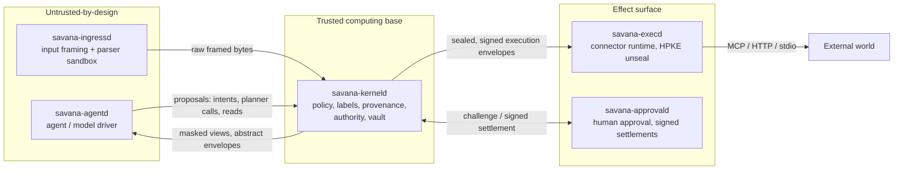

# Savana Core: A Capability- and Information-Flow Kernel for LLM Agent Systems

> **Historical report, superseded 2026-09-05.** This August 1 snapshot is
> retained for history. Its status, measurements and absolute security claims
> are not assertions about the current implementation. Use the
> [current summary](academic-summary.zh-CN.md),
> [verification record](verification/intent-bound-execution.md) and
> [revised paper](../paper/usenix-sec27/main.tex).

**Technical Report** · Revision 1.0 · 2026-08-01
Target audience: security architects, platform engineers, technical due diligence.

---

## Executive summary

Savana Core is a security kernel for systems in which a large language model
takes actions on a user's behalf. It is built on one premise: **a language
model is not a trustworthy component, and a system that lets one act must be
architected so that a fully compromised model cannot cause an unauthorized
effect.**

The industry's dominant approach — instruct the model to behave, filter its
inputs and outputs, hope the classifier catches the attack — is defense by
persuasion. Prompt injection remains unsolved under that approach because it
is not a bug to be patched but a consequence of the architecture: instructions
and data share one channel, and the model is the security boundary.

Savana Core moves the boundary. The model proposes; the kernel disposes. Every
value carries a four-dimension security label; every authorized action requires
a signed policy decision the model cannot influence; every widening of
confidentiality is a recorded, gated transition. The design goal is that a
prompt-injected agent is reduced to a component that can request things it
will not receive.

**What exists today**: 233,730 lines of Rust across 14 crates, implementing a
multi-daemon kernel with a signed policy supply chain, hash-chained deployment
manifests, a durable dispatch pipeline with crash recovery, HPKE-sealed
executor envelopes, human-approval round-trips bound to signed settlements,
and an information-flow label system with mechanically enforced invariants.
1,165 test functions, including adversarial matrices and a 6,427-vector
differential corpus for the content gate.

**What does not exist yet**, stated plainly because a security report that
oversells is worthless: the declassification gate — the mechanism that makes
confidentiality widening a governed operation — is fully implemented and
**has no production callers**. The kernel is currently safe in the masking and
egress paths because nothing ever widens a label, not because widening is
gated. Section 8 specifies exactly what this does and does not buy, and
Section 10 gives the staged plan that closes it.

This report describes the system as it is, distinguishes rigorously between
enforced and aspirational properties, and states the evidence for each claim.

---

## 1. Threat model

### 1.1 Adversaries

| ID | Adversary | Capability assumed |
|---|---|---|
| **A1** | Prompt injection via content | Fully controls text the agent reads: web pages, documents, emails, tool results. Can craft arbitrary instructions and data. |
| **A2** | Compromised model / model provider | The planner returns arbitrary attacker-chosen output. Includes a malicious or subverted external model endpoint. |
| **A3** | Compromised agent process | Arbitrary code execution in the agent daemon; can issue any protocol message the agent role is permitted to issue. |
| **A4** | Malicious connector / tool | A registered tool or MCP server returns hostile results and attempts to escalate through them. |
| **A5** | Network adversary | Full control of the network between daemons and between the executor and external services. |
| **A6** | Crash / partial failure | Arbitrary process termination at arbitrary points, including between state mutation and its journal write. Not malicious, but adversarially timed. |

### 1.2 Trust anchors

The kernel trusts, and the design admits it trusts:

- **The kernel process itself** (`savana-kerneld`) and its memory integrity.
- **The installer/MDM signing key**, which roots the operational trust roots.
- **The deployment authorization and activation keys**, transitively rooted.
- **The platform's cryptographic primitives** and the OS process/IPC boundary.
- **The human approver**, when a decision is escalated to one — for the
  specific, digest-bound thing they were shown.

### 1.3 Security goals

- **S1 — No unauthorized effect.** No side-effecting action occurs without a
  policy decision derived from signed policy, over evidence the model cannot
  forge.
- **S2 — No unauthorized disclosure.** No confidential value reaches a reader
  outside its authorized set.
- **S3 — Untrusted data cannot authorize.** Data of external provenance may
  be read and analyzed but may never carry the authority to cause an effect.
- **S4 — Attribution.** Every value's lineage is recorded and replayable;
  every decision is reproducible from recorded inputs.
- **S5 — Fail closed.** Every failure mode denies; no failure mode widens
  authority.

### 1.4 Explicit non-goals

- **Preventing the model from being wrong.** The kernel constrains what the
  model can *do*, not whether it reasons correctly within its authority.
- **Preventing a fully compromised kernel.** The kernel is the TCB.
- **Side-channel resistance.** Timing and micro-architectural channels are
  out of scope.
- **Availability under a compromised executor.** A malicious executor can
  refuse to act; it cannot act unauthorized.

---

## 2. Architecture

### 2.1 Process decomposition

Savana Core is a multi-daemon system with narrow, authenticated, CBOR-framed
protocols between roles. Isolation is enforced by process boundaries, not
module boundaries: a compromise of one role cannot assume another's authority
because it does not hold the other's keys or socket credentials.



| Crate | LOC | Role |
|---|---|---|
| `savana-policy-core` | 76,397 | Label algebra, provenance, policy engine, deployment/manifest verification, durable ledger, quota, validator |
| `savana-kerneld` | 45,572 | The kernel daemon: authority state machines, data plane, startup, recovery, transports |
| `savana-kernel-protocol` | 38,023 | Closed wire vocabulary: messages, handles, signed objects, canonical CBOR |
| `libsavana-ner` | 15,301 | Legacy NER/interpreter components (not in the V2 enforcement path) |
| `savana-execd` | 13,605 | Executor: connector runtime, provider transport, effect gate, sandboxed workers |
| `savana-approvald` | 12,388 | Human-approval service and its durable state |
| `savana-agentd` | 11,705 | Agent driver (untrusted by design) |
| `savana-ingressd` | 7,750 | Input framing, sandboxed parser workers |
| `savana-platform-identity` | 4,977 | Platform/service identity |
| `savana-vault` | 4,004 | Sealed value custody, release material |
| `savana-leak-gate` | 1,745 | The deterministic content gate: one definition of "sensitive" |
| `savana-input-runtime` | 1,389 | Ingress scanning and masking |
| others | 874 | Python binding, dev audit bridge |
| **Total** | **233,730** | |

### 2.2 The kernel's structural claim

The agent daemon holds no capability. It cannot read a vault value, cannot
call a tool, cannot release data. It can only send proposals to the kernel and
receive what the kernel chooses to return. Every capability-bearing operation
is a kernel state machine with its own verification path — 45,572 lines of
kerneld are, in effect, the enumeration of what an agent is allowed to ask for
and what each request must prove.

This is the difference between "the agent is sandboxed" and "the agent has no
authority to sandbox." The kernel does not filter the agent's actions; the
agent has no actions, only requests.

---

## 3. The label model

### 3.1 Four dimensions

Every value in the kernel carries a `SecurityLabelV2`
(`savana-policy-core/src/v2/labels.rs`) with four independent dimensions:

| Dimension | Type | Values |
|---|---|---|
| **Integrity** | total order | `KernelTrusted` < `UserAuthorized` < `ExternalUntrusted` (join = max) |
| **Confidentiality** | lattice | `Public`, `PlannerAbstract`, `AgentMasked`, `VaultBound` |
| **Readers** | closed bit set | `KERNEL`, `AGENT`, `INGRESS`, `APPROVAL_DISPLAY`, `EXECUTOR`, `EXTERNAL_PLANNER`, `EXTERNAL_SINK` |
| **Effects** | closed bit set | `READ`, `CREATE`, `UPDATE`, `DELETE`, `SEND`, `EXECUTE`, `FINAL_RELEASE` |

The confidentiality lattice is deliberately non-linear: `PlannerAbstract` and
`AgentMasked` are incomparable, and their join is `VaultBound`. A value
derived from something the planner may see and something the agent may see is
readable by neither — the safe outcome, produced by algebra rather than by a
special case.

### 3.2 Propagation

Derivation (`derive_normal`) joins integrity upward, joins confidentiality
upward, and **intersects** readers and effects. Widening never happens by
derivation: a derived value's readers are a subset of every parent's readers.
This is what makes the system safe by construction in the absence of
declassification — and what makes declassification the single interesting
operation in the system (§4).

### 3.3 The untrusted effect ceiling

The single most load-bearing invariant in the codebase:

```rust
pub const UNTRUSTED_EFFECT_CEILING_V2: EffectSetV2 = EffectSetV2::READ;
// integrity == ExternalUntrusted  ⇒  effects ⊆ {READ}
```

Applied on **every construction and every derivation**, including
re-application after a join (so that a value derived from a trusted and an
untrusted parent becomes untrusted and *loses* the authorizing effects its
trusted parent contributed).

This directly implements goal S3. Without it, a value's effect set comes from
the session-wide policy allowance, and a recipient address fabricated by an
injected agent from fetched web content would pass effect-based confinement.
With it, no provenance source — planner output, tool result, ingress content —
can hand an untrusted value the authority to send, execute, or release.

Attribution: this ceiling was added during the security assessment recorded on
this branch (commit `13382b8`), after analysis found the pre-existing paths
allowed untrusted values to inherit authorizing effects.

---

## 4. Provenance and declassification

### 4.1 The provenance DAG

Every value is accompanied by a `ProvenanceRecordV2` naming its origin
(`SourceKindV2`, 8 variants: gated ingress, kernel extraction, policy constant,
planner output, tool result, derivation, **kernel declassification**, recovered
execution), its parents, its evidence digests, and its label. Bounds are
compiled: ≤ 256 parents, ≤ 64 root evidence entries, bounded value depth,
node count, and encoded size — a hostile lineage cannot exhaust the kernel.

### 4.2 Declassification as the only widening operation

Because derivation only narrows, the only way a value's audience can grow is
an explicit declassification. The kernel defines exactly five such transitions:

| Transition | Target label | Gate duty |
|---|---|---|
| `MaskTokenizeAndLeakCheck` | (`AgentMasked`, AGENT) | blocklist **and** no residual PII |
| `BuildPlannerEnvelope` | (`PlannerAbstract`, EXTERNAL_PLANNER) | blocklist **and** no residual PII |
| `BuildApprovalDisplay` | (`AgentMasked`, APPROVAL_DISPLAY) | blocklist only |
| `BuildExecutionEnvelope { executor_identity_digest }` | (`VaultBound`, EXECUTOR) | blocklist only |
| `BuildFinalRelease { sink_identity_digest }` | (`VaultBound`, EXTERNAL_SINK) | blocklist only |

The duty split follows *who reads the result*, not how far confidentiality
drops. A language model cannot be trusted to hold personal data without it
becoming prompt context or an outbound request, so the two LLM-facing
transitions must be free of residual PII. A human approver and an executor
both need real values to do their jobs; masking those would not be a stricter
gate but a broken one. The blocklist — injected instructions — applies
everywhere: no recipient is entitled to those under any transition.

The two transitions that hand a value to one recipient carry that recipient's
identity **inside the variant**, so the transition cannot be named without
naming its reader. A reader *class* can only say "an executor may read this";
the design requires "this executor may read this."

### 4.3 The gate is structurally unskippable

The declassification constructor computes the gate digest from what the gate
actually saw:

```rust
let leak_gate_digest = enforce_for_declassification(value, transition.leak_gate_duty())?;
```

It is *not* a parameter. Accepting `leak_gate_digest` from the caller would
let a caller assert a check the kernel cannot verify happened — at the one
point where the kernel gives up a confidentiality guarantee. The constructor
additionally refuses all-zero rule, implementation, token-set, and purpose
digests, and refuses an all-zero exact-reader identity: a record that names
nobody would collapse "one exact sink" back into a class bit.

### 4.4 One definition of "sensitive"

The masker (ingress) and the verifier (the gate) consume the **same**
definition from `savana-leak-gate`: a 21-pattern content blocklist plus a
17-pattern PII table, with `pii_spans` computing the union of the pattern
table and a blunter byte scanner, and a `pattern_set_digest` folded into every
gate digest. A differential corpus asserts the one-way implication
`masked(x) ⇒ gate_passes(masked(x))` over 6,427 vectors.

The consequence matters operationally: routing the masking path through the
gate costs zero false blocks today, and the day the two halves drift, the gate
refuses and ingress fails closed — a loud production error instead of a silent
leak.

---

## 5. The signed policy supply chain

Nothing in this kernel is configured; everything is *signed*.

### 5.1 Layered authorities

- **Installer/MDM key** → signs operational trust root sets.
- **`OperationalTrustRootSetV2`** — canonically encoded, domain-separated,
  hash-chained (sequence + previous-signed-digest), with per-purpose members
  (`DeploymentAuthorization`, `RollbackAuthorization`, `InstallationActivation`,
  `InstallerOrMdm`), each with its own validity window nested inside the set's.
  Members are sorted, deduplicated by key id, and the set's binding digest is
  recomputed and compared at decode.
- **Deployment manifests and claims** — signed release identity, binary and
  projection pins.
- **Tool descriptor registry (G4)** — descriptors signed by a publisher whose
  key is authenticated by the active state manifest, version-consistent,
  digest-deduplicated, bounded.
- **G7 executor material** — executor identity, key id, seal public key,
  connector registry digest (zero-refused at type level), bound into every
  dispatch through an effect-gate lease.

### 5.2 Verification discipline

Three properties recur across every signed object in the codebase and
constitute the house style:

1. **Possession implies verification.** Types like `OperationalTrustRootSetV2`
   and `VerifiedToolRegistryV2` have private fields and one constructor that
   verifies. Holding the value *is* the proof; no downstream code re-checks or
   forgets to.
2. **Canonical re-encode equality.** Decode, re-encode, compare to the input
   bytes. Any non-canonical encoding — a mutated byte, a different integer
   width, an indefinite-length container — is refused. 92 distinct
   domain-separation strings prevent cross-protocol signature reuse.
3. **Chain, don't patch.** Revocation is expressed by publishing a successor
   set; predecessor validation enforces sequence continuity, previous-digest
   equality, and family identity.

### 5.3 Fail-closed startup

Missing, expired, mis-signed, or unpinned policy material yields a kernel that
runs and refuses, rather than one that runs permissively. This is exercised by
the production state machine tests: corrupt bootstrap material must leave *no
socket bound* — the daemon does not offer a degraded service.

---

## 6. The action pipeline

An effectful action traverses, in order:

1. **Proposal** — the agent proposes an intent. State: `Proposed`.
2. **Policy evaluation** — the engine evaluates over signed policy and
   labeled evidence. State: `Evaluating` → `Authorized` | `AwaitingApproval` |
   `Denied`.
3. **Human approval** where required — the kernel mints a challenge-bearing,
   principal-bound approval envelope with a 5-minute TTL, signs it, and pairs
   it with a UI-authentication envelope binding what must be displayed.
   `approvald` returns a signed settlement; the kernel verifies it against the
   settlement key, installation id, active manifest digest, deployment
   generation, envelope digest, principal, and challenge. Single-use, with
   idempotent replay of the resulting ticket.
4. **Quota and effect lease** — a dispatch quota subject and an effect-gate
   lease bound to installation, manifest, generation, fence epoch, executor
   identity, executor key id, and connector registry digest.
5. **Durable preparation** — dispatch record, execution nonce, subject digest,
   and journal write *before* the effect.
6. **Seal and dispatch** — payload re-verified against the authorized binding
   digest, then HPKE-sealed to the executor's public key and signed; the
   executor unseals and acts.

The recovery path is a first-class citizen: `SourceKindV2::RecoveredExecution`
exists precisely so that a value produced by an action whose outcome was
learned after a crash carries honest provenance rather than being
indistinguishable from a fresh result.

**Cryptographic stack** (pinned versions): Ed25519 (`ed25519-dalek`) for
signatures with weak-key rejection, SHA-256 (`sha2`) for domain-separated
digests, X25519 + AES-GCM / ChaCha20-Poly1305 for HPKE sealing, `minicbor`
for canonical CBOR, `getrandom` for entropy with explicit zero-checks on
generated nonces.

---

## 7. Assurance evidence

### 7.1 Test inventory

| Category | Count |
|---|---|
| Test functions (`#[test]`) | 1,165 |
| Integration test files | 78 |
| Unit test modules | 139 |
| Leak-gate differential vectors | 427 (17 groups) |
| Leak-gate fuzz vectors | 6,000 (4,000 blocklist + 2,000 redaction) |
| Distinct domain-separation strings | 92 |

Adversarial suites of note: `policy_attack_matrix` (671 lines) covering
signature forgery, equivocation, expiry precedence, replay across boots and
rollovers, and ordering of refusals; `v2_crash_matrix` covering crash points
in the durable pipeline; `production_state_machine` (601 lines) covering
startup under corrupt or partial installation material.

### 7.2 Verified test results (this assessment)

Executed under an unprivileged sandbox user on the assessment branch:

| Suite | Result |
|---|---|
| `savana-policy-core` | 183 / 183 pass |
| `savana-leak-gate` | 11 / 11 pass (includes the differential implication property) |
| `savana-input-runtime` | 4 / 4 pass |
| `savana-kerneld` | 262 pass, 32 fail |

All 32 failures share one cause: the test harness's daemon-startup wait
exceeds a hard 10-second wall-clock deadline in the constrained container.
An A/B run against the parent commit produced byte-identical failure
signatures, establishing that the failures are environmental and pre-existing,
not regressions. **Recommendation**: make the 10-second deadline configurable;
as written, it will produce nondeterministic CI failures on slow runners.

### 7.3 Properties enforced mechanically today

| ID | Property | Evidence |
|---|---|---|
| P1 | Untrusted values are read-only | `UNTRUSTED_EFFECT_CEILING_V2` applied at construction, derivation, and post-join; label tests |
| P2 | Derivation never widens the audience | `derive_normal` intersects readers/effects; propagation tests |
| P3 | The gate cannot be asserted, only run | Gate digest computed inside the constructor; no caller-supplied path |
| P4 | Declassification records name an exact reader | Identity inside the transition variant; zero-identity refused |
| P5 | Masker and verifier share one definition | Single crate; 6,427-vector differential implication |
| P6 | Signed objects verify canonically or not at all | Re-encode equality across every manifest/trust-root type |
| P7 | Refusals are ordered deterministically | Attack-matrix precedence tests (e.g. expired policy before bad signature) |
| P8 | Decisions are three-valued | Validator returns admit / refuse / unproven; unproven denies |

---

## 8. Honest limitations

This section exists because a security report without one is marketing.

### L1 — The declassification gate has no production callers

`ProvenanceRecordV2::kernel_declassification` is private and invoked only from
unit tests. Consequently the gate's *verify* half never runs in production.
Two real paths widen confidentiality without traversing it:

- **The masked agent view.** Ingress builds a `GatedIngress` node for the raw
  value, masks it via the shared leak-gate definition, and hands the result to
  the agent as a vault record — with no `KernelDeclassification` node and no
  recorded gate digest.
- **The planner envelope.** Assembled from abstract slots and digested, with
  no declassification recorded.

**What this does and does not mean.** It does not mean data is leaking: since
the masker and verifier were unified, the masked output provably satisfies the
gate over the differential corpus, and the planner envelope is structurally
abstract (opaque slot references, no free text). The system is safe here *by
construction*. It does mean the safety is not *enforced* — it rests on the two
implementations agreeing, with no mechanism that notices if they stop
agreeing, and no signed rule authorizing the widening. "Bypassing but
incidentally compliant" and "passing through the gate" are not the same
assurance.

### L2 — Two label dimensions are computed but unread

`confidentiality` and `readers` propagate correctly and are hashed into every
node, but **no judgment anywhere consults them**. Today the kernel is safe
because nothing widens — safety by inertness rather than safety by gated
widening. Making them load-bearing requires the handoff judgment and envelope
lineage checks specified in the companion design.

### L3 — No signed declassification rule surface

`rule_digest`, `implementation_digest`, and `purpose_digest` are accepted as
opaque parameters, validated only against all-zero. Nothing verifies that a
declassification was authorized by a rule anyone signed. This is the root
blocker: L1 cannot be wired compliantly until L3 exists.

### L4 — Egress is strong but ungated

The final-release pipeline implements approval envelopes, signed settlement
verification, single-use consumption, quota, effect leases, durable dispatch,
payload re-verification, and HPKE sealing — and never runs the content gate
over the released plaintext, mints no declassification node, consults no
signed rule, and stubs the token scope to an empty set.

### L5 — Detection recall is single-modality

The V2 content gate is a deterministic union of a pattern table and a byte
scanner. Recall is below what a measured NER model achieves. The failure
direction is safe (over-blocking rather than under-detecting), but recall is
not at the design's intended level.

### L6 — Assurance gaps

- No third-party security audit or penetration test.
- No formal verification; invariants are enforced by construction and tested,
  not proven.
- **No performance evaluation has been conducted.** No throughput, latency, or
  overhead figures exist. Any such claim would be fabricated.
- The 10-second daemon-startup deadline makes the integration suite
  environment-sensitive (§7.2).
- Connector registration currently requires a deployment rollover; there is no
  runtime self-service path (design exists; unimplemented).

---

## 9. Comparison with prevailing approaches

| Approach | Boundary | Failure mode under A1/A2 |
|---|---|---|
| System-prompt instruction | The model's compliance | Fails: instructions are advisory to a model the attacker also instructs |
| Input/output classifiers | A statistical filter | Fails open on novel phrasings; an arms race with no fixed point |
| Sandboxed tool execution | Process isolation | Contains code, not authority: a sandboxed tool called with attacker-chosen arguments still performs the attacker's action |
| Human-in-the-loop only | Human attention | Degrades with volume; users approve what they are shown, and what they are shown is chosen by the compromised component |
| **Savana Core** | **Kernel-enforced labels and signed policy** | Model compromise yields requests, not effects; disclosure requires a gated transition; effects require signed decisions |

The nearest published analogue is the CaMeL line of work (control-flow/data-flow
separation with capability-based information flow for LLM agents), which
demonstrated the approach at prototype scale. The distinguishing contribution
here is the systems engineering: signed supply chain, durable state and crash
recovery, real transports, adversarial test matrices — the properties that
separate a research prototype from something operable.

---

## 10. Roadmap

Two designs are accepted and specified in this repository; both are staged so
that early stages are inert until a deployment opts in.

**Declassification (`docs/declassification-v2.md`, accepted v1.1)** — closes
L1–L4:

| Stage | Content |
|---|---|
| S1 | Signed `DeclassificationRuleSetV2` (hash-chained, trust-root-rooted, manifest-pinned), closed purpose vocabulary, rule-checked kernel entry. Pure addition. |
| S2 | Masking path routed through the gate; vault record binding. |
| S3 | Planner envelope routed. Prerequisite: the planner intent vocabulary must become real (today every call hardcodes one intent). |
| S4 | Reader-dimension judgments and envelope lineage checks — closes L2. |
| S5 | Approval display and executor/release handoffs routed; consent bound to the existing signed settlements — closes L4. |

**Connector registration (`docs/connector-registration-v2.md`, accepted v1.2)**
— adds runtime self-service without weakening the invariant, via a
hash-chained registry whose genesis is deployment-pinned, tiered capability
ceilings (a user-registered connector structurally cannot become an egress
sink), and per-tier identifier namespaces.

**Recommended sequence.** S1 first: it is pure addition, independently
mergeable, and is the precondition for every other stage. S1→S2 converts the
system's most important claim from "true by construction" to "enforced," which
is the single highest-leverage change available.

---

## 11. Conclusion

Savana Core is a serious attempt at the correct architecture for the agent
security problem — capability confinement plus information-flow control,
enforced by a kernel rather than requested of a model. The engineering
discipline visible throughout (types that cannot be constructed unverified,
canonical encodings, hash-chained authorities, fail-closed defaults, ordered
refusals, crash-recovery as a first-class provenance source) is of a standard
rarely found outside mature systems security work.

Its principal gap is equally clear and is not architectural but connective:
the mechanism that governs disclosure is built, tested, and unreachable. The
value of closing that gap is disproportionate — it converts a system that is
safe because it never widens into one that is safe because widening is
governed, which is the property the architecture was designed to provide.

---

*Prepared from direct inspection of the working tree on branch
`claude/security-capabilities-assessment-06bjbl`. Every quantitative figure was
measured, not estimated; every unmeasured quantity is marked as such.*
